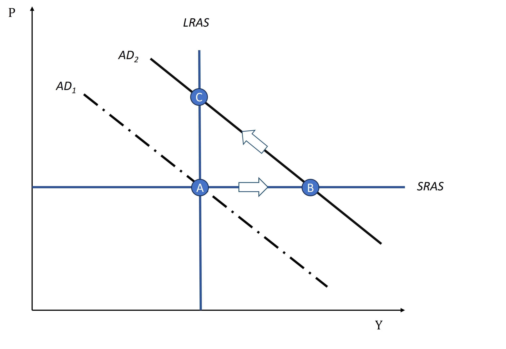
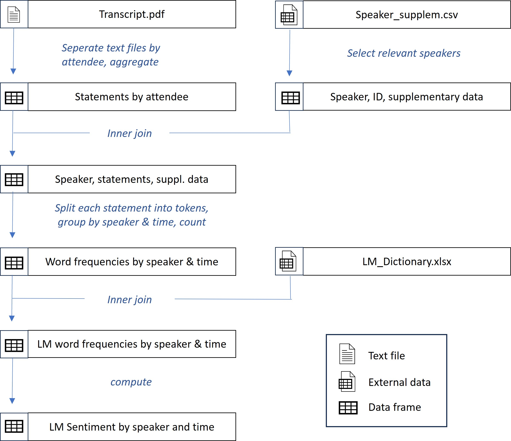
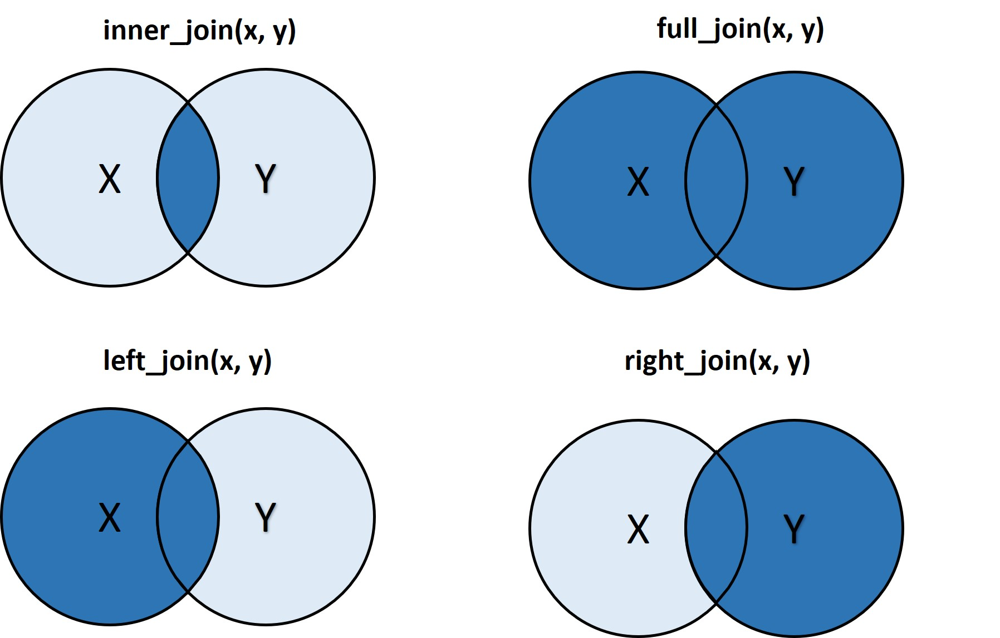
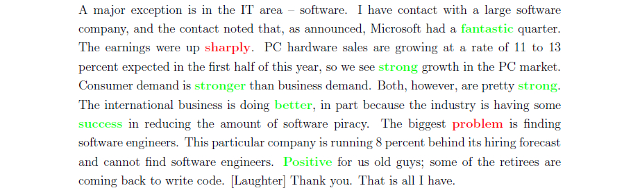
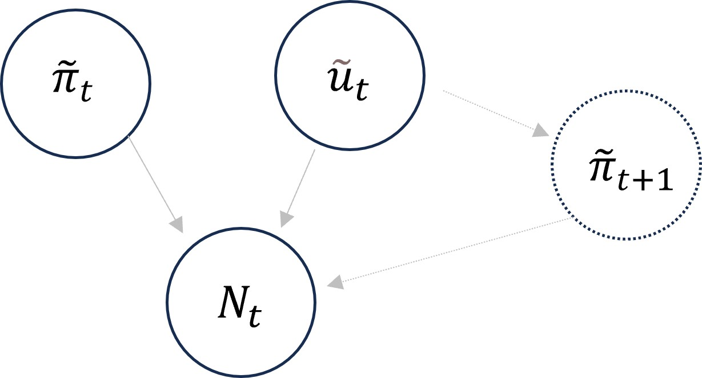
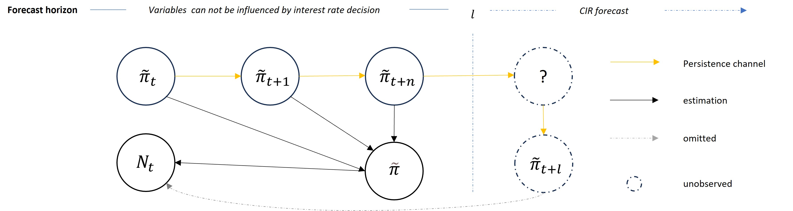

# Estimating Central Bank Objectives using Text Analysis - An Interactive Analysis with R

#< ignore

```{r setup}
#current version: G_1.0.0_central_bank_objectives
library(RTutor)
# Adapt the working directory below and then run setup chunk in RStudio.
setwd("C:/Masterarbeit/Github")
ps.name = "FEDwatch_1.0.0"; sol.file = paste0(ps.name,"_sol.Rmd")
libs = c("ggplot2","quanteda", "quanteda.textstats", "tidyverse","tidytext", "readtext", "skimr","haven", "fixest", "broom", "magrittr", "car", "urca", "kableExtra") # character vector of all packages you load in the problem set

#name.rmd.chunks(sol.file)
create.ps(sol.file=sol.file, ps.name=ps.name, libs=libs,addons = "quiz")
          
# The following line directly shows the problem set 
# in the browser
show.ps(ps.name,launch.browser=TRUE,
  auto.save.code=FALSE,sample.solution=FALSE)
```
#>

## Exercise I. Overview

The following problem set presents a step-by-step analysis of the monetary policy objectives of the Federal Reserve System. It is based on Shapiro and Wilson's paper *Taking the Fed at its Word: A New Approach to Estimating Central Bank Objectives using Text Analysis* cited as Shapiro and Wilson 2021a). Furthermore supplementary information and technical details are used (cited as Shaprio and Wilson 2021b). The data and code underlying their research is available on <a href="https://doi.org/10.5281/zenodo.5598429" target="_blank">Zenodo</a>.

Shapiro and Wilson presented a novel approach to analyzing monetary policy with textual data. Routinely, central bank objectives are inferred from policy actions in response to certain economic conditions. More specifically, analyses of interest rate setting behavior in response to inflation and output changes, often grounded in the works of Taylor (1993). Instead of inferring objectives from policy actions, the authors attempt to measure objective attainment directly. Using expressed negative sentiment as a proxy for loss, the authors propose a model framework to estimate an assumed central bank loss function.

The authors provide an extensive data set and a sophisticated analysis. This replication analysis will be limited to some elements that are considered to be essential for an understanding of the authors’ overall approach. Before the actual analysis some basic knowledge on the Federal Reserve System and its policy framework will be provided. The Tutorial will feature the theoretical framework which lead to the authors empirical strategy. Following that a glance into the meetings of the FOMC is created, which informs the user about the source data for the loss proxy and gives some impressions on the political body’s economic considerations. An optional interjection on the main challenges in the lower-level textual data generation process follows. The empirical analysis will start with a descriptive analysis of the main sentiment proxy and the development of key macroeconomic variables. This provides the necessary insight for the subsequent development and interpretation of the basic empirical loss model. The development process will focus mainly on aspects that are relevant for the construction of an empirical model which aims to reflect causal economic relationships. The developed empirical model will subsequently be implemented, following Shapiro and Wilsons baseline specification. Hypothesis testing and residual diagnostics will aid in deriving economic conclusions from the model. For illustration purposes, the tutorial ends with a visual representation of the core finding.


### Table of Content

The RTutor problemset is composed of the following parts:

- I. Overview

-  1. Background Information  

    + 1.1 The Federal Reserve System  
  
    + 1.2 Key Indicators for the Dual Mandate
  
    + 1.3 Money Supply Process 
    
    + 1.4 Key Interest Rates for Monetary Policy

- 2. Economic model 
    
    + 2.1 New Keynesian Framework
    
    + 2.1 Central Bank Loss Function
    
    + 2.2 Interest Rate Rule Model
    
    + 2.4 From Economic Model to Empirical Approach 
  
- 3. Insight into FOMC discussion 

    + 3.1 Example Transcript Content 
    
    + 3.2 Objectives in Context 

- 4. Generating Data from Text Files 

    + 4.1 Generating Text Data
  
    + 4.2 Joining Speaker Data and Statement
  
    + 4.3 Scoring Speaker Statements
  


-  5. Descriptive Analysis   

    + 5.1 Computation of Loss Proxy  
      
    + 5.2 Loss Proxy and Key Features 
      
    + 5.3 Validity of Loss Proxy  

-  6. Developing a empirical loss model    

    +  6.1 Basic Empirical Model  
    
    +  6.2 Omitted Variable Bias 
    
    +  6.3 Loss Model with Speaker Fixed Effects

  
-  7. Estimation of Objectives and Diagnostics  

    +  7.1 Full Model with Additional Controls 
    
    +  7.2 Residual Diagnostics
    
    +  7.3 Visualization of estimated effect 


-  8. Conclusion


-  II. References


-  A1 Centered Regression


## Exercise 1. Background information

This chapter will feature a brief introduction into the Institution of the Federal Reserve System and its policy framework. The framework is conceptually divided into objectives and implementation, with summarized descriptions for each aspect. 


### 1.1 The Federal Reserve System

This chapter will feature a brief introduction into the Institution of the Federal Reserve System and its policy framework. The framework is conceptually divided into objectives and implementation, with summarized descriptions for each aspect.

**Institution and purpose**

The Federal Reserve System (FED) is the central bank of the United States of America. It performs several functions regarding financial stability and monetary policy. Objectives for monetary policy are mandated by the US Congress (c.f. FED 2021, pp.1-2). Currently these objectives are set in the Federal Reserve Reform Act of 1977, Title II, Section 225a:

> *“The Board of Governors of the Federal Reserve System and the Federal Open Market Committee shall maintain long run growth of the monetary and  credit aggregates commensurate with the economy’s long run potential to increase production, so as to promote effectively the goals of maximum employment, stable prices, and moderate longterm interest rates.”*

This legislation gives the FED its general target direction, while not mandating explicit objectives and actions. Thus, the FED claims to act as an independent, nonpartisan agency. Through a variety of monetary policy tools, most importantly through its influence on interest rates, the FED aims to progress towards the legislated objectives of stable prices and maximum employment. Sometimes these objectives are summarily referred to as the dual mandate (c.f. FED pp. 21-22.)

**The FOMC**

The FOMC is the board which shapes concrete U.S. monetary policy. It decides on the appropriate policy stance to reach the monetary policy goals mandated by congress. The FOMC is composed of twelve voting members. Seven of these members are nominated by the President of the United States and confirmed by the Senate for a 14-year term to the Board of Governors. The Chair of the Board of Governors is traditionally elected by the FOMC to serve as their chair. The remaining five seats are filled by reserve bank presidents. Reserve bank presidents are appointed by the Reserve bank boards. One seat is allocated to the New York Federal Reserve Bank president. The other four seats are rotating annually among the remaining 11 reserve bank presidents. The non-voting reserve bank presidents may attend and participate in FOMC debates as well (c.f. FED pp. 12-13).

The decision process of the FOMC has historically been characterized as largely consensual, with the FED chair being able exert higher influence on the overall decisions through his control of the meeting agenda and policy proposals (c.f. Krause 1994). El-Shagi and Jung (2016) reaffirm this view for the more recent chairmanship of Alan Greenspan.

### 1.2 Key indicators for the dual mandate ###

The following chapter describes the economic definition of the objectives and indicators which could be used to judge the degree of target achievement.

**The price stability objective**

Price stability is commonly defined as low and stable inflation. Inflation is unwanted because it leads to uncertainty. For example, high or volatile inflation complicates the planning processes by consumers and companies. Consequently, there is some evidence that high inflation coincides with low economic growth. To measure price stability a nominal anchor, which can be an economic indicator like the inflation rate or money supply, is used (cf. Mishkin 2019, p. 440).

The current FOMC monetary policy strategy explicitly takes the view that inflation is primarily driven by monetary policy. The committee adopted a target of 2 percent for the average annual inflation rate. Key measurement is the annual change in the price index for personal consumption expenditures (PCE) (c.f. FRB 2023). Before 2012 no concrete inflation target was announced (Shapiro and Wilson 2021a, p. 2769). However, the PCE chain index was already adopted as the main indicator in FOMC monetary policy reports to congress in the year 2000 (see FRB 2000).

*Personal consumption expenditures index and the consumer price index* 

Personal Consumption Expenditures (PCE) serve as the primary indicator of consumer spending in the U.S. economy. PCE encompasses approximately two-thirds of domestic final spending, making it a crucial driver of the gross domestic product. PCE comprises purchases of goods and services by households and nonprofit institutions serving households. Market prices, including taxes, are used to value PCE transactions. Additionally, PCE includes housing costs, irrespective of whether housing is rented or owned. Furthermore, it incorporates purchases made by other parties on behalf of households, such as medical care from government programs. PCE can be categorized based on product type (e.g., durable goods) and function (e.g., “Health”) (cf. BEA 2021, pp. 5-1 - 5-5).

On the other hand, the Consumer Price Index (CPI) by the Bureau of Labor Statistics (BLS) measures the price changes of everyday goods and services experienced by its target population. The BLS collects prices for a wide range of items and constructs a representative basket, including housing-related costs. The main target populations for the CPI are “All Urban Consumers” and “Urban Wage Earners and Clerical Workers.” The first group includes the second target population and encompasses approximately 88% of the U.S. population. CPI items are categorized into eight main groups based on necessity (e.g., “Recreation”) (cf. BLS 2023).

PCE data is aggregated from various sources, including the BEA’s Benchmark Input-Output Accounts, primarily derived from the Census Bureau’s Economic Censuses, International Transactions Accounts, various government surveys, and the Bureau of Labor Statistics Consumer Price Indexes (cf. BEA 2021, pp. 5-7).

Consumer price data is collected on a monthly basis through related surveys. The CPI is composed of a geographic sample, which pertains to the areas where prices are collected, a consumer expenditure survey to formulate and weigh the representative basket, and samples of prices for commodities, services, and housing. The price data is collected in person or via telephone (cf. BLS 2023).

Following a short summary of the calculation of the PCE price index based on McCully et al. (2007) will be provided: The PCE price index is established by  chaining Fisher Ideal Formula price relatives denoted as $F$. The Fisher Ideal price relative is formulated as the geometric mean of the Laspeyres $L$ and Paasche $P$ price relatives. 

$$(1) \, F = \sqrt{L_{t}, L_{t+1} \cdot P_{t}, P_{t+1}}$$
Laspeyres price relative:

$(2) \, L_{t}, L_{t+1} = \frac{\sum_{i} P_{t+1}^{i} \cdot Q_{t}^{i}}{\sum_{i} P_{t}^{i} \cdot Q_{t}^{i}}$

Paasche price relative:

$(3) \, P_{t}, P_{t+1} = \frac{\sum_{i} P_{t+1}^{i} \cdot Q_{t+1}^{i}}{\sum_{i} P_{t}^{i} \cdot Q_{t+1}^{i}}$

Price of item $i$ in period $t$: 

$P_{t}^{i}$ 

Quantity of item $i$ in period $t$:

$Q_{i}^{t}$ 

Computation of chain index: 

$(4) \, Chained  F_{t+1} = Chained F_{t} \cdot F_{t+1}$ The first chain index value is often arbitrarily set to 100, for easier interpretation. 

A key feature is that it accounts for substitution effects since it uses quantities of the measured (Paasche) and quantities of the period before (Laspeyres). This is important since consumers tend to substitute items which get more expensive relative to their substitutes. 


**The maximum employment objective**

The objective of maximum employment aims at low, but not zero unemployment. Some sources of unemployment are acceptable or not primarily addressed by monetary policy. Frictional unemployment describes short transitional phases by workers who are searching for or are moving to a new job. Structural unemployment arises due to a disparity between the skills of workers and the requirements of employers. Monetary policy therefore aims to reach the natural rate of unemployment which excludes such phenomena (cf. Mishkin 2019, p. 441). The FOMC currently does not have a fixed specific employment target or indicator but claims to consider a range of indicators (FRB 2023).


*Unemployment rate for the US*

The Bureau of Labor Statistics (BLS) categorizes individuals over the age of 16 who are either employed or unemployed as members of the labor force. Those who fall under the employed category include individuals who worked for at least one hour in a paid position, worked in their own business, worked for more than 15 hours in a family member's business, or were temporarily absent from work due to illness or other reasons. The labor force excludes Military personnel, volunteers and institutionalized people (e.g. prisoners). People who were not employed during the reference week are classified as unemployed if they were available for work and made an effort to find work. An exception to the requirement of active search for work are temporary layoffs, who are classified as unemployed regardless of whether they attempted to find work or not (cf. BLS 2018a).

The U.S. Census Bureau collects monthly data of U.S. households in the Current Population Survey. The sample is made up of a rotating Selection of households, where a sample household is interviewed for 8 monthly interviews over a 16-month period. The interviews are done in person or via telephone. During the monthly interviews data on the employment status of household members is collected. This survey provides the data source for the BLS employment data (cf. BLS 2018b).

The unemployment rate is the proportion of unemployed in the labor force, expressed in percent (cf. BLS 2018a).

The non-accelerating inflation rate of unemployment (NAIRU) is conceptualized as the rate of unemployment which does not influence inflation. The concept postulates that if the unemployment rate is above the NAIRU inflation will tend to fall and if unemployment is below the NAIRU inflation will tend to increase. The reasoning is that the utilization of the labor force above capacity will put upward pressure on prices, and utilization below capacity vice versa (cf. Mishkin 2019, p. 465). The concept is related to the output gap, which will be discussed in chapter 2.

### 1.3 Money supply process ###

Following the money supply process is sketched, primarily based on Mishkin (2019):

**The money multiplier model**  
The Federal Reserve’s historical monetary policy actions are evident from its balance sheet. Circulating currency and reserves R, which compose the monetary base, are among the liabilities of the Federal Reserve. Circulating currency refers to Federal Reserve Notes, commonly known as cash $C$. Reserves refer to deposits made by banks at the FED. Banks are required to hold reserves at the Fed and are also allowed to hold excess reserves $ER$. The required reserve ratio $rr$ determines the level of required reserves that a bank must hold in relation to its customers’ deposits $D$. It mandates which fraction per dollar deposited at the bank needs to be held as reserves at the FED. The sum of the FEDS liabilities forms the monetary base $MB$ (cf. Mishkin 2019, p.389).

$(5) \, MB =  \underbrace{rr * D}_{\text{Required Reserves}} + \underbrace{e * D}_{\text{Excess Reserves}} + \underbrace{c * D}_{Cash}$

Required reserve ratio: 

$rr = \frac{R}{D}$ 

Excess reserves ratio:

$e = \frac{ER}{D}$ 

Ratio of currency $C$ to deposits $D$:

$c = \frac{C}{D}$ 

On the Assets side two categories are important: securities and loans. Securities held by the FED are primarily purchased from the U.S. treasury, for example treasury bonds. Loans are issued to financial institutions which compensate by paying interest in return. The current interest rate is called the discount rate. The changes of Assets hold by the FED are mirrored by corresponding changes in its liabilities. By buying and selling securities in open market operations, the Fed influences the monetary base. If the Federal Reserve purchases bonds from private banks, the bond’s asset volume will increase. This will also increase the reserve supply on the liabilities side. The reserve supply increases through this type of transaction as the bank receives payment, which increases its reserve deposit at the FED. This transaction is commonly known as an open market purchase. Conversely, if the Federal Reserve sells a bond, it lowers the bank’s reserve deposit, which decreases the total reserve supply. (cf. ibid, pp.391-392).

FED discount loans provide the debtor with reserves, and therefore increase the amount of reserves as well. If banks repay their discount loans or decrease their use, reserves will decrease. The money supply can be viewed as a multiple of the monetary base, see the following equation:

$(6) \, M = m * MB$

The money multiplier $m$ expresses by which factor the money supply changes in response to changes of the monetary base. Typically, the money multiplier is much higher than one. As described earlier the money supply entails deposits and currency.

$(7) \, M = D + c*D$

The equation for the monetary base can be used to derive $D$:

$(8) \,D = \frac{1}{rr+e+c}*MB$

By substituting $D$ in the money supply equation with the expression above one can express the money supply relative to the monetary base. 

$(9) \,M = \frac{1+c}{rr+e+c} *MB$

Given the money multiplier we can conclude that the money supply is determined by the required reserve ratio, the excess reserves ratio and the currency ratio. The fractional term in the expression above is the money multiplier. It informs us about the change of the money supply per dollar increase of the monetary base.

**Criticism of money multiplier model**

It should be emphasized that this is a simplified educational model which implies a mechanical control of the money supply by the central bank and the actual creation of deposits is more variable (c.f. Mishkin 2019, pp. 400-401). The money multiplier model fails to address the lending decisions of banks. Money creation through credit is additionally limited by banks’ considerations of customers creditworthiness (c.f. Heine und Herr 2013, p.314). For example, Carpenter and Demiralp (2010) investigated the validity of the sketched “textbook” transmission mechanism of monetary policy through the money multiplier and claim that changes in reserves are unrelated to changes in lending (c.f. Carpenter and Demiralp pp. 27-28).

### 1.4 Key interest rates for monetary policy ###

In this chapter the key policy rate in the nominal sphere and the opposing, unobserved rate of return in the real sphere are contrasted and put in relation.

**The federal funds rate**

The interest rate which is charged for overnight lending of reserves on the reserve market is called the federal funds rate. It can thus be understood as the price of reserves. The FOMC votes on a target range for this rate. The supply of Reserve markets is composed of two elements, non-borrowed reserves accrued through open market operations, and borrowed reserves. The equilibrium interest rate in the reserve market ranges from the discount rate, which is set a fixed amount above the target rate, to the interest rate collected by banks on reserves deposited at the FED. Banks lend reserves exclusively to other depository institutions if they obtain an interest rate premium on the interest on reserve balances, which represents their cost of opportunity. Conversely, they only borrow from other depository institutions when the rate is lower than the discount rate, as they can resort to borrowing from the FED at the latter’s discount rate. Through open market operations, discount lending, reserve requirements, and the interest rate paid on reserves, the Federal Reserve determines reserve market conditions to achieve its target equilibrium interest rate (c.f. Mishkin pp. 413-415). 
In practice, the Federal Reserve targets the federal funds rate through open market operations that involve the continuous changing of the reserve supply by the Federal Reserve’s traders until the target is reached. (c.f. Mankiw 2019, p.396).


**Natural rate of interest**

The natural rate of interest, denoted as $r^*$, is a concept that represents the interest rate consistent with trend economic output growth while maintaining the current inflation level, denoted as $\pi_t$. It serves as an indicator of whether monetary policy is expansionary or contractionary. When the real interest rate, which refers to the interest rate adjusted for inflation falls below the natural rate of interest, it signals an expansionary policy, whereas if it rises above it, it signifies a contractionary policy. This relationship is illustrated in monetary policy guidelines such as the Taylor Rule (c.f. Laubach and Williams 2003, p.1063-1064):

$(10) \, ffr_t = \pi_t + r^* + \alpha(\pi-\pi^*) + \beta(y_t-y^*)$ 

To influence the inflation rate, the central bank adjusts the interest rate in relation to the rate required to maintain the current inflation level, i.e., $\pi_t + r^*$. If the inflation rate exceeds the target inflation rate $\pi^*$ (i.e., $\pi > \pi^*$), the central bank raises interest rates above the maintenance rate; conversely, if inflation falls below the target (i.e., $\pi < \pi^*$), it lowers rates relative to the maintenance level. The degree of this reaction is determined by the reaction coefficient $\alpha$. The third part of this rule can be interpreted as a response to deviations in current economic growth $y_t$ from trend growth $y^*$ or as a response to anticipated inflation (c.f. Mishkin, p. 464).

Taylor originally suggested the policy rule as a lose guideline, assuming a natural rate of 2% and reaction coefficients of 0.5 on the inflation gap and the output gap (c.f. Taylor 1993, p.202). 


#< info "A policy cycle example"
To understand this rule, let’s consider an example of an expansionary policy cycle: As previously explained, the Federal Reserve (FED) indirectly controls the nominal interest rate by determining the growth of the reserve supply. When the FED guides the nominal interest rate below the sum of the natural rate and inflation, lending activity tends to expand. This is because the real interest rate (the nominal rate adjusted for inflation) falls below the natural rate, making it more attractive for debtors to invest or borrow, as the expected return from investments is higher (or the present value of future consumption is lower) than the interest they need to repay.

This expansionary policy can lead to an acceleration in price increases due to heightened demand, as the inflation it generates further reduces the real interest rate. To avoid runaway inflation, the FED must adjust the nominal interest rate to at least match the current rate of inflation plus the natural rate. To curb inflation, it must raise nominal interest rates even higher than the combined rate of inflation and the natural rate. This action effectively pushes the real interest rate above the natural rate, helping to mitigate inflationary pressures. (refer to Mishkin (2019) pp. 439-463 for a in depth explanation)

#>

#< quiz "Taylor Rule"
question: Suppose the inflation rate is at 5% and the natural rate of interest would be 2%. Which nominal interest rate is is at least needed to decrease inflation ? 
sc:
- More than 7%*
- 7%
- 6%
- More than 2%

failure: Try again. 
success: Correct!
#>
According to the outlined theory, for a contractionary effect to occur, the real interest rate must be above the natural rate of 2 %. If one (re-)adds inflation to the necessary real interest rate one gets a nominal rate of above 7%. 

#< award "Rate hiker"
#>


## Exercise 2. Economic model

In this chapter economic concepts underpinning Shapiro and Wilsons economic model are sketched. Furthermore it is shown why Shapiro and Wilson reason it is preferable to estimate the loss function instead of an interest rule model. The chapter is concluded by the economic model used and the empirical approach. 

The general formulas and derivative functions presented in the chapters 2.2-2.4 are taken from Shapiro and Wilson (2021b), although sometimes interim steps were added for easier understanding.    
 

### New Keynesian framework ###

Shapiro and Wilsons empirical model, which will be explored later, is based on an a New Keynesian understanding of the macroeconomy (Shapiro and Wilson 2021, p.2773). 




*Figure 1: "Impact of a monetary expansion on the aggregate price level in the short and long run"; Source: adapted from Mankiw(2019, p. 350).*


 In the New Keynesian framework, central banks manage the long-term equilibrium price level and exert influence over short-term output through the control of the money supply. For example, an increase in the money supply results in lower interest rates, subsequently leading to higher levels of investment. Figure 1 shows the resulting changes, by the induced rightward shift of the aggregate demand curve $AD_1$. This phenomenon drives an increase in aggregate demand regardless of the prevailing price level $AD_2$. In the short term, prices demonstrate stickiness, causing the heightened demand to correspond with a greater quantity of goods supplied, while the equilibrium price level does not. However, if the new short-run equilibrium — the market clearing  price output combination (B), represented by the intersection of supply and demand curve — surpasses the long-run output capacity, suppliers will progressively raise prices until a new equilibrium (C) is achieved, aligning aggregate demand with long-run aggregate supply. It should be noted that Figure 1 shows this for an exaggerated case, of perfectly inelastic long run aggregate supply $LRAS$ and perfectly elastic short run aggregate supply $SRAS$. A reduction of the money supply on the other hand leads to higher interest rates and subsequently opposite effects on long term price level and short run output (cf. Mankiw 2019, pp. 378-404). 

These considerations lead to two important conclusions for this study. First of all, a short-run trade-off between unemployment and inflation might exist. As previously described, expansionary monetary policy (or fiscal policy) leads to higher utilization of production capacity, thereby reducing unemployment but increasing inflation. This implies that achieving both low inflation and low unemployment becomes challenging within this theory, particularly over a short time horizon. 

Secondly, this could manifest itself empirically by a time lag between output increases or decreases caused by monetary policy and the subsequent effect on inflation (c.f. Shapiro and Wilson 2021b). This issue is further elaborated in a three period model of the interest-rate setting behavior of central banks presented by Shapiro and Wilson, grounded in the aforementioned New Keynesian framework.

The sketched macroeconomic relationships might be transferable to the labor market as well. Aggregate labor supply and demand curves might be interpreted similarly to the sketched curves in Fig 1. This implies a statistical relationship between inflation and unemployment, which is known as the Phillips curve. The Phillips curve theory posits a negative correlation between these two phenomena over the short run. Over the long run however, unemployment is claimed to be determined by its natural rate, while the price level is determined by the aggregate demand curve. Because the central bank might move the aggregate demand curve one might say the central bank chooses a combination of unemployment and inflation along the Phillips curve in the short run, and an inflation level on the long run  (c.f. Baumol et al. 2019 p. 331-340). Since this is highly relevant for the authors reasoning, the relationship will be shown empirically in chapter 5. 

#< quiz "Rate decision"
question: Suppose a central bank believes in the accuracy of the Phillips curve model. Unemployment is below the natural rate. What response do you expect?
sc:
- The central bank should raise interest rates*
- The central bank should lower interest rates

failure: Try again. 
success: Correct!
#>

An unemployment rate below the natural rate indicates an over exhaustion of the labor force, indicating future inflation, for example through the channel of wage growth/labor cost (see chapter 5). This might lead to an interest rate hike by the central bank.

An expanded model of the Phillips curve states that inflation is determined by expectations of inflation $E(\pi)$, cyclical unemployment $(u - u^*)$ and supply shocks $v$. 

$(11) \, \pi = E(\pi) - (u - u^*) + v$
 
Expectations of inflation are formed by previous experiences of inflation. Negative deviations of output growth from its natural rate (if output growth is lower than trend growth) cause increased cyclical unemployment, while positive deviations decrease it. Supply shocks represent exogenous effects on inflation, for example effects of the world’s oil price (c.f. Mankiw 2019, pp. 470 - 472).
 
 
### Central bank loss function ###

Shapiro and Wilson (2021b) abstract the central bank’s decision process, in regard to interest rate, as the minimization of a lifetime loss function:

$$(12) \, L = \sum_{\tau = 0}^{\infty} L_{\tau} \;\; \; \;\;\;\;\;\;\;\;\;\; (13) \, L_{\tau } = \frac{1}{2}(\tilde{\pi}_{\tau}^{2} + \phi x^{2}_{\tau} )$$
 The central bank aims to minimize the sum of present and discounted future losses (12), which depend on the inflation gap $\tilde{\pi} = \pi -\pi^{*}$  and real activity $x$ like the unemployment gap (13) (cf. Shapiro and Wilson, 2021b, p.1). The quadratic function implies a symmetric aversion to target indicators above and below the respective objectives. Secondly, marginal increases of the gap would cause more and more loss. This could abstract a very strong dislike for large gaps and (almost) indifference to small gaps. Analytically this hypothetical functional form has the benefit that the  objectives can be derived exactly by calculating the coordinates in the minimum ( see illustration below).


*One period loss function*

**Task 1** Press check. The code below sketches an example loss function for one period, with freely chosen parameters. The loss function is changed to be decreasing for better visualization, so for the sketch assume the central bank maximizes $L$ instead of minimizes $L$. 

```{r}
#< task
x <- -10:10 # Real activity
y <- -10:10 # Inflation

Loss <- function(x, y) {
  -1/2 * ((y - 2)^2 + 0.8*(x - 3)^2)
}

loss <- outer(x, y, Loss)

persp(x, y, loss, xlab='Real activity', ylab='Inflation', zlab='Loss',  col='blue', shade=.02, theta=-60,phi=0, border = TRUE, box = TRUE)

#>

```

#< quiz "Loss function"
question: What is the inflation target in the sketched loss function?
sc:
- The inflation target is 2*
- The inflation target is 2.4 
- The inflation target is 3
- The inflation target is 0

failure: Look at the code. 
success: Correct!
#>

The diagram shows that one could identify the objectives, using the coordinates in the minimum. The observed variable will be equal to the respective objective if the gap is zero. However, in practice, one might not know the exact size of the gap beforehand, since the objectives are not always public. Nevertheless, one can estimate a modified version of the model.

Suppose one wants to find the inflation target $\pi^{*}$ of a central bank. The fictional central bank has an inflation goal $\pi^{*}= 2$, which is not publicly announced. One can rewrite as following for the ...

squared inflation gap:

$\tilde{\pi}_{\tau}^{2} = (\pi-2)^2 =   \pi^{2} - 4\pi + 4$ 
 
one period loss function :

$L_{\tau } = \frac{1}{2}((2-\pi)^2 + \phi x^{2}_{\tau} )  = 0.5\pi^{2} - 2\pi + 2 + \frac{1}{2}(\phi x^{2}_{\tau})$ 

The revised function serves as the foundation for the subsequent empirical model that will be discussed. It can be estimated through ordinary least squares (OLS) using a structure similar to the following format:  

$(14) \, L_{\tau } =  \hat{\beta}_0 + \hat{\beta}_1 \pi^{2} + \hat{\beta}_2 \pi$

Assuming accurate coefficients have been estimated for inflation variables, the inflation objective can be determined by computing the derivative function and setting it to zero, which locates the minimum of the loss function.

*Example first order condition inflation target:*

Suppose one estimated a constant and coefficients for the inflation polynomial: 

$L_{\tau} = \hat{\beta}_0 + 0.5\pi^{2} - 2\pi$

To determine the value of $\pi$ where the slope of $L_{\tau}$ is zero, differentiate $L_{\tau}$ with respect to $\pi$ and set the resulting expression to zero: 

$\frac{dL_{\tau }}{d\pi} = \pi -2 = 0$ 

This yields the estimated inflation goal:
$\pi^{*} = 2$


### Interest rate rule model

Shapiro and Wilson (2021b) show their economic reasoning why an empirical approach aiming to estimate the central bank loss function instead of trying to estimate an interest rule model might be more sensible:

The central bank aims to minimize its loss $L$ by choosing a real interest rate $r_{0}$ for the entire time span. The example considers a central bank loss $L$  over three periods $\tau$: 

$$L = \sum_{\tau = 0}^{2}$$


In this three period model real activity  $x_{0}$, and inflation $\pi_{0}$  in period zero and inflation in the first period $\pi_{1}$ are predetermined. Real activity in the following periods $x_{1}$, $x_{2}$ depend on the impact of the interest rate $ar$ and previous output $\rho x_{t-1}$: 

$x_{0} = x_{0}$ 

$x_{1} = \rho x_{0}-ar_{0}$

$x_{2} = \rho x_{1} - ar_{0} = \rho*(\rho x_{0}-ar_{0}) - ar_{0} = \rho^{2}x_{0}-\rho ar_{0} - ar_{0} = \rho^{2}x_{0} - (1+\rho)ar_{0}$


Inflation $\pi$ is determined by the impact of previous inflation $\psi \pi$ and the impact of previous real activity $\gamma  x_{t-1}$ : 

$\pi_0 = \pi_0$

$\pi_1 = \psi \pi_{0}+\gamma x_{0}$

$\pi_2 = \psi \pi_1 + \gamma x_{1} = \psi(\psi \pi_{0}+\gamma x_{0})+ \gamma (\rho x_{0}-ar_{0})$

$= \psi^{2} \pi_{0} + \psi \gamma x_{0}+ \gamma \rho x_{0} - \gamma ar_{0}$ 

$= \psi^{2} \pi_{0} + (\psi+\rho) \gamma x_{0} - \gamma ar_{0}$


*First-order condition for the central banks interest rate choice*:

Take the derivative: 

$\frac{dL_{\tau }}{dr_0} = \frac{d\tilde{\pi}_{2}}{dr_0}\tilde{\pi}_{2} + \phi \frac{d x_{1}}{dr_0}x_{1} + \phi \frac{d x_{2}}{dr_0}x_{2}$

Interest rule: 

$r_0 = B\tilde{\pi_0} + Cx_{0}$

Response of the interest rate to inflation: 

$B = \frac{\gamma \psi^{2}}{a (\gamma^2 + \phi +\phi(1+\rho)^2)}$

Response of the interest rate to output gap:

$C = \frac{\psi^{2}(\psi+\rho)+\phi\rho(1+\rho+\rho^2)}{a(\psi^2+\phi+\phi(1+\rho)^2)}$

*Key takeaway*

If an inflation-real activity tradeoff is assumed, as suggested by the Phillips curve model, and one observes a reaction of interest rate policy to some measure of real activity one cannot conclude the phenomena is part of the central bank’s objectives. The reason is that the central bank is likely forward-looking and current economic conditions might signal or cause future inflation. Secondly, we cannot judge the objectives from an estimated interest rule alone because unobserved parameters enter the estimated coefficients (cf. Shapiro and Wilson 2021).


### From economic model to empirical approach 
In the following economic model proposed by Shapiro and Wilson(2021b) the central bank makes repeated interest rate decisions based on current and predicted economic conditions. Therefore, the previous model is augmented, by relaxing the implicit assumption of total foresight by the central bank, which necessitates repeated interest rate decisions.

Given that the central bank’s interest choice affects the target variables with a lag, some loss is unavoidable at the time of a potential interest rate decision (cf. Shapiro and Wilson 2021b). Therefore, Shapiro and Wilson interpret part of the central banks loss as short run loss, that is current loss and the loss that is predicted to occur anyway until a monetary policy instrument like the interest rate could affect the inflation and output targets. The other part of the loss is the loss that would occur, according to the central bank’s predictions, if the interest rate would be held constant. Such forecasts are termed constant interest rate (CIR) forecasts.


$(16) \, L_{t} = \tilde{\pi_t}^2 + \phi x_t^2 - \lambda x_t+ \tilde{\pi}_{t+l}^2 + \phi x_{t+l}^2$  

Short term loss (observed): 

$\tilde{\pi_t}^2 + \phi x_t^2$ 

CIR loss (unobserved):

$\tilde{\pi}_{t+l}^2 + \phi x_{t+l}^2$ 

Other variables influencing central bank loss, e.g. financial market stability:

$-\lambda x_t$ 

Because the FED does not release constant interest rate predictions they cannot be included into the model. Therefore, Shapiro and Wilson raise the question whether this omission might introduce some bias. Referencing the usual observation of macroeconomic variables with themselves across time (autocorrelation) they argue that it is likely that predictions of short-term inflation forecasts are correlated to CIR inflation forecasts.

They exemplary suppose the following specification for the CIR forecast variables: 

CIR inflation:

$\tilde{\pi}_{t+l} = \psi \pi + \gamma x_t$

CIR output:

$x_{t+l} = \rho x_t$

The lag variables are then substituted into (16) and the hypothetical coefficients are determined by factoring out.

$(17) \, L_{t} = \tilde{\pi_t}^2 + \phi x_t^2 + \psi^2 \pi^2 + 2\psi \pi \gamma x_t + \gamma^2 x_t^2 + \phi \rho^2 x_t^2 = (1+\psi)\tilde{\pi_t}^2+ (\phi(1+\rho^2)+ \gamma)x_t^2+ 2\psi \pi \gamma x_t$  

Since loss can not be observed directly a proxy is used to measure it. Verbalized negativity $N_t$ by the FOMC serves as proxy for loss, and a linear relationship via some proportionality factor $\delta$ is assumed:

$(18) \, L_t = \delta N_t$

The authors multiply out and model verbalized net negativity as following: 

$(19) \, N_t = \hat\delta \tilde{\pi}^2+\hat w x_t^2 + \hat \alpha \tilde{\pi_t}x_t + \hat\epsilon$ 

Restructuring $\tilde{\pi}$:

$= \hat\delta\pi^2+\theta  \pi+ \hat w x_t^2 + \hat \alpha \tilde{\pi_t}x_t + \hat\epsilon$

The hypothetical coefficients are provided as following ...

on inflation squared: 

$\hat\delta = \delta(1+\gamma^2)$

on inflation:

$\hat\theta = -2\hat\delta \pi^*$

on the output gap:

$\hat w  = \delta(\phi(1+\rho^2)+ \gamma)$

interaction term: 

$\hat \alpha = 2\psi \gamma$

The partial derivative with respect to $\pi$ shows that the target is not biased by the lag structure,  if we ignore the interaction term $\hat \alpha \tilde{\pi_t}x_t$, considering that $\hat\alpha$ is generated from two fractions and therefore close to zero. Although the coefficients on squared and linear inflation are biased, the bias cancels itself out when we back out the inflation objective (see below).  

Partial derivative: 

$(20) \, \frac{dN_{\tau }}{d\pi} = 2\hat\delta\pi + \hat\theta = 0$ 

The estimated inflation goal:

$\pi = \frac {-\hat\theta}{2\hat\delta} = \frac {-(-2\hat\delta \pi^*)}{2\hat\delta} = \pi^*$

#< quiz "Output gap bias"
question: Is the hypothetical estimator of the effect of the  output gap on loss biased (ignoring the interaction term) ?
sc:
- No
- Yes*

success: Your answer is correct! 
failure: Look at the parameters that go into the estimator. 
#>

The coefficient $\hat w$ quantifies the effect of changes in the current output gap on loss including persistence plus its effect via increased CIR inflation through the pathway of the Phillips curve (c.f. Shapiro and Wilson 2021b). 

*Key takeaway*

Interest rate models coefficients might depend on unobserved economic parameters, making it impossible to infer a causal relationship between economic conditions and loss. While the coefficients of the inflation gap polynomial in a model of loss may also be biased by unobserved CIR predictions, one may still be able to infer an unbiased inflation target. (see expression 20). Thus a model using loss, instead of the interest rate is preferable.  

#< award "Not los(s)t"

#>

## Exercise 3. Insight into FOMC discussions

This chapter will present the main data source for the loss proxy. The net negativity proxy, notated in the economic model as $N_t$ was sourced from transcripts of FOMC meetings, which are available in pdf format (see Replication file). Three meeting transcripts  are examined as examples. The purpose is to offer an initial impression of the transcripts content. Furthermore, an analysis is conducted on the context in which the dual mandate goals are discussed. To process the text data generic functions of the Quanteda package, will be used. The interested user can find a tutorial <a href="https://tutorials.quanteda.io/" target="_blank">here</a>. The code in this chapter is adapted from Quanteda tutorials to this subject. For text mining terminology the textbook of Jo (2019) is consulted.


### 3.1 Example transcript content

The FED publishes the transcripts of FOMC meetings online (<a href="https://www.federalreserve.gov/monetarypolicy/fomc_historical_year.htm" target="_blank">see here</a>). 

To gain insight into the structure of a transcript, refer to the image below which displays an excerpt from the September 2006 FOMC meeting transcript. 


*Figure 2: "picture of FOMC excerpt"; Source: (Replication file, <a href="https://www.federalreserve.gov/monetarypolicy/files/FOMC20060920meeting.pdf" target="_blank">full text</a>).*

First, the selected transcripts are loaded. To prevent potential errors during the file loading process, an RDS file is utilized, as it already includes the required PDF data. The interested user may employ the readtext() function from the readtext package for independent analysis.

**Task 2** Load the dataset "selection_pdf.rds" using readRDS(). 

```{r}
#< fill_in
#Loading the pdfs 
selection_pdf <- readRDS("./ExerciseData/___")
colnames(selection_pdf)

#>
selection_pdf <- readRDS("./ExerciseData/selection_pdf.rds")
colnames(selection_pdf)

```

The source data file can be seen, which was created by the readtext() function. It contains the file name, the raw text and the document title.

After the data has been loaded, a corpus will be generated from the PDF files. A corpus is a structured collection of texts (cf. Jo 2019, p.6)


**Task 3** Create a corpus object.
```{r}
#< fill_in
corp_ex_text <- corpus(___, text_field = ___)
head(corp_ex_text)
#>
corp_ex_text <- corpus(selection_pdf, text_field = "text")
head(corp_ex_text)

```

To determine the frequency of specific words in the discussion, the text files will be divided by whitespace or punctuation marks into individual words, which are represented as tokens. A token consists of a sequence of characters, such as words (cf. Jo 2019, p. 21).

**Task 4**  Separate the texts within the corpus object into individual words using Quantedas tokens function. Remove all punctuation and numbers. Use head() to display the resulting data. 

```{r}
#< fill_in
# tokenize the corpus 
toks <-
___
#>
toks <- tokens(corp_ex_text, remove_punct = TRUE, remove_numbers = TRUE)
head(toks)

```

It can be seen that the text has been broken up into individual words.

**Task 5** Create a document feature matrix and assign it to `dfmat_ex_text`. A document feature matrix gives a mathematical representation of characteristics of a document. In this case it is a word-document matrix. 

```{r}
#< fill_in
dfmat_ex_text <-___
dfmat_ex_text

#>
dfmat_ex_text <- dfm(toks)
dfmat_ex_text

```

The word-document matrix output represents each document as a row. Each entry in a row gives the frequency of the word indicated by the column (c.f. Jo 2019, p. 67). For the example transcripts, it is evident that there are 8179 unique words.

**Task 6** Perhaps it would be useful to show the most frequent words, to get an idea what the discussions are about. The following code shows the 50 most frequent terms. Press check.

```{r}
#< task
dfm_ex_text_feat <- textstat_frequency(dfmat_ex_text, n = 50)

dfm_ex_text_feat$feature <- with(dfm_ex_text_feat, reorder(feature, -frequency))

ggplot(dfm_ex_text_feat, aes(x = feature, y = frequency)) +
    geom_point() + 
    theme_minimal()+
    theme(axis.text.x = element_text(angle = 90, hjust = 1))+
    labs(
        title = "Word frequency",
        x = "Word",
        y = "Frequency",
    )


#>

```

One can see this illustration has little value as it includes words that contain no information outside of their context. Stop words are grammatical words, irrelevant to the content (c.f. Jo 2019, p.24).

For analytical purposes, it may be more useful to differentiate by transcript.

**Task 6** Filter out stop words and return the 30 most frequent words for each document! Remove words with less than three letters.

```{r}
#< fill_in
dfm_ex_text_filtered <- tokens_remove(___, stopwords("english"), min_nchar = ___) %>% dfm()
groups = docnames(_)
freq_weight <- textstat_frequency(_, n = 30, groups = _ )
dfm_ex_text_filtered
#>
dfm_ex_text_filtered <-tokens_remove(toks, stopwords("english"), min_nchar = 3) %>% dfm()
groups = docnames(dfm_ex_text_filtered)
freq_weight <- textstat_frequency(dfm_ex_text_filtered, n = 30, groups = groups )
dfm_ex_text_filtered

```

The modified text-document matrix is shown. This modified object is used to create frequency graphs by document.

**Task 7** Press check to show frequency graphs for the selected documents.

```{r}
#< task_notest
t_labels <- c(FOMC20060920meeting.pdf = "Sept. 2006", FOMC20070807meeting.pdf = "Aug. 2007", FOMC20150128meeting.pdf  = "Dec. 2015")

ggplot(data = freq_weight, aes(x = factor(nrow(freq_weight):1), y = frequency)) +
  geom_point() +
  facet_wrap(~ group, labeller = as_labeller(t_labels), scales = "free") +
  coord_flip() +
  scale_x_discrete(breaks = nrow(freq_weight):1,
                   labels = freq_weight$feature) +
  theme_minimal()+
  labs(x = NULL, y = "Frequency")

#> 

```

It is evident that the discussions frequently included the monetary policy objective of maintaining price stability, as indicated by the frequent use of the word “inflation” across all transcripts. However, the employment objectives did not seem to be frequently mentioned in these statements. It must be noted though that relying solely on word frequencies has limited value, as it fails to take into account the context in which these words are used. Furthermore, it can be questioned whether the repeated use of a term genuinely signifies its designated significance.

The three example transcripts may not be representative and could create a misleading impression of the discussions. To give an impression of the economic situation at the time of the example meetings a glance of the projected macroeconomic situation is shown.


**Task 8** Press check to create a preliminary glance of the macroeconomic situation at the time of the respective discussions.

```{r}

#< task_notest
macro_wide <- read_rds("./ExerciseData/context_wide.rds")
m_labels <- c(ffr = "Federal Funds Rate", gppcef0 = "Inflation (PCE)", grgdpf0 ="GDP Growth", urate = "Unemployment Rate")

macro_long = macro_wide %>% pivot_longer( cols = grgdpf0:ffr, names_to = "typ",) %>% 
  mutate(color = ifelse(date == "2006-09-20"| date == "2007-08-07"|date == "2015-01-28", "Example", "Other"))


ggplot(macro_long, aes(date, value)) + 
  geom_segment(aes(x = date, y = 0, xend = date, yend = value, color=color)) + 
  facet_wrap(~typ,labeller = as_labeller(m_labels),  scales = "free_y", ncol = 1)+
  labs(color = "Transcript", x = "Date", y = "%")+
  theme_minimal()+
  theme(legend.position = "bottom")
#>

```

The diagram illustrates the historical trend of the federal funds rate and projected rates for certain macroeconomic indicators. These indicators will be explained further at a later point. It is possible that, with respect to the objective of achieving full employment, the unemployment rate was not a significant issue at the time of the meetings and was thus not given much attention in the discussion. One of the meetings cited occurred during the onset of the financial crisis, which may have prompted the FOMC to give more priority to financial stability than unemployment.  

Regardless it might be interesting to look into the overall frequency of words in a larger sample. Because processing a large number of large text files is limited by hardware resources, this is shown from a prepared file. 

**Task 9** Press check to show a list of the top 25 words for a longer sample period (2000-2015).

```{r }
#< task
ngrams <- readRDS("./ExerciseData/ngram50.rds")
ngrams

#> 

```

The table shows the most frequent words, bigrams and trigrams for the larger discussion sample. 

### 3.2 Objectives in context

For an assessment of the FOMC's perception of the relevance of specific aspects to their objectives, it may be crucial to consider the context in which the objectives are discussed. 

The Quanteda <a href="https://quanteda.io/reference/textstat_keyness.html" target="_blank">keyness function </a> can be used to assess which words were used exceptionally frequent inside a defined context. The context is arbitrarily defined by a window, which sets the number of words around the target word. See also <a href="https://tutorials.quanteda.io/advanced-operations/target-word-collocations/" target="_blank">here </a>. 

To evaluate whether a word’s occurrence, both in context and out of context, can be more accurately explained by a model that takes categories into account than by an overall model, the likelihood ratio test is employed by the following function. The maximum likelihood estimator is used to estimate the models’ parameters. For the multinomial distribution assumed here, the maximum likelihood estimates for the parameters are identical to the respective sample proportions (c.f. Agresti 2013, p.18).

The likelihood ratio tests null hypothesis, applied to this case, is that an overall model provides a similar fit in comparison to a model with different parameter estimates for the subsets. The null hypothesis can be rejected with increasing certainty, the higher the calculated likelihood ratio statistic $G^2$ is (c.f. ibid 2013, p. 19). For details on the likelihood ratio test see Agresti (2013).

**Task 10** Press check for an example how this can be done for the inflation objective.

```{r }

#< task
infl_t <- c("inflation", "price*", "expenditures")
toks_inside_i <- tokens_keep(toks, pattern = infl_t, window = 10) #window of 10 around the chosen words (left and right)
toks_context_i <- tokens_remove(toks_inside_i, pattern = infl_t) #"context" 
toks_outside_i <- tokens_remove(toks, pattern = infl_t, window = 10) #words outside of context

dfmat_inside_i <- dfm(toks_context_i)
dfmat_outside_i <- dfm(toks_outside_i)

tstat_key_inside_i <- textstat_keyness(rbind(dfmat_inside_i, dfmat_outside_i), 
                                     target = seq_len(ndoc(dfmat_inside_i)), measure = "lr")
head(tstat_key_inside_i, 10)
#>

```

Each row in the table shows the test statistics for a word, for which the likelihood ratio test has been performed. The table is orderd by the $G^2$ statistic. Therefore the null hypothesis can be rejected with most certainty for the word "core". The column n_target refers to the number of occurrences inside the defined window around the defined words (see `infl_t` object), whereas n_reference refers to the frequency outside the window. 

Given that the statistic is just displayed for the top 10, the null hypothesis can be rejected for all displayed context words with negligible probability of error $\text{round}(p) = 0$. Therefore the words displayed in the table occur much more frequently around the defined words than can be expected by their occurrences in the overall transcript sample.

Content wise it seems possible that the FOMC prefers core inflation, which is the inflation rate ex food and energy prices, to headline inflation, which refers to the overall inflation (see source data in replication file and chapter 5), given that both the absolute values and the test statistic is higher. Another interesting aspect is that they focus on the oil price, which may frequently be the cause of external shocks to inflation (see chapter 2) or perhaps a source of uncertainty for the projections. 


**Task 11** Adapt the example code to replicate the process for the unemployment objective. 
```{r }

#< fill_in
employment_terms <- c("employment", "unemployment", "job")
toks_inside_e <- tokens_keep(toks, pattern = ___, window = 10)
toks_context_e <- tokens_remove(___, pattern = ___) # remove the keywords
toks_outside_e <- tokens_remove(toks, pattern = employment_terms, window = 10)

dfmat_inside_e <- dfm(toks_context_e)
dfmat_outside_e <- dfm(toks_outside_e)

tstat_key_inside_e <- textstat_keyness(rbind(dfmat_inside, dfmat_outside), 
                                     target = seq_len(ndoc(dfmat_inside)), measure = "lr")
head(tstat_key_inside, 10)
#>
employment_terms <- c("employment", "unemployment", "job")
toks_inside_e <- tokens_keep(toks, pattern = employment_terms, window = 10)
toks_context_e <- tokens_remove(toks_inside_e, pattern = employment_terms) # remove the keywords
toks_outside_e <- tokens_remove(toks, pattern = employment_terms, window = 10)

dfmat_inside_e <- dfm(toks_context_e)
dfmat_outside_e <- dfm(toks_outside_e)

tstat_key_inside_e <- textstat_keyness(rbind(dfmat_inside_e, dfmat_outside_e), 
                                     target = seq_len(ndoc(dfmat_inside_e)), measure = "lr")
head(tstat_key_inside_e, 10)


```

A highlightable fact in regard to the supposed unemployment objective is that they may indeed consider the natural unemployment rate as predicted by the described economic theory.

The presented analysis may be biased by several factors. A possible source of bias is that only a small subsample of the transcripts is looked at. Furthermore, for some of the tested words the absolute number of occurrences is low. Additionally, the words which determine the location of the windows are arbitrarily chosen and may not accurately reflect the terminology used by the FOMC for their objectives.

To give an overall impression to the defined objectives in context, the test statistics are shown for a larger sample of FOMC discussions, from 2000-2015.  Given that the computation needs considerable hardware resources, pre-prepared results are loaded. 

**Task 12** Press check.
```{r }

#< task_notest
objectives_df <- readRDS("./ExerciseData/list_objectives.rds")
names(objectives_df)[1]
head(objectives_df[[1]], 10)
#>

```

The result seem to confirm the preliminary finding that they focus on core inflation and that oil prices are highly relevant to their assessments of inflation. 

**Task 13** Press check.
```{r }

#< task_notest
names(objectives_df)[2]
head(objectives_df[[2]], 10)
#>

```

Again the result of the larger sample seems to confirm that the concept of natural unemployment is a important part of their considerations. Another interesting observation could be that they may look at employees payroll, which may be a driver of future inflation or indicate labor scarcity (c.f. Leduc and Wilson 2017, see chapter 5). 

The previous analysis is supplemented by a look at the considerations to the federal funds rate. It should be cautioned that the following test statistic may not be valid, because the words "federal" "funds" "rate" located the windows in isolation (not as a trigram), since this would have required additional work space and/or extensive manual adaptation of the generic function.   

**Task 14** Press check.
```{r }

#< task_notest
names(objectives_df)[3]
head(objectives_df[[3]], 10)
#>

```

Anyway, the resulting test statistic may show that unemployment is a important consideration in decisions on the level of the federal funds rate. 

#< award "FED fluent"
#>

## Exercise 4. Generating data from text files 

The following Chapter is only relevant if the user is interested in lower level methods for processing text data. Those who are more interested in the analysis can skip the following exercises. 

**Summary of Wilson and Shapiros original data generation process**

Kanyoya software was used to generate sentiment measures (see replication file). Wilson and Shapiro converted the pdf files into text files. They then separated the text into individual sentences. Each sentence was stored in a labeled text file. They applied several filters to the total of 704499 text files: First, they kept only sentences with more than five words. Second, they discarded independent sentences, i.e. single sentences between sentences of other speakers. Third, they filtered out remarks (sets of consecutive sentences) without an economic term, using the Oxford Dictionary of Economics. The resulting text data was then used to compute sentiment measures (c.f. Shapiro and Wilson 2021a, p. 2777). 

To label the speakers status and to remove non-FOMC attendees (like staff) remarks, a supplementary list with historical data was used. (see Replication file).  

**Simplification of data generation process** 

The aim of this process is to develop a condensed version of the aforementioned procedure utilizing R. The focus is primarily on comprehension and convenient implementation in RTutor, so scalability might be limited. Nonetheless, resolving the primary challenges unlocks the potential for an interested user to create a scalable process with slight modifications.  The accompanying flowchart outlines a rough draft of the abbreviated process.



*Figure 3: "Simplified text data generation process"; Source: Own chart.*

The main difference between this shortened version and the original process is that each speakers text will be processed as a whole. Thus, there will be no separation into individual sentences and no filtering of statements.  This is to circumvent generating new files or numerous data objects.

#< info "dplyr package"

Dplyr is a package for convenient and readable data manipulation . A overview of the most used dplyr functions can be found in the [dplyr documentation](https://dplyr.tidyverse.org/): 


+ `mutate()` adds new variables that are functions of existing variables
+ `select()` picks variables based on their names.
+ `filter()` picks cases based on their values.
+ `summarise()` reduces multiple values down to a single summary.
+ `arrange()` changes the ordering of the rows.
+ `group_by()` allows you to perform any of those operations by group.

Additionaly magittr pipes `%>%`are often used for a series of steps on a object, see [magrittr documentation](https://magrittr.tidyverse.org/) . R recently introduced a similar base pipe operator, for further information see [here](https://www.tidyverse.org/blog/2023/04/base-vs-magrittr-pipe/) 

#>

**Task 15** Just press check. The following custom function iteratively removes all string patterns contained in `pat` from a string object `x`. 
```{r "3.1.0", optional=FALSE}
#< task_notest
rem_pat <- function(x, pat) {
  i = 1
  for( i in 1:length(pat) ){
    x <- gsub(pat[i], "",perl= TRUE, x) 
    
  }
  x
}
#>
```

The procedure starts by loading a dataset which contains selected and labelled FOMC transcripts. This was done beforehand to avoid problems in the loading process.

**Task 16** Load the dataset which contains three selected transcripts and look at the structure. 
```{r "3.1.1", optional=FALSE}
#< task
transcript_df <- readRDS("./ExerciseData/transcriptdf.rds")
head(transcript_df %>% select(-text))
#>
```

The `transcript_df` dataframe stores the file name in `doc_id`, the `filepath` which contains the file address of the PDF, and the end date of the meeting, which may not always correspond with the start date. It also includes the transcript type. Although this tutorial is limited to meeting transcripts, Shapiro and Wilson processed other transcript types as well. Additionaly, the dataframe contains the entire text, which is not displayed for a clearer view.    


The following task provides a demonstration of how R-base functions can be used to manipulate specific portions of text. To illustrate, a segment of a transcript will be extracted and saved as the object 'extract'. 

The regexpr() function finds the position of the first match of a given pattern.

**Task 17** Find the position of the first and last character of the desired example text.
```{r "3.1.2", optional=FALSE}
#< fill_in

start_pat = "CHAIRMAN BERNANKE."
stop_pat =  "weeks."

position_start <- regexpr(___, transcript_df$text[1])
position_end <- regexpr(___) + nchar(stop_pat) - 1

extract <- substring(transcript_df$text[1],position_start, position_end )
extract

#>
start_pat = "CHAIRMAN BERNANKE."
stop_pat =  "weeks."

position_start <- regexpr(start_pat, transcript_df$text[1])
position_end <- regexpr(stop_pat, transcript_df$text[1]) + nchar(stop_pat) - 1

extract <- substring(transcript_df$text[1],position_start, position_end )
extract

```

#< info "Regular Expressions " 

There a numerous tutorials on regular expressions (Regex) freely available on the Web, some examples from [Regular Expressions Tutorial](regular-expressions.info):

**Classes**
- \\D All letters  
- \\d All numbers 

**Quantfiers** 
- \* 0 or more 
- \+ 1 or more 
- {7} seven 
- {7,} seven or more 

**characters**
- [ABC] A, B or C 
- [A-Z] letters A-Z

A convenient way to test regular expressions, is to use a [Regex tester](https://spannbaueradam.shinyapps.io/r_regex_tester/)

#>

The following code uses the grexexpr() function to locate all positions of given text patterns. The identified positions are then used to cut out the strings, in this case the speaker strings. 

**Task 18**  Write a Regex pattern which captures the following pattern: "ALL." but not other parts of the text. Use only 3 characters inside the parentheses. Include the pattern in the code below. 
```{r "3.1.3", optional=FALSE}
#< fill_in
# [A-ZÜÄÖ.]{3,}[ ][A-ZÜÄÖ]{3,}[.] e.g. : Mr. Mishkin.
# [A-ZÜÄÖ]{3,}[ ][A-ZÜÄÖ]{3,}[ ][A-ZÜÄÖ]{3,}[.] e.g. : VICE CHAIRMAN GEITHNER.

sp_pattern = gregexpr("[A-ZÜÄÖ.]{3,}[ ][A-ZÜÄÖ]{3,}[.]|[A-ZÜÄÖ]{3,}[ ][A-ZÜÄÖ]{3,}[ ][A-ZÜÄÖ]{3,}[.]|___", extract)

pattern = substring(extract, as.numeric(sp_pattern[[1]]), as.numeric(sp_pattern[[1]]) + attr(sp_pattern[[1]],'match.length')-1)

pattern
#>
sp_pattern = gregexpr("[A-ZÜÄÖ.]{3,}[ ][A-ZÜÄÖ]{3,}[.]|[A-ZÜÄÖ]{3,}[ ][A-ZÜÄÖ]{3,}[ ][A-ZÜÄÖ]{3,}[.]|[AL.]{4}", extract)

pattern = substring(extract, as.numeric(sp_pattern[[1]]), as.numeric(sp_pattern[[1]]) + attr(sp_pattern[[1]],'match.length')-1)

pattern

```

It should be noted that there are various methods to identify the patterns of interest. The regular expressions in this chapter were developed through trial and error, utilizing the regex tester provided in the infobox. 

#< quiz "Speaker patterns"
question: Would the Regexp above catch the speaker pattern "CHAIRMAN BERNAKE" ?
sc:
- Yes
- No*

success: Your answer is correct! 
failure: No.
#>

One challenge in identifying speaker patterns is the possibility of typos in transcripts that may go unnoticed. For example, if there is no period after a speaker's name, we may overlook the pattern. To tackle this issue, we could gather all capitalized patterns, though this may also include several non-speaker patterns. Subsequently, we could remove patterns that do not specify a speaker. This process can be executed manually or perhaps be automated by comparing to the attendance lists at the beginning of each transcript.   

By determining the location and length of speaker patterns, one can calculate the positions of text between the speaker patterns, specifically, the speakers' statements. This method ensures that no text is inadvertently excluded before the transcribed dialogue, as the capitalized pattern only appears after the transcribed dialogue. Additionally, the list detailing the voting results and "END OF MEETING" can be recorded. If this is not removed, it may slightly impact the sentiment analysis as it increases the word count per speaker. Refer to the example transcript for clarity.    

**Task 19** Extract what the individual speakers said.  
```{r "3.1.4", optional=FALSE}
#< fill_in
pattern_start = as.numeric(sp_pattern[[1]])
pattern_end = attr(sp_pattern[[1]],'match.length')

start_text = ___
end_text = c(___, nchar(extract))-1
speaker_text = substring(extract, start_text, end_text)

ex_speakertext = data.frame(pattern,speaker_text) %>% mutate(speaker_text = gsub("\n", "", speaker_text))
head(ex_speakertext)
#>
pattern_start = as.numeric(sp_pattern[[1]])
pattern_end = attr(sp_pattern[[1]],'match.length')

start_text = pattern_start + pattern_end
end_text = c(pattern_start[-1], nchar(extract))-1
speaker_text = substring(extract, start_text, end_text)

ex_speakertext = data.frame(pattern,speaker_text) %>% mutate(speaker_text = gsub("\n", "", speaker_text))
head(ex_speakertext)

```

It is unknown as to how exactly the sentences were originally separated. If one desires to replicate the process, the statements may be separated into sentences using punctuation marks.  However, employing a full stop could cause incorrect matches due to its multifaceted usage. Consequently, some matches must be negated.  

Below is a simple illustration that demonstrates how sentences could be separated by means of punctuation marks. The algorithm separates the string whenever a period, exclamation point, or question mark appears, unless there is a Mr. or Mrs. preceding it. 

**Task 20** Press check.  
```{r "3.1.4", optional=FALSE}
#< task_notest
tstring = c("We split this test statement. But we want to avoid splitting it at Mr.Doe or Mrs. Doe!") 
splits <- unlist(strsplit(tstring, split = "(?<![Mrs]{2})(?i)[.!?]", perl = TRUE))
splits
#>

```

In practice, this process may still be somewhat flawed due to potential typos or situations where the sentence ends with a pattern that negates our efforts, meaning that adopting a more sophisticated pattern or additional filtering would be necessary. After splitting the text, sentences can be labeled and saved in either text files or a database for subsequent processing.  

For this tutorial, the process is streamlined by scoring the statements in their entirety. Quanteda provides a general function for dividing the text by speakers, which will be used as a shortcut. As this function requires a corpus object as input, the following task will create this object instead of manipulating the data frame. 

**Task 21** Create a corpus from the data frame `transcript_df`. Segment the text of each document using Quanteda's corpus segment() function. Then rearrange the corpus object into a data frame.  
```{r "3.1.5", optional=FALSE}

#< fill_in
corp_meet <- ___
corp_sp <- corpus_segment(___, pattern = "([MRSCHAIRN]{2,}[.]*[ ][A-ZÜÄÖ]{3,}[.]|[A-ZÜÄÖ]{3,}[ ][A-ZÜÄÖ]{3,}[ ][A-ZÜÄÖ]{3,}[.]|[A-Z]{7}\\(\\?\\)[.]|[A-Z]{7}[.])", valuetype = "regex", case_insensitive = FALSE)
speaker_conv = cbind(docvars(corp_sp), text = as.character(corp_sp))
head(speaker_conv %>% select(pattern, text))

#>
corp_meet <- corpus(transcript_df)
corp_sp <- corpus_segment(corp_meet, pattern = "([MRSCHAIRN]{2,}[.]*[ ][A-ZÜÄÖ]{3,}[.]|[A-ZÜÄÖ]{3,}[ ][A-ZÜÄÖ]{3,}[ ][A-ZÜÄÖ]{3,}[.]|[A-Z]{7}\\(\\?\\)[.]|[A-Z]{7}[.]|[AL.]{4})", valuetype = "regex", case_insensitive = FALSE)
speaker_conv = cbind(docvars(corp_sp), text = as.character(corp_sp))
head(speaker_conv %>% select(pattern, text))

```

The speaker_conv dataframe now consists of statements made by each speaker, following the same structure as the manual example. 

The output above shows that the text contains unwanted patterns. The patterns are removed because they might later interfere with the separation of words, especially if there is no space between the pattern and the word. 

**Task 22** Remove digits and emotional expressions. Replace punctuation and "\n" with a single space. Show some text using head() in combination with select() 
```{r "3.1.15", optional=FALSE}
#< fill_in
# [[a-zA-Z]+\\] Emotions noted in the transcript, e.g.: [Laughter]
pat_dig_emot = c( "[1-90]", "[[a-zA-Z]+\\]")

speaker_conv_2 <- speaker_conv %>% mutate(text = rem_pat(text, pat_dig_emot), text = ___("[[:punct:]\n]", " ", text)) 
___
                                  
#>
# [[a-zA-Z]+\\] Emotions noted in the transcript, e.g.: [Laughter]
pat_dig_emot = c( "[1-90]", "[[a-zA-Z]+\\]")

speaker_conv_2 <- speaker_conv %>% mutate(text = rem_pat(text, pat_dig_emot), text = gsub("[[:punct:]\n]", " ", text)) 
head(speaker_conv_2 %>% select(text))

```

Currently, the speaker's statements are structured by their temporal order in the dialogue. As described earlier, the speaker's statements should be aggregated directly as a shortcut for easier presentability and briefness.  


**Task 23** Aggregate the statements by speaker and meeting, using group_by() and summarise(). Following, the created data object's structure will be shown through the display of a singular speaker. 
```{r "3.1.6", optional=FALSE}

#< fill_in
speaker_text_0 <- speaker_conv_2 %>% ___ %>% ___(speakertext = paste0(text, collapse=" "))
head(speaker_text_0 %>% filter(pattern == "MR. KOHN.") %>% select(-speakertext))

#>
speaker_text_0 <- speaker_conv_2 %>% group_by(pattern, end_date) %>% summarise(speakertext = paste0(text, collapse=" "))
head(speaker_text_0 %>% filter(pattern == "MR. KOHN.") %>% select(-speakertext))


```

As one can see, the new dataframe aggregates the statements a speaker made during each meeting. Because Mr. Kohn participated in two of the selected meetings, two observations are part of the data frame.

The speaker_text dataframe additionally contains the remarks made by the corresponding speaker in a separate column. However, for ease of presentation, these long strings are excluded from display. 

Following this, one can check for errors. For this purpose, it lends itself to look at unique patterns, especially patterns that occur only once. Therefore, the unique observations are issued with their frequency. 

**Task 24** Use distinct to display unique patterns! 

```{r "3.1.6", optional=FALSE}

#< fill_in
speaker_text_0 %>% ___ %>% count(pattern, sort = TRUE) 

#>

speaker_text_0 %>% distinct(pattern) %>% count(pattern, sort = TRUE) 

```

There is in fact a small error, but it is not easy to see. The pattern "MR FISHER." lacks a full stop, which might lead to misaggregation further downstream. Consequently, this error will be eliminated. Since the correction leads to a duplicate the statements of Mr. Fisher need to be reaggregated, using aggregate().

**Task 25** Fill in the missing dplyr commands, the aim is to subset distinct patterns with their frequency. Following this we aim to detect patterns with no full stop after "MR" or "MS".

```{r "3.1.6", optional=FALSE}

#< fill_in
ind <- speaker_text_0$pattern == "MR FISHER."
speaker_text_0$pattern[ind] <- "MR. FISHER."

speaker_text <- aggregate(speakertext ~ ___ + end_date, data = speaker_text_0, FUN = function(x) paste(x, collapse = " "))

speaker_text %>% ___ %>% ___, sort = TRUE) %>% ___(str_starts(pattern, "^(MR |MS )"))

#>
ind <- speaker_text_0$pattern == "MR FISHER."
speaker_text_0$pattern[ind] <- "MR. FISHER."

speaker_text <- aggregate(speakertext ~ pattern + end_date, data = speaker_text_0, FUN = function(x) paste(x, collapse = " "))

speaker_text %>% distinct(pattern) %>% count(pattern, sort = TRUE) %>% filter(str_starts(pattern, "^(MR |MS )"))
```


Identifying attendees solely by last name may lead to misaggregation of statements due to identical surnames. Therefore, Shapiro and Wilson's methodology is followed to identify politically significant attendees from a historical list of speakers. While it is possible to directly identify, extract, and label speakers from transcripts, such action would be time-consuming due to the presence of speakers with identically surnamed individuals. 

**Task 26** Load the csv dataset into the provided variable fomc_att. Show the first lines with head.
```{r "3.1.7", optional=FALSE}
#< fill_in
fomc_att <- ___("./ExerciseData/govpres_1936_2017.csv")
#>
fomc_att <- read.csv("./ExerciseData/govpres_1936_2017.csv")
head(fomc_att)

```

This list provides additional information regarding the official titles and full names of each speaker, which will ease the procedure. 

Firstly, to filter the relevant attendees, the date variables will be reformatted. Secondly, the goal is to establish unique speaker identifiers. Following the approach by Shapiro and Wilson, the identification of speakers will be primarily by their last name. Therefore, the "LastNm" variable will be renamed as the string identifier "speakerstring".  


**Task 27** Fill out the missing dplyr commands. Reformat the date columns with as.Date(). Capitalize the last name and rename it to speakerstr.

```{r "3.1.8 ", optional=FALSE}
#< fill_in
fomc_att_mut <- fomc_att %>%
  mutate(across(c("MeetingStartDt", "MeetingEndDt"), ~as.Date(as.character(.), format = "%Y%m%d"))) %>% 
  ___(___ = toupper(LastNm)) %>%
  ___(speakerstr != "VACANT")
#>
fomc_att_mut <- fomc_att %>%
  mutate(across(c("MeetingStartDt", "MeetingEndDt"), ~as.Date(as.character(.), format = "%Y%m%d"))) %>% 
  mutate(speakerstr = toupper(LastNm)) %>%
  filter(speakerstr != "VACANT")


```


The variable 'speakerstring' will serve as a distinctive identifier for speakers by mainly using their surnames. Nonetheless, this column comprises extraneous strings like generational titles. 

**Task 28** Use the rem_pat() function to remove unwanted strings and punctuation. `string_patterns` defines patterns we want to remove. The first element removes strings with the letters J or S followed by an r and then some punctuation mark, aiming to remove ", Jr." or ", Sr."  

```{r "3.1.9", optional=FALSE}
#< fill_in
string_pattern = c("[JS][r][[:punct:]]", "[[:punct:]]" )
fomc_att_mut$speakerstr = ___
sort(unique(fomc_att_mut$speakerstr))

#>
string_pattern = c("[JS][R][[:punct:]]", "[[:punct:]]" )
fomc_att_mut$speakerstr = rem_pat(fomc_att_mut$speakerstr, string_pattern)
sort(unique(fomc_att_mut$speakerstr))[1:10]

```

Note that this could have been done efficiently with gsub() directly by using a single string pattern. However, Shapiro and Wilson removed a large amount of other strings originally, so the above code provides an example of how different patterns can be removed with the custom function defined at the start of this chapter. 

The objective of this procedure is to recognize individuals with matching last names in the dataset. To accomplish this, singular full names are chosen, assuming there are no instances where all parts of the full name are identical. From this collection, individuals with replicated last names are returned. 

**Task 29** Use distinct() to find distinct combinations of first, middle name and last name (speakerstr).
```{r "3.1.10", optional=FALSE}
#< fill_in
duplicates <- fomc_att_mut %>% distinct(___ speakerstr) %>% filter(duplicated(speakerstr)) %>% select(speakerstr)
duplicates
#>

duplicates <- fomc_att_mut %>% distinct(FirstNm, MiddleNm, speakerstr) %>% filter(duplicated(speakerstr)) %>% select(speakerstr)
duplicates

```

The set of duplicated last names will now be used to select the respective speakers. To judge whether it is necessary to change the speakerstr identifiers for this example, the last occurrence of the speaker with a duplicated surname is returned. 

**Task 30** Press check.
```{r "3.1.10", optional=FALSE}
#< task_notest
last_occurrences <- fomc_att_mut %>%
  group_by(FirstNm, MiddleNm, speakerstr) %>%
  slice_max(MeetingEndDt) %>% 
  filter(speakerstr %in% duplicates$speakerstr) %>%
  arrange(MeetingEndDt)

last_occurrences %>% select(-MeetingStartDt)

#>


```

Through filtering the historical list, we can identify and differentiate between attendees with identical surnames. However, there may be cases where FED staff and politically relevant attendees have the same last name and are in the same meeting. Consequently, cross-referencing their presence by date would not be a reliable option to avoid data misinterpretation. Therefore, one could either scrutinize the transcripts directly or utilize another data source to ensure the accuracy of the findings. The methodology utilized remains unclear; however, it is presumed that Shapiro and Wilson performed additional manual checks.  

When comparing the three most recent speakers to the author's dataset, it appears that only a new identifier was assigned to Williams. This could be because the names of the other speakers have a long time distance to their name siblings. However, upon examining the Stata source code, it is evident that identifiers for other speakers were also changed, likely due to sharing a last name with staff personnel or because of typos. (see replication file). Manual comparison with the author's data indicates that for this example it will be sufficient to rename Williams. 


### Joining speaker data and statement 

#< info "Mutating joins"

A quick summary of mutating of mutating joins following [dplyr mutating joins](https://dplyr.tidyverse.org/reference/mutate-joins.html):  

- An inner_join(x, y) only keeps observations from x that have a matching key in y.

- A full_join(x, y) keeps all observations in x and y.

- A left_join(x, y) keeps all observations in x.

- A right_join(x, y) keeps all observations in y.

Mutating joins add columns from Relation (here just a "Table") y to  Relation x, matching observations based on a join key: 



*Figure 4: "Dplyr joins"; adapted from: [here](https://intro2r.library.duke.edu/join).*

#>

The dataset of previous participants is restricted to correspond with the speakers in our three example transcripts. While not essential, it clarifies the problem and facilitates the detection of any errors. 

**Task 31** Match the relevant speakers using the `%in%` operator. 
```{r "3.1.11", optional=FALSE}
#< fill_in
speaker_ex <- fomc_att_mut[fomc_att_mut$MeetingEndDt ___,] %>%
  mutate(speakerstr_unique = if_else(speakerstr == "WILLIAMS", "J_WILLIAMS", speakerstr))
speaker_ex %>% select(-Affiliation, -Status, -MiddleNm) %>% arrange(desc(MeetingEndDt))
#>

speaker_ex <- fomc_att_mut[fomc_att_mut$MeetingEndDt %in% transcript_df$end_date,] %>%
  mutate(speakerstr_unique = if_else(speakerstr == "WILLIAMS", "J_WILLIAMS", speakerstr))
speaker_ex %>% select(-Affiliation, -Status, -MiddleNm) %>% arrange(desc(MeetingEndDt))

```

As seen in the previous examples, the speakers' titles are included in their names. To enable easy filtering of politically relevant speakers and to join the speaker statements with supplementary data from the historical list, join keys must be present in both relations. For better error management, is seems more prudent to generate a join key in the dataframe containing the aggregated speaker statements. 

**Task 32** Press check. The following code creates a auxiliary join variable which does not contain unwanted strings. 
```{r "3.1.13", optional=FALSE}
#< task_notest

#[A-Z]*[\\s]   e.g. "PRESIDENT "
#[\\s][A-Z]{0,3}[\\.] e.g. " MRS."
#^[A-Z]{0,3}[\\.] e.g. "MR."

pt_speaker_text_rem = c("[A-Z]*[ ]", "[ ][A-Z]{0,3}[\\.]", "^[A-Z]{0,3}[\\.]", "[ ]", "[\\.]" )
speaker_text$joinkey_left = rem_pat(speaker_text$pattern, pt_speaker_text_rem)
sort(speaker_text$joinkey_left)
#>


```

Some errors are apparent. The empty joinkey is the speakerstr "All.", which was removed because it matches the regex which was intended to remove "Mrs.". Fischer and Fisher are different speakers, so this is no typo. Participant ("icipant") refers to a situation where the typist presumably did not know who spoke, and because of a question mark in front of it some part of the string went missing. Both errors are irrelevant though because the statements should not be scored anyway. 

**Task 33** Press check to show that the empty joinkey relates to "ALL.".
```{r "3.1.13", optional=FALSE}
#< task_notest
speaker_text %>% filter(joinkey_left == "")
#>


```


 With the created join key, one can now join the supplemental data to the statements of politically relevant speakers. Since the primary interest is in the speakers who hold a political function, the historic list serves as a filter for relevant statements. To merge the supplemental list with the aggregated speaker string, an inner join is used. This means speakers on the supplemental list without statements will be dropped, and speaker statement observations with no match on the supplemental list will be dropped as well. Ideally, this would lead to the removal of listed persons who did not attend and the removal of politically insignificant people like staff. 

**Task 34** Fill in the missing join key.
```{r "3.1.14", optional=FALSE}
#< fill_in

speaker_text_ex = inner_join( speaker_text, speaker_ex,  by = c( ___ = ___  , "end_date" = "MeetingEndDt" ) ) %>% 
  rename(speakerstr = joinkey_left, MeetingEndDt = end_date) %>%
  select(speakerstr, MeetingEndDt, Title, Status, Affiliation, speakertext) %>% 
                    arrange(speakerstr)
str(speaker_text_ex)

#>
speaker_text_ex = inner_join( speaker_text, speaker_ex,  by = c( "joinkey_left" = "speakerstr"  , "end_date" = "MeetingEndDt" ) ) %>% 
  rename(speakerstr = speakerstr_unique, MeetingEndDt = end_date) %>%
  select(speakerstr, MeetingEndDt, Title, Status, Affiliation, speakertext) %>% 
                    arrange(speakerstr)
str(speaker_text_ex)


```


An additional join is used to check if there are any problems in the matching process, meaning speakers on the supplementary list with no matching statements. For a more precise process, one could use a full join and examine the unmatched parts to find speakers that do not match due to typos in the transcribed speaker name, for example. However, to limit this tutorial to the essential challenges and to minimize repetitive tasks, some inaccuracy is accepted, and only missing matches on the right side are scrutinized as an example. 


**Task 35** Fill in the appropriate join to show the speaker in the extraction of the supplementary list who was not matched.
```{r "3.1.14", optional=FALSE}
#< fill_in
___( speaker_text, speaker_ex,  by = c( "joinkey_left" = "speakerstr",        "end_date" = "MeetingEndDt")) %>% filter(is.na(speakertext))

#>
right_join( speaker_text, speaker_ex,  by = c( "joinkey_left" = "speakerstr",        "end_date" = "MeetingEndDt")) %>% filter(is.na(speakertext))


```

As one can see, Ms. Cumming has no matching statements. Manually checking the selected transcripts reveals that she is listed as present at the 2006 and 2007 meetings but made no statements. 

### Scoring speakers statements

Sentiment analysis is the automated process of categorizing expressions as positive, negative, or neutral (c.f. Jo 2019, p.95). For general information on sentiment analysis see Ibid. (2019 p.95-96) 

The main tool to measure negativity in a speaker's  expression used by Shapiro and Wilson (2021a) was the Loughran McDonald Dictionary (LM). As will be seen, this dictionary categorizes words as expressing a negative or positive sentiment. To make the following process more understandable the measure of sentiment constructed through this dictionary by Shapiro and Wilson is displayed beforehand:

$(21) \,N_{it} = \frac{\text{negative words - positive words}}{\text{total words }} \times 100\%$

The measure represents the net fraction of negative classifications in a filtered aggregate of statements at a time $t$ by a speaker $i$ scaled in percent (c.f. Shapiro and Wilson 2021a, p.2778).

To quantify and classify a speaker's choice of words at a given time, the frequency of individual words within their aggregated statements must be counted. The following code splits the aggregated statements. For each speaker's contribution at a meeting, the respective frequency of all unique words is counted. 

**Task 36** Press check. 
```{r "3.1.15", optional=FALSE}
#< task_notest
word_freq_speaker_date_0 <- speaker_text_ex %>% 
  unnest_tokens(word, speakertext)%>%
  group_by(speakerstr,MeetingEndDt) %>%
  count(word, sort = TRUE)

head(word_freq_speaker_date_0)                               
#>


```

The output using head clarifies this. The supplemental data is omitted. 

Following the dictionary is loaded and some excerpt showcasing the structure is shown. 

**Task 37** Load the dictionary. Press check.
```{r "3.1.16", optional=FALSE}
#< task_notest
LM_dict_0 <- read.csv2("./ExerciseData/Loughran-McDonald_MasterDictionary_1993-2021.csv")
head(LM_dict_0 %>% filter(Negative != 0))
#>


```

The selection shows some words that are classified as negative by the dictionary. The dictionary indicates this by the year of introduction (see source file for details).

Since this is inconvenient for processing, binary classifiers are created for both negatively and positively classified words. This is not redundant because the dictionary includes other words and it makes the following computation easier.   

**Task 38** Press check, to create the binary classifiers. 
```{r "3.1.17", optional=FALSE}
#< task_notest
LM_dict_1 <- LM_dict_0 %>% select(Word, Negative, Positive) %>% mutate(across(all_of(c("Negative", "Positive")), ~ ifelse(. != 0, 1, .)))
head(LM_dict_1)
#>


```

The word frequencies by speaker and transcript are joined with the dictionary. Since non-classified words in the statements will be needed for the total of words, a join is utilized. 

**Task 39** Fill in the code to capitalize the words in the statements. Fill in the appropriate join. 
```{r "3.1.18", optional=FALSE}
#< fill_in
word_freq_speaker_date_1 <- word_freq_speaker_date_0 %>% mutate(Word = ___(word)) %>% select(-word) %>% ___(., LM_dict_1, by = "Word")
head(word_freq_speaker_date_1)
#>
word_freq_speaker_date_1 <- word_freq_speaker_date_0 %>% mutate(Word = toupper(word)) %>% select(-word) %>% left_join(., LM_dict_1, by = "Word")
head(word_freq_speaker_date_1)


```

This will cause a lot of NA values for the uncategorized words. To remove these, the coalesce() function is employed, which sets the NA values, in the columns providing the classification, to zero. 

**Task 40** Fill in the missing dplyr code.
```{r "3.1.19", optional=FALSE}
#< fill_in
word_freq_speaker_date_2 <- word_freq_speaker_date_1 %>% ___, ~ coalesce(., 0)))  
head(word_freq_speaker_date_2)
#>
word_freq_speaker_date_2 <- word_freq_speaker_date_1 %>% mutate(across(all_of(c("Negative", "Positive")), ~ coalesce(., 0)))  
head(word_freq_speaker_date_2)


```

Following the LM sentiment scores will be computed, using dplyr's summarize(). 

**Task 41** Press check to compute the components and the LM net negativity sentiment score.
```{r "3.1.19", optional=FALSE}
#< task
scores <- word_freq_speaker_date_2 %>% group_by(speakerstr, MeetingEndDt) %>% summarise( total = sum(n), positive = sum(Positive*n), negative = sum(Negative*n), score = ((negative-positive)/total)*100) 
head(scores)
#>


```

To test the accuracy of the abbreviated process, the data pertaining to the featured example transcripts is loaded. The Flag_ChairGovPres varibale indicates whether the speaker is part of the FOMC (see Introduction, replication file). This data is subsequently attached to the example dataset via a full join.To check if the datasets are not congruent, a search of NA values is conducted using any().

**Task 42** The original data is loaded and joined with the generated data. Press check.
```{r "3.1.19", optional=FALSE}
#< task
test1 <- readRDS("./ExerciseData/full_data.rds") %>% filter(type == "meeting" & Flag_ChairGovPres ==1 & date %in% as.Date(c("2006-09-20","2007-08-07","2015-01-28"))) %>% select(speakerstr, date,  total_count, LM_Neg_Count, LM_Pos_Count, LM_NegPos_Lex) 

cor_test = full_join(scores, test1, by = c( "speakerstr" , "MeetingEndDt" = "date" ))   
cor_test
any(is.na(cor_test))
#>

```

There are no missing matches for the example dataset, however deviations in the measurement components are apparent. 

To evaluate the accuracy of the individual components visually, the wide dataset will be converted to a long dataset.    

**Task 43** Press check to generate a long dataset for the visual comparison.
```{r "3.1.19", optional=FALSE}
#< task_notest

x = c("total_count", "LM_Neg_Count", "LM_Pos_Count", "LM_NegPos_Lex")
y = c("total", "negative", "positive", "score")


long_pdata <- data.frame()
for(i in 1:4){
long_pdata <- rbind(long_pdata, 
  cor_test %>%
    select(speakerstr, x[i], y[i]) %>%
      tidyr::pivot_longer(x[i], names_to="x_var", values_to="x_value") %>%
      tidyr::pivot_longer(y[i], names_to="y_var", values_to="y_value")
  ) }

head(long_pdata)
#>

```

A long dataset which contrasts the original (x) values with the generated values (y).

#< quiz "Direction of inaccuracy"
question: Given that some filters utilized by the authors were omitted, if the errors of the absolute parts of the measure are contrasted, using a scatter plot and a 45 degree line. Should the deviations tend to be above or below the line?
sc:
- Above*
- Below

success: Your answer is correct! 
failure: False.
#>


For a quick assessment of the deviations of each component of the sentiment measure, they are visually compared. If they were identical, all measures should be on a 45-degree line. However, because the removal of short sentences and remarks without economic terms was not implemented, this is not expected. If the process is fundamentally correct, the totals should tend to be above or on the line.

**Task 44** Press check to generate the comparison graphs. 
```{r "3.1.19", optional=FALSE}
#< task_notest

ggplot(long_pdata, aes(x=x_value, y=y_value)) +
  geom_point() +
  geom_abline(intercept = 0, slope = 1) +
  facet_wrap(x_var ~ y_var, scales = "free", labeller = labeller( .multi_line = FALSE))+
  labs(x = "Original", y = "Generated", title = "Accuracy Test")+
  theme_minimal()


#>

```

Manual inspection of the outstanding observation with a large deviation above the comparison line shows that a farewell speech was part of the transcribed statement by the speaker (Mrs. Yellen in the 2015-01-28 meeting). This part of heir statements was presumably removed by Shapiro and Wilson.  

#< award "Weigher of words."
#>

## Exercise 5. Descriptive Analysis 

This chapter demonstrates the construction of Shapiro and Wilson's (2021a) main sentiment measure. Additionally, it compares the development of the loss proxy to macroeconomic indicators and assesses the validity of the proxy variable.  

#< info "Recap summary of the data generation process by Shapiro and Wilson"
Summary based on Shapiro and Wilson (2021a, p.2777-2778):

* Raw data is taken from FOMC meeting transcripts 
* Text is separated into labelled sentences 
* Several filters are applied: 
  + Removed sentences without economic content   
  + Revoved sentences with less than five words   
  + Removed sentences from staff    

* Every observation aggregates the negative and positive words per speaker and meeting 


For details, see the chapter on textual data generation, or for additional information, see the appendix by Shapiro and Wilson (2021b).

#>

Although Shapiro and Wilson considered several sentiment proxies for loss, this analysis focuses on their main measure.  The authors employed the net fraction of negative sentiment in a speaker's expressions, as categorized by the Loughran McDonald sentiment dictionary (see Shapiro and Wilson 2021a, p. 2778, replication file). 



*Figure 5: "Raw scored text"; Source: Shapiro and Wilson (2021b).*

The picture above shows an excerpt scored with the mentioned dictionary. The colors green and red indicate words classified as positive and negative, respectively. The picture also highlights some limitations of the method: strictly classifying words as negative or positive does not account for context. The negation of words may be partially included, since Shapiro and Wilsons sentiment algorithm does not categorize words preceded by "not" (c.f. Shapiro and Wilson 2021b).  The excerpt states that Microsoft had a successful quarter, with a sharp increase in earnings. In this particular context, the term "sharply" conveys a positive sentiment, contrary to its usual negative connotation.  Additionally, the inclusion of small talk in the transcripts may lead to measurement inaccuracies if all words are scored, as not all are related to monetary policy. Nonetheless, Shapiro and Wilson have addressed this issue by filtering out comments that do not pertain to economics.     

### 5.1 Computation of loss proxy 

The dataset 'full_data.rds' will be loaded. This dataset is a conversion of the original Stata dataset used by the authors converted to R's rds format.   

**Task 45** Load the dataset, look at it and determine how many columns and rows the dataset has. 
```{r "4.1.1", optional=FALSE}

#< fill_in
dat <- _("./ExerciseData/full_data.rds")
dat[180:1855,1:7]
ncol = ___
nrow = ___
print(c("number of columns:",_ ,"number of rows:", _ ))

#>
dat <- readRDS("./ExerciseData/full_data.rds")
dat[180:1855,1:7]
ncol = ncol(dat)
nrow = nrow(dat)
print(c("number of columns:", ncol ,"number of rows:", nrow ))

```


#< quiz "Number of variables"
question: How many variables does the data set include?
sc:
- 861*
- 13899
- 12
- 5
success: Your answer is correct! 
failure: Just look at the previous output.
#>

One can observe that the dataset is extensive. The objective of this chapter is to analyze the loss proxy and essential variables. The subsequent variables will be selected: 

- `LM_Neg_Count_econ` Total number of words classified as negative, Oxford Economics Dictionary filtered sentences.
- `LM_Pos_Count_econ` Total number of words classified as positive, Oxford Economics Dictionary filtered sentences.
- `total_count_econ` Total number of words, Oxford Economics Dictionary filtered sentences.
- `LM_NegPos_Lex_econ` The net negativity proxy for the sentences that remain after sentences that do not contain a word from the Oxford Economics Dictionary. Will later be renamed LMe for Loughran McDonald economics filtered, in line with the authors notation in stata. 
- `unempf0` Greenbook projections for the unemployment rate (percentage points). 
- `nairuF0` The Greenbook estimate for the non-accelerating unemployment rate.
- `gppcef0` Greenbook projections for Q/Q headline PCE inflation,  annualized percentage points.
- `gppcexf0`  Greenbook projections for Q/Q core PCE inflation,  annualized percentage points. Core inflation excluding food and energy, presumably used to reduce volatility. Additionally,  the FOMC may prefer core inflation as an indicator (see chapter 3).
- `grgdpf0` Greenbook projections for Q/Q growth in real GDP, annualized percentage points
- `ffr` Federal Funds Rate. 
- `FFRchangeDummy` Dummy variable indicating a change in the federal funds rate.
- `date` Date of the observed meeting. 
- `time` Time dummy. 
- `date` Date at the end of the FOMC meeting.
- `speakerstr` Unique string identifier for a speaker. 
- `Flag_ChairGovPres` Dummy indicating if someone may (ever) vote (see Introduction).
- `type` String indicating whether it is a meeting, a conference call or a speech. The baseline model which will be replicated in this tutorial is limited to meetings. 

Descriptions were taken from the raw data contained in the replication file and the authors Stata dataset.

The data on the economic variables is sourced from the Greenbook (now termed Tealbook). The Greenbook is a collection of projections produced by the research staff of the FRB about the US economy in the current quarter and future quarters. The projections cover a vast range of macroeconomic measures, such as the unemployment rate, GDP, CPI, PCE or industrial production.  adjusted. The predictions are recorded in the Greenbook and released to the public five years after the meeting. An abbreviated set of Greenbook time series is published by the Philadelphia Fed (cf. Philadelphia FED 2016). It is presumed that the projections are season and calendar adjusted.

The notation for macroeconomic variables works as follows: Greenbook projection, the abbreviation for the measure, for example pcex for core PCE inflation, and "f" stands for forecast. Therefore, f0 means it refers to the projection for the current quarter, while f1 refers to a forecast one quarter ahead.  (see source data in replication file). 

Presumably, because the authors wanted to use information that was available to the decision-makers at the time, and perhaps more importantly, because the decision-makers might have influenced the final outcome of these variables, Shapiro and Wilson used historical projections from the Greenbook.Depending on the macroeconomic variable and the lag period, it is possible that a monetary policy decision might influence the macroeconomic development in the quarter, making it harder to infer a causal relationship if one would use final and revised estimates from the responsible statistical bureaus. Additionally, as reasoned in the section on the economic model, the current loss might depend not only on the current condition but also on the discounted expected CIR loss. Forecasts may be helpful to capture and assess the persistence channel reasoned by Shapiro and Wilson (see chapter 2, c.f. Shaprio and Wilson 2021a)

Following an overview of the selected variables will be generated using skim(). For clarity, the display is limited to some basic measures using focus(). 

**Task 46** Press check to generate a limited overview  of the selected variables.
```{r "4.1.2", out.width="100%", optional=FALSE}
#< task_notest
variables = c("date", "time", "type", "speakerstr", "LM_Neg_Count_econ", "LM_Pos_Count_econ", "total_count_econ", "LM_NegPos_Lex_econ", "unempf0", "unempf1", "unempf4", "nairuF0", "gppcef0", "gppcexf0", "gppcexf1", "gppcexf4", "grgdpf0", "ffr", "FFRchangeDummy",   "Flag_ChairGovPres" )
main_dat <- dat %>% select(variables)  %>% filter(type == "meeting" & time >= 481 & time <= 623 ) 

skim_df <- main_dat %>%
  skim() %>%
  focus(numeric.mean, numeric.sd,  numeric.p0, numeric.p100, numeric.hist) %>% 
    rename(mean = numeric.mean, sd = numeric.sd, min = numeric.p0, max = numeric.p100,  histogram = numeric.hist) %>%
  as.data.frame()

kable(skim_df, digits = 2) %>% kable_styling()
#>


```

The overview shows the mean, the standard deviation, minimum, maximum and a histogram for the sample of the selected variables.

#< quiz "FED sentiment"
question: What is conspicous regarding the tone of the FOMC, in the sample ? 
sc:
- They tend to use more negative words, so it may be negative*
- They tend to use more positive words, so it may be positive

success: Your answer is correct! 
failure: False.
#>

There are more words classified as negative than words classified as positive. Given that there are more classifications for negative words in the LM dictionary one may ask how accurately this reflects the expressed sentiment.

The LM sentiment measure used by Shapiro and Wilson is recalled for users who did not look into the last chapter: 

$(21) \,N_{it} = \frac{\text{negative words - positive words}}{\text{total words }} \times 100\%$

The measure represents the net fraction of negative classifications in a filtered aggregate of statements at a time $t$ by a speaker $i$ scaled in percent (c.f. Shapiro and Wilson 2021a, p.2778).


**Task 47** The main sentiment measure will be replicated. Check if the replicated sentiment measure is (nearly) identical to the LM sentiment measure in the dataset ! Use all.equal().
```{r "4.1.3", optional=FALSE}
#< fill_in
test_LMe = with(main_dat, (LM_Neg_Count_econ-LM_Pos_Count_econ)/total_count_econ*100)
___
#>
test_LMe = with(main_dat, (LM_Neg_Count_econ-LM_Pos_Count_econ)/total_count_econ*100)
all.equal(test_LMe, main_dat$LM_NegPos_Lex_econ )

```

The measures are the same, with small differences due to rounding error.

To give some impression of the distribution of the sentiment variable, an estimate of its probability density function is displayed.

**Task 48** visual analysis. Just press check!
```{r "4.2.2", optional=FALSE}
#< task_notest
main_dat %>% na.omit() %>% rename(LMe = LM_NegPos_Lex_econ ) %>%
  ggplot( aes(x=LMe)) +
  geom_histogram( aes(y =..density..),binwidth=0.25, fill="steelblue", color="black", alpha=0.9) +
  geom_line(stat="density") +
  geom_vline(aes(xintercept=mean(LMe), col= "sample mean"))+
  labs(color = NULL, y = "Density", x = "LMe", title = "Distribution of LMe" )+
  theme_minimal()+
  theme(legend.position = "bottom")
#>


```

The shape and symmetry of the sentiment variable suggest that it can reflect a wide range of expressed sentiments, and the wider scope of negative words in the LM dictionary may not be problematic. 

### 5.2 Loss proxy and key features

Adjustments to the dataset may be useful in comparing the sentiment variable and macroeconomic indicators. A section of the dataset is presented to illustrate the reasoning behind this suggestion.

**Task 49** Press Check.
```{r "4.1.3", optional=FALSE}
#< task_notest
speaker_meeting_dat <- main_dat %>% rename(LMe = LM_NegPos_Lex_econ) %>% na.omit()  
speaker_meeting_dat %>% filter(time %in% c(481,482))
#>

```

Each row in the dataset represents an observation of speaker sentiment expressed at a given time, along with relevant economic variables for modeling purposes, to be discussed later. To simplify the comparison between speaker sentiment and macroeconomic conditions visually, speaker sentiment will be reaggregated to reflect general sentiment. The process shall be carried out herein for transparency.  
 
To compare the total negative sentiment of politically relevant speakers to the macroeconomic state, the sentiment values are aggregated with the follwing code:
 
**Task 50** Fill in the missing dplyr commands to sum the LMe measure components. Note that the dataset is already limited to meetings. 
```{r "4.1.3", optional=FALSE}
#< fill_in
t_LMe_dat <- speaker_meeting_dat %>% filter(Flag_ChairGovPres == 1) %>%  ___ %>% ___( t_neg = sum(LM_Neg_Count_econ), t_pos = sum(LM_Pos_Count_econ), t_total = sum(total_count_econ)) %>% mutate(t_LMe = ((t_neg- t_pos)/t_total)*100 )
head(t_LMe_dat)
#>
t_LMe_dat <- speaker_meeting_dat %>% filter(Flag_ChairGovPres == 1) %>%  group_by(time) %>% summarise( t_neg = sum(LM_Neg_Count_econ), t_pos = sum(LM_Pos_Count_econ), t_total = sum(total_count_econ)) %>% mutate(t_LMe = ((t_neg- t_pos)/t_total)*100 )
head(t_LMe_dat)

```

The absolute values are summed up and an overall net negativity score dor a given transcript is computed. This can be interpreted as a weighted mean of speaker sentiment for a given meeting, since speakers who contributed more words will have a larger impact on the overall mean. 

**Task 51** Press check to join the transcript sentiment measures with the macroeconomic conditions. 
```{r "4.1.3", optional=FALSE}
#< task_notest
plot_dat = left_join(t_LMe_dat, speaker_meeting_dat %>% select(time, date, gppcef0,gppcexf0, gppcexf1, gppcexf4,  nairuF0, unempf0, unempf1,  unempf4, ffr, FFRchangeDummy  ) %>% distinct() )
plot_dat
#>


```

The produced dataset can be utilized to visually compare sentiment with macroeconomic conditions. To obtain an initial impression of whether the outlined economic model and paradigm is consistent with the observed data, some correlations are evaluated using a correlation heatmap. For a tutorial on heat maps with ggplot2 see: [R-charts: heat map](https://r-charts.com/correlation/heat-map-ggplot2/) 

**Task 52** A correlation matrix is created. Press check !
```{r "4.2.2", optional=FALSE}
#< task
cor_data <- plot_dat %>% select(t_LMe, ffr, gppcef0, gppcexf0, gppcexf4, unempf0, unempf4) 

correlation_matrix <- cor(cor_data) %>%
  as_tibble(rownames = "Var1") %>% 
  pivot_longer(cols = -Var1, names_to = "Var2", values_to = "value")

# Create the heatmap
ggplot(data = correlation_matrix, aes(x = Var1, y = Var2)) + 
  geom_tile(aes(fill = value), color = "white") + 
  geom_text(aes(label = sprintf("%.2f", value)), size = 3, color = "black") +
  scale_fill_gradient2(low = "red", high = "green", mid = "white", 
                       midpoint = 0, limit = c(-1,1), space = "Lab", 
                       name="Correlation") +
  theme_minimal() +
  theme(axis.text.x = element_text(angle = 45, vjust = 1, hjust = 1)) +
  coord_fixed() +
  labs(title = "Correlation Heatmap", x = NULL, y = NULL)
#>


```

Some of the displayed correlation may appear as conspicuous: The sentiment measure shows only a weak correlation to core inflation. Current unemployment and inflation projections are correlated to one year ahead projections (f4), as suspected by Shapiro and Wilson (2021b).

There is a strong positive correlation between the federal funds rate and one year ahead inflation and unemployment projections. 

#< quiz "Impact of Federal Funds Rate"
question: Is the correlation direction of the rate and inflation/unemployment in line with the outlined theory ? 
sc:
- Yes
- No
- Maybe*

success: Your answer may be correct! 
failure: False. Maybe.
#>
Raising the federal funds rate is theoretically expected to result in an increase in future unemployment and a decrease in inflation due to its impact on aggregate demand, therefore one may expect a positive correlation between the federal funds rate and unemployment forecasts as well as a negative correlation between the federal funds rate and inflation forecasts (see Chapter 2). However considering that the available forecasts span at most one year, and the lag time of the impact of federal funds rates is assumed to be 1-2 years by Shapiro and Wilson (2021b) these simple correlations may not be useful. Given that the true lag is unknown and the FOMC may proactively set interest rates one could also reason that there should be a positive relationship between the policy rate and anticipated inflation, as well as a negative relationship between the federal funds rate and forecasted unemployment.   

This further emphasizes the difficulties, when relying on interest rates to derive central bank goals as argued by Shapiro and Wilson. Regardless, it may be useful to visually compare the developments of the variables over time.
 
A long dataset will be created for the visual comparison.

**Task 53** Create the long dataset!
```{r "4.2.2", optional=FALSE}
#< fill_in
facet_var = c("t_LMe", "ffr", "gppcexf0", "unempf0", "gppcexf4", "nairuF0")+
main_f_long = plot_dat %>% select(facet_var, date) %>% ___(cols = facet_var, names_to = "type") 

head(main_f_long)

#>
facet_var = c("t_LMe", "ffr", "gppcexf0", "unempf0", "gppcexf4", "nairuF0")
main_f_long = plot_dat %>% select(facet_var, date) %>% pivot_longer(cols = facet_var, names_to = "type") 

head(main_f_long)


```

This dataset will be used to generate time series plots for the selected variables. 

The following code generates facet plots for each of the selected variables. 

**Task 54** visual analysis. Just press check!
```{r "4.2.2", optional=FALSE, out.width = "100%", fig.height= 15}
#< task

#time label
long_breaks <- as.Date(c(seq(min(plot_dat$date), max(plot_dat$date), by = "2 years"), "2012-01-01" ))

# var label
var_labels <- c(t_LMe = "Transcript LMe", ffr= "Federal Funds Rate", gppcexf0 = "Core Inflation (PCE, f0)", unempf0 = "Unemployment Rate (f0)", gppcexf4 = "Core Inflation (PCE,f4)", nairuF0 = "NAIRU")

#plot
ggplot(main_f_long, aes(date, value)) + 
  geom_line( color="steelblue") + 
  facet_wrap(~type, labeller = as_labeller(var_labels), scales = "free", ncol = 1)+ 
  scale_x_continuous(breaks = long_breaks, labels = scales::date_format("%Y")) +
  theme(panel.spacing = unit(15, "pt"))+
  labs(Title= "Time series for key variables", y = "%p", x = "Date")+
  theme_minimal()+
  theme(legend.position = "bottom")

#>


```

There is no clear visual relationship apparent between the LMe sentiment measure and the plotted macroeconomic variables. A visual relationship may be apparent for the federal funds rate and core inflation one year ahead, which may indicate that the FOMC sets the funds rate in anticipation of future core inflation. 

The New Keynesian paradigm hypothesizes that if production exceeds capacity, there may be a delayed acceleration in price increases. On the other hand, if production falls behind capacity , there may be a deceleration in price increases. The transfer of this relationship to the labor market is known as the Phillips curve . This may be observed by comparing deviations from full employment (indicated by the NAIRU) with future price increases, since labor could be a important constraint on capacity (see chapter 2). If this relationship holds or the FOMC staff believes it holds, one may find a linkage between the Greenbook forecasts of the unemployment gap and Greenbook forecasts of future inflation.     

Given this theoretical prediction, the current unemployment gap, estimated as the forecasted unemployment rate minus the forecasted NAIRU, is compared to core inflation one year ahead.  

**Task 55** visual analysis. Just press check!
```{r "4.2.2", optional=FALSE}
#< task

ggplot(plot_dat, aes(x=unempf0-nairuF0, y=gppcexf4)) +
  geom_point() +
  geom_smooth(method=lm , color="steelblue", se=FALSE)+
  geom_vline(aes(xintercept=0, color="NAIRU"), linetype="dashed")+
  labs(title = "Phillips Curve", x = "Unemployment Gap (f0)", y ="Core Inflation (PCE, f4)", color = NULL)+ 
  theme_minimal()
#>


```

As one can see, there is a negative linear relationship between the projected current unemployment gap and projected core inflation one year later, in line with the theoretical prediction. This strengthens the plausibility of Shapiro and Wilson's economic model. On the other hand, possible confounding factors are not taken into account. 

Empirical studies of the Phillips curve report a flattening of the Phillips curve, meaning the (negative) effect of unemployment on inflation has declined over time (cf. Blanchard 2016). Since the scarcity or abundance of labor might influence the development of inflation through its relationship to labor costs, wage growth might cause inflation. Leduc and Wilson (2017) report a flattening relationship between the unemployment rate and wage growth, which reaffirms the observation of a flattening of the Phillips curve in the United States. 


### 5.3 Validity of main measure

Shapiro and Wilson attempted to validate the sentiment measures by comparison with human ratings. They drew a random sample of about 10 percent of the speaker-meeting observations between 2000 and 2013. The selected observations were read by research assistants  who assigned a sentiment score based on their impression, from 1 (very positive) to 5 (very negative). This rating was used for comparison with several sentiment measures (c.f. Shapiro and Wilson 2021a 2778-2779). The following code replicates the figure Shapiro and Wilson and Wilson used to display their results (see Shapiro and Wilson 2021a).

**Task 56** Press check to prepare the dataset which contrasts LMe and human ratings. 
```{r "4.3.1", optional=FALSE}
#< task_notest

# manual corrections of data, adapted from the authors Stata code
audit <- read_dta("./ExerciseData/human_audit.dta") %>% 
    filter(!is.na(LM_NegPos_Lex_w), !is.na(score)) %>% 
    mutate(score = ifelse(transcript == 369 & speakerstr == "EVANS" & raassignment == "AMBER", 4, score))

# Data for subsequent graph, sentiment scaled by standard deviation    
x = audit$score
y <- audit$LM_NegPos_Lex_w / sd(audit$LM_NegPos_Lex_w)

#Spearman rank correlation, caption
spear_r_cor = cor.test(x,y, method = 'spearman')
cap_text = paste("Spearman rank correlation =",round(spear_r_cor$estimate,3), "n =", length(x))
cap_text

data_audit = data.frame(x,y)
head(data_audit)


#>
```

Column x shows the assigned human rating, column y shows sentiment scaled by its standard deviation. 

**Task 57** Compute the mean sentiment for each rating level.
```{r "4.3.1", optional=FALSE} 
#< fill_in
ddat.m = data_audit %>%
  ___ %>%
  summarise(m= ___)

head(ddat.m)
#>
ddat.m = data_audit %>%
  group_by(x) %>%
  summarise(m= mean(y))

head(ddat.m)

```

The computed means will be applied to the results figure, allowing interpretation of how many standard deviations the measure deviates from zero.

**Task 58** Press check to create the audit graph.
```{r "4.3.2", optional=FALSE}
#< task

ggplot(data_audit, aes(x=x, y=y)) +
  geom_point() +
  geom_smooth(method=lm , color="steelblue", se=FALSE) + 
  geom_point(data=ddat.m,aes(x=x,y=m, color = "Mean within score."),shape = 23, size = 3, fill ="white",inherit.aes=FALSE)+
  labs(title = "LM Net Negativity vs. Human Scores", x = "Human Audit Score" , y = "LM Net Negativity (SD)", color = NULL, caption = cap_text )+
  theme_minimal()+
  theme(legend.position = "bottom")


#>


```

The negativity score assigned is graphed on the x-axis, with the LM sentiment measure on the y-axis. The regression line indicates a correlation between human ratings and sentiment measure in the appropriate direction. However, due to the significant variance within rating levels, the measure may produce a noticeably noisy measure of expressed sentiment. 

Shapiro and Wilson (2021a) also evaluated whether the metric displayed peaks during economic crises in history.

**Task 59** Press check for a closer look on the sentiment measure over time.
```{r "4.2.2", optional=FALSE}
#< task
#time label
breaks <- as.Date(c(seq(min(plot_dat$date), max(plot_dat$date), by = "2 years"), "2012-01-01" ))

#plot
ggplot(plot_dat, aes(x=date, y=t_LMe)) +
  geom_rect(aes(xmin=as.Date("2001-03-20", "%Y-%m-%d"), xmax=as.Date("2001-11-06", "%Y-%m-%d" ), ymin=0, ymax=Inf, fill="red" ) )+
  geom_rect(aes(xmin=as.Date("2007-12-11", "%Y-%m-%d"), xmax=as.Date("2009-06-03", "%Y-%m-%d" ), ymin=0, ymax=Inf, fill="red" ) )+
  geom_line() + 
  scale_x_continuous(breaks = breaks, labels = scales::date_format("%Y")) +
  labs(title = "Meeting Negativity during Recessions",  y = "Transcript LMe", x = "Date")+
  guides(fill = FALSE)+
  theme_minimal()+
  theme(legend.position = "bottom")

#>

```

The graph illustrates the evolution of the sentiment metric over time, showing US recessions in red, as identified by Shapiro and Wilson (2021a). 

As loss is an unobservable abstraction, the validity of the sentiment variable as a proxy can only be made plausible, not proven.  Even if it were known that LMe sentiment reflects the impression of FOMC speakers' statements on addressees, one does not necessarily know that it is also a useful proxy for central bank decisions, given that the communication goals of the speakers are unknown. Therefore, one may ask if the measure is predictive of changes in the policy rate.  

Shapiro and Wilson's source data provides an indication whether changes in the federal funds rate occurred. Thus one can compare the distribution and tendency of sentiment in both cases.

**Task 60** Press check to generate boxplots.  
```{r "3 b) ", optional=FALSE}
#< task

bdat <- plot_dat %>% select(t_LMe, FFRchangeDummy) %>% na.omit()
n_count <- bdat %>% group_by(FFRchangeDummy) %>% summarise(observations = n())

bdat %>% ggplot(aes(x = factor(FFRchangeDummy, levels = c(0, 1)), y = t_LMe, fill = factor(FFRchangeDummy, levels = c(0, 1)))) +
  geom_boxplot(width = 0.6) +
  labs(title = "Predictiveness of LMe", x = "Federal Funds Rate", y = "Transcript LMe", fill = NULL, caption = paste("Obs. no change:", n_count$observations[1], "Obs. change:", n_count$observations[2] )) +
  scale_fill_manual(values = c("green", "red"), labels = c("no change", "change")) +
  scale_x_discrete(labels = NULL) +
  theme_minimal()+
  theme(plot.caption = element_text(size = 7), legend.position = "bottom"  )
#>

```

The plot may show that there is some tendency towards higher expressed negativity, as indicated by a higher median and third quartile, in meetings with interest rate changes. It is however not clear enough to give a final assessment.

In conclusion, Shapiro and Wilson demonstrate that LMe sentiment is a plausible proxy for central bank losses. However, visual comparisons may not be sufficient to detect relationships with reasonable confidence, and they may be too subjective. This is especially true given the likely imprecision of the sentiment measure and the multivariate relationships between the relevant variables. 

#< award "Fed watcher"

#>


## Exercise 6. Estimating the central bank loss function

The following section provides a step-by-step reproduction of Shapiro and Wilson's (2021) quadratic empirical model of the central bank loss function. The first following subsection will show a simplification and focus on practical considerations of the implementation. 

The second subsection discusses the issue of potential omitted variable bias due to missing CIR forecasts. It shows how this can appear in the estimated models and discusses possible implications. Thereby, it will elaborate on the outlined considerations of Shapiro and Wilson's economic model and their argument why the inflation target can still be correctly estimated despite missing constant interest rate forecasts. 
  
In the third section, we implement Shapiro and Wilson's full empirical model with speaker fixed effects. Specifically, speaker contribution and individual style and tone will be taken into account.

Estimation of the empirical models will be implemented via the ordinary least squares method. 


#< info "Ordinary least squares method (OLS) for time series"

**computation**
See Winker(2017) pp.138 - 147

**Gauss-Markov Assumptions for Time Series Regression**
A quick recap of time series regression assumptions based on Woolridge (2018, pp. 339-343) is given :

*A1 Linear in parameters* 
The dependent variable is a linear combination of the "true" parameters and independent variables.
$Y_t = \beta_0 + \beta_1 X_{1t} + ... + \hat{\epsilon}$

*A2 No perfect collinearity:* 
No independent variable is invariant or a complete linear combination of others.  

*A3 Zero conditional mean:*  
The expected error is zero given any value of the independent variables for all time periods $t$
$E(\varepsilon_{t}|X) = 0$

*A4 Homoskedasticity:* 
The variance of the error term is the same for all periods.
$Var(\varepsilon_{t}|X) = Var(\varepsilon_{t})$

*A5 No serial correlation:* 
The errors of different time periods are not correlated.
$Cor(\epsilon_t, \epsilon_s) = 0$ for all $t \neq s$


*Characteristics*
The estimators $\hat{\beta}$ are unbiased if Assumptions A1-A3 hold (c.f. Ibid p.341). 
If all assumptions hold the ols estimators are the best linear unbiased estimators (c.f. Ibid p.343).

#>

### 6.1. Basic empirical model

In this subsection an abridged version of Shapiro and Wilsons basic "u-shaped" loss function is covered. This first attempt will ignore the heterogeneity of speakers and their respective verbal styles, which was considered by Shapiro and Wilson. This means that the overall net negativity as seen in chapter 5, will be used as a loss proxy.

$$(22) \,N_{t} = \beta_0 + \beta_1\pi^2_t + \beta_2 \pi_t + \beta_3 (u^{*}_t - u_t)^2 + \beta_4 (u^{*}_t - u_t) + \epsilon$$ 


- $N_{t}$ Loughran McDonald net negativity, linear proxy for loss $N_t = \delta L$, therefore each parameter $\beta_k$ includes the proportionality factor $\delta$

- $\beta_0 + \beta_1\pi^2 - \beta_2 \pi = (\pi - {\pi} ^{*})^2$ Inflation gap, see chapter economic model 

- $\pi$ Inflation rate measured by Greenbook projections for quarter on quarter core PCE inflation, annualized percentage points.

- ${\pi}^{\ast}$ Inflation objective

- $u^*$ Greenbook estimate of current NAIRU, assumed as unemployment goal, percentage points

- $u$ Greenbook projections for the unemployment rate, percentage points

- $\epsilon$ error term 

- $_{t}$ time index

*Basic model specification taken from Shapiro and Wilson(2021a, p.2773), using slightly modified notation.

Recall that Shapiro and Wilson's (2021a) model assumes a loss function for the central bank that abstracts the overall decision-making process of the FOMC as an optimization problem. The model is conceptually based on a New Keynesian model of the macroeconomy (see the economic model chapter). As loss is not observable, the authors suggest using expressed net negativity as a linear proxy for loss. This basic model considers the difference between the undisclosed inflation target and current inflation, as well as the divergence of current unemployment from the NAIRU. 
Shapiro and Wilson (2021a, p.2773) emphasize that their approach might be favorable compared to commonly used Taylor-Rule like models because unknown and possibly changing structural economic parameters might enter the coefficients of the estimated interest rule, thus making it impossible to get an unbiased indication of the FEDs objectives (see chapter economic model - optimal interest rule model).   

As described before, the FOMC has announced to use PCE inflation as a key indicator to gauge its success in reaching its inflation objectives. However, it did not announce an explicit target for its preferred level of inflation until 2011. This means that for this period, the measurement of its target achievement is at least partially transparent, but not the explicit objective. This makes the period highly suitable to test the model and approach. Thus, the sample will be limited from 2000 to the end of 2011, in line with Shapiro and Wilson's (2021a) initial analysis. 


**Task 61** Load the dataset and look at it using head()
```{r "5.1.1" , optional=FALSE}
#< fill_in
dat <- readRDS("./ExerciseData/c61_data.rds") 
___
#>
dat <- readRDS("./ExerciseData/c61_data.rds") 
head(dat)

```

**Task 62** Limit the sample to the relevant time span, using the year() function.
```{r "5.1.1" , optional=FALSE}
#< fill_in
sample1_dat = dat  %>% filter(___ >= 2000, ___ <= 2012 ) %>% rename(LMe = t_LMe)
head(sample1_dat)
#>
sample1_dat = dat  %>% filter(year(date) >= 2000, year(date) <= 2012 ) %>% rename(LMe = t_LMe)
head(sample1_dat)

```
 
 In the chapter on the economic model, it was covered how the inflation gap can be transformed into an estimable equation. As a reminder, the relevant model structure is shown again for the subsequent task.  
 
 $\; L_t = \hat{\beta}_0 + \hat{\beta_1} \pi^2_{t} + \hat{\beta_2} \pi_{t}$


**Task 63** Estimate a loss function, using the model structure above. Use the square of current inflation `gppcexf0_SQ` and current inflation `gppcexf0` as a variable. Create a summary with brooms tidy()! 

```{r "5.1.2" , optional=FALSE}
#< fill_in
gppcexf0_SQ = sample1_dat$gppcexf0^2
reg_simple = lm(t_LMe ~ ___)
tidy(_)

#>
gppcexf0_SQ = sample1_dat$gppcexf0^2
reg_simple = lm(LMe ~ gppcexf0_SQ + gppcexf0 , sample1_dat)
tidy(reg_simple)


```


#< quiz "coeficient signs"
question: Do the coefficients signs look plausible to you ?
sc:
- Yes*
- No

success: Your answer is correct! 
failure: False.
#>

The coeffcient on squared inflation is plausible because it indicates a u-shaped function, meaning the loss will increase with deviations from the objective.The negative coefficient on inflation leads to an estimated inflation target above zero. If the target would be below zero it would be a deflation objective, which would be outside of previous evidence and published objectives of other central banks (c.f. Heine und Herr 2013, p.587) 

To estimate $\pi^*$ we could take the derivative for each estimated loss function, or more conveniently use the expression derived in the chapter on the economic model:

$(23) \, \hat\pi^* = -\frac{\beta_2}{2\beta_1}$ 


**Task 64**  Use the formula above to calculate the inflation goal, be aware that the constant is indexed by 1, not 0. The coefficient estimates are obtained via coef(). 
```{r "5.1.2" , optional=FALSE}
#< fill_in
pi_star_simple = (-coef(___)[___]) / (2*coef(___)[___])

cat("Estimated inflation objective pi_star:", pi_star_simple, "\n")


#>
pi_star_simple = (-coef(reg_simple)[3]) / (2*coef(reg_simple)[2])

cat("Estimated inflation objective pi_star:", pi_star_simple, "\n")
```

To cross check the estimate above, we calculate the minimum of the function with respect to $\pi^*$.

**Task 65**  Write the function of the estimated short run loss function, using coef() and estimate the minimum using optimize() .   

```{r "5.1.2" , optional=FALSE}
#< fill_in
L_simple <- function(x) {        
  coef(reg_simple)[1] + coef(reg_simple)[2]*x^2 + ___ * x
}
optimize(___, interval = c(-10, 10))

#>
L_simple <- function(x) {        
  coef(reg_simple)[1] + coef(reg_simple)[2]*x^2 + coef(reg_simple)[3] * x
}
optimize(L_simple, interval = c(-10, 10))

```

As you can see the estimated $\pi^*$ using the derived formula is identical to the minimum returned by optimize.To further clarify this the estimated function will be plotted with the data.  

**Task 66** Press Check.
```{r "5.1.2" , optional=FALSE}
#< task
ggplot(sample1_dat, aes(x=gppcexf0, y=LMe, )) +
  geom_point() + 
  geom_function(fun = L_simple, colour = "steelblue")+
  geom_vline(aes(xintercept =pi_star_simple, color = "Inflation Objective"), linetype="dashed") +  
  scale_color_manual(values = c("Inflation Objective" = "red"))+
  labs(title = "Inflation Objective", color = NULL)+
  theme_minimal()+
  theme(legend.position = "bottom")
#>


```

The generated plot shows the estimated relationship between forecasted core inflation and LMe. The vertical line shows the estimated axis of symmetry, its intersection with the x-axis gives the estimated inflation objective $\hat\pi^*$. The minimum of the estimated loss function is at the intersection of the axis of symmetry with the function (vertex point).  

*How can the coefficients be interpreted ?* 

Because the estimated function is quadratic the slope depends on the level of the explanatory variable. Thus the interpretation of the coefficient can not be immediately read out from the model estimates.

Estimated loss function:
- $f(\pi) = \hat{\beta_0} + \hat{\beta_1}\pi^2+\hat{\beta_2}\pi$  

Estimated slope given $\pi$:
- $f´(\pi) = 2*\hat{\beta_1}\pi+\hat{\beta_2}$ 

The slopes estimated rate of change:
- $f´´(\pi) = 2*\hat{\beta_1}$ 

For a refresher on the relevant math see Woolridge (2018, p.672-674)

For a quick glance, the change of $N_t$ can be approximated as following (adapted from Woolridge 2018, p. 188):
$(23) \, \Delta N / \Delta \pi \approx ( 2\hat{\beta_1} + \hat{\beta_2})\Delta \pi$

It will be seen however that approximation is not necessary, since an interpretation of the effect relative to the axis of symmetry is easier and more useful for this specific use case. 

The interpretation of the effect sizes is clouded by the abstract nature of the proxy variable, therefore the effect sizes are compared to the standard deviation of the sentiment measure. Possibly it should be noted that Shapiro and Wilson did not discuss effects sizes, presumably because the coefficients are assumed to be biased and their primary research goal was to estimate the central bank objectives. For completeness, it will be done anyway.   

The following code compares the predicted effects for a inflation gap of one percentage point and two percentage points on net negativity with the standard deviation of the dependent variable. To gather the ceteris paribus effects, the minimum expectation of net negativity is subtracted from the predictions of net negativity if the inflation gap would be one and two percentage points.  

**Task 67** Press Check.
```{r "5.1.2" , optional=FALSE}
#< task_notest
pi_values <- data.frame(gppcexf0 = c(pi_star_simple + 1, pi_star_simple + 2 ), gppcexf0_SQ = c(pi_star_simple + 1, pi_star_simple + 2 )^2)
pi_star_values <- data.frame(gppcexf0 = as.double(pi_star_simple), gppcexf0_SQ = as.double(pi_star_simple)^2)
 
predictions <- predict(reg_simple, newdata = pi_values) - predict(reg_simple, newdata = pi_star_values)
sd_comparison = sd(sample1_dat$LMe) 
effect_data <- data.frame(term = c("SD of LMe", "One percentage point", "Two percentage points"), estimate = c(sd_comparison, predictions)) 


ggplot(effect_data, aes(x = term, y = estimate)) +
  geom_hline(yintercept = 0, color = "gray50", linetype = "dashed") +
  geom_point(color = "black", size = 2.5) +
  coord_flip() +
  labs(x = "Term", y = "LMe (%p)", title = "Effect of Deviations from Objective") +
  theme_minimal()

#>

```

To make the idea more clear the estimated function is sketched out with the estimated inflation gap on the x-axis instead of inflation on the x-axis. Thus the y-axis is the new axis of symmetry. 

**Task 68** Press Check.
```{r "5.1.2" , optional=FALSE}
#< task_notest
vertex = predict(reg_simple, newdata = pi_star_values)
pred_1 = vertex + predictions[1] #inflation gap = 1
gap = sample1_dat$gppcexf0-pi_star_simple
gap_fun =  function(x){0.275*x^2 + vertex}

ggplot(sample1_dat, aes(x=gap, y=LMe, )) +
  geom_point() + 
  geom_function(fun = gap_fun, colour = "black")+
  geom_hline(yintercept=vertex + sd_comparison, linetype="dashed", color = "red")+
  geom_hline(yintercept=pred_1, linetype="dashed", color = "blue")+ 
  geom_hline(yintercept=vertex, linetype="dashed", color = "grey")+
  labs(x = "Inflation Gap", y = "LMe", title = "Effect of 1%p")+
  theme_minimal()

#>


```

The estimated effect of a deviation from the inflation goal on the proxy variable can be stated as following:  

$(24) \,\Delta N / \Delta \tilde\pi =  \hat{\beta_1}*((\hat{\pi}^*+ \Delta\pi) -\hat{\pi}^{*})^2$ 

This is easy to see if one recalls the original function:
$\tilde{\pi} = \beta_1(\pi-\pi^{*})^2$.

This means that for a quick interpretation the effect size of a one percentage point deviation from the estimated objective is equal to the squared coefficient. For different effect sizes one needs to multiply the squared coefficient with the square of the deviation. 

The constant in the simple model gives us the level of net negativity if inflation would be at zero. This may not be seen as meaningful, given that for a positive inflation objective the function will be to the right of the y-axis. 

Following thg the unemployment gap is included into the model. First we show that the forecast of the current unemployment gap is computed as following:  `unempf0` - `nairuf0` = `nairuF0`


**Task 69**  Compute the squared unemployment gap `ugapF0_SQ`. Supplement the previous model with the squared unemployment gap.  

```{r "5.1.2" , optional=FALSE}
#< fill_in
with(dat, all.equal(unempf0 - nairuF0, ugapF0, check.attributes = FALSE))
ugapF0_SQ = sample1_dat$___ 
reg_simple_2 = lm(LMe ~ + gppcexf0_SQ + gppcexf0 + ___ , sample1_dat)
tidy(___)


#>
with(sample1_dat, all.equal(unempf0 - nairuF0, ugapF0, check.attributes = FALSE))
ugapF0_SQ = sample1_dat$ugapF0^2
reg_simple_2 = lm(LMe ~ + gppcexf0_SQ + gppcexf0 +  ugapF0_SQ, sample1_dat)
tidy(reg_simple_2)


```

One can see that unemployment seems to have no discernible effects on loss, the possible reasons for this unexpected finding will be investigated in the next chapter. 

For now, the test statistic of the model is not discussed.This is because it is highly likely that ols assumption A5 (no serial correlation) is violated.

*Autocorrelation*
$E(\epsilon_t | \epsilon_{t-k}) \neq 0$

Autocorrelation describes a function where the current error $\epsilon_t$ depends on previous errors. For time series data this is to be expected. This usually leads to a underestimation of the standard errors of the estimators. It does however not affect the consistency of ols estimators, if the model is not dynamic (c.f. Winker 2017, p.176-177). It will be seen that the authors accounted for this issue, therefore it is only briefly discussed for interested users. 

To test for serial correlation in the model, the Breusch-Godfrey test can be used. Following the instructions of Woolridge (2018, p. 406) a Breusch-Godfrey test will be performed.  A maximum lag of 8 periods is chosen, oriented at the typical number of FOMC meetings per year.

The test regression is structured as following (adapted from Ibid. p.406) : 
$(25) \, \hat{\epsilon}_{t}= \rho_1 \hat{\epsilon}_{t-1} + ... + \rho_8 \hat{\epsilon}_{t-8} + ... +\hat{e_t}$

The regression is run using the residual $\hat{\epsilon_t}$  as the dependent variable. The lagged residuals $\hat{\epsilon}_{t-1}$ and the original explanatory variables are used as independent variables.  To achieve this in R the lagged residuals need to be created. The Dplyr package provides a function to achieve this. 

**Task 70**  A dataframe of the lagged residuals is created.
```{r "5.1.2" , optional=FALSE}
#< task_notest
t <- 1
names_vector <- c("r_t")

while (t <= 8) {
  names_vector <- c(names_vector, paste("r_t", t, sep = "m"))
  t <- t + 1
}

resid <- residuals(reg_simple_2)
lag_r <- lapply(1:8, function(n) dplyr::lag(residuals(reg_simple_2), n )) 
bg_df <- data.frame(resid, lag_r, sample1_dat$gppcexf0, ugapF0_SQ, gppcexf0_SQ)
colnames(bg_df) <- c(names_vector, "gppcexf0", "ugapF0_SQ", "gppcexf0_SQ")

head(bg_df)
#>


```
 


**Task 71**  Press check to show the test regression. 
```{r "5.1.2" , optional=FALSE}
#< task_notest
bg_reg <- lm(r_t ~ ., data = bg_df)
summary(bg_reg)
#>


```

The null hypothesis of the Breusch-Godfrey test states that the previous errors $\hat{\epsilon}_{t-l}$ have no effect on the current errors $\hat{\epsilon}_{t}$. This null hypothesis may be rejected, given that significant effects are detected for a lag of one and two. 

This can also be done automatically using the bgtest() function, but it does not return the test regression. Note that this was just to show why the significance of estimators is not discussed immediately and it is not relevant to the authors estimation since they take serial correlation of errors into account. A tutorial and explanation of clustered standard errors can be found [here](https://www.r-bloggers.com/2012/06/standard-robust-and-clustered-standard-errors-computedin-
r/). The interpretation and computation of standard errors will not be focused in this tutorial, because the validity of the estimated standard errors is unclear, due to multicollinearity (see Appendix).

## Exercise 6.2 -- Omitted variable bias

This subsection will explain omitted variable bias  and subsequently discuss how omitted variable bias may have affected the estimated effects and objectives. 


A summary of endogeneity and omitted variable bias based on Woolridge (2018, p.84-87)
follows:

*Endogenity:*
One assumption of regression analysis is that the expected value for the true error is zero regardless of the value of the independent variables: $E(\epsilon | x_i) = 0$. This assumption is violated if an explanatory variable is correlated to the unobserved true error term.  A variable that is correlated to the error term is called an endogenous explanatory variable 

$x_i \; is \; endogenous \; if : cor(x_i, \epsilon) \neq 0$

*Omitted variable bias:* 
The exclusion of a relevant variable which is related to another relevant variable. For example if one attempts to estimate the causal effect of an explanatory variable x on outcome y, but fails to account for a variable that influences both x and y, or a variable that is influenced by x and also influences y, the analysis may not accurately capture the true relationship between x and y. The direction of the bias is identical to the correlation of the endogenous variable and the omitted variable.

A inconsistent estimator $\bar{\beta_1}$ due to omitted variable bias can be disassembled as following: $E(\bar{\beta_1}) = E(\hat\beta_1 + \hat\beta_2 \mho)$ 

The coefficient $\beta_2$ is the effect of the omitted variable on the observed outcome, $\mho$ denotes the relationship between the included and the omitted variable $x_2 = \beta_0 + \mho x_1$.   

$$(26) \, Bias(\bar{\beta_1}) = E(\bar{\beta_1}) - \beta_1 = \beta_2 \mho$$ 


Note that the notations used here are partially different from Woolridge (2018) and may be different from established conventions, this was done to avoid confusion with parameter notations used by Shapiro and Wilson.  

Assume the following true data generating model for $Y =2*x_1 - 0.5*x_2 + \epsilon$ and for the omitted variable $x_2 = 1*x_1 + \epsilon$
One tries to estimate the effect of x1 on Y, omitting x2.  

#< quiz "Omitted variable"
question: What would be the expected value $E(\hat{\beta_1})$ ? 
sc:
- 1.5* 
- 2.5 

success: Your answer is correct! 
failure: False.
#>


The previously used model includes the inflation gap  $\tilde\pi$ and unemployment gap $\tilde u$ as explanatory variables. Imagine the FOMC or their staff believes a negative unemployment gap causes additional inflation in the future, and a positive unemployment gap decreases inflation, as implied by the Phillips curve model. Thus their forecast model of future inflation includes a negative linear relationship between the current unemployment gap and future inflation.



*Figure 6: "Fictional relationship between sentiment, inflation and unemployment"; Source: own diagram.*

Now imagine loss, proxied by $N_t$ would depend on their forecasts of the current inflation gap $\tilde\pi$ , the future inflation gap $\tilde{\pi}_{t+1}$ and their estimate of the current unemployment gap $(u-u^*)$. 


Assume this is unknown and the following model is estimated: $N_t=\hat\beta_0+\hat\beta_1\pi^2+\hat\beta_2\pi+\hat\beta_3(u-u^{*})^2+\hat\epsilon$ 

Suppose $N_t = L_t$. The fictional true loss function is structured like: $L_t=\beta_0+\beta_1\tilde\pi_t^2 +\beta_2\tilde\pi_{t+1}^2+\hat\beta_3(u-u^{*})^2$ 


#< quiz "Omitted forecasts"
question: Would one get a consistent parameter estimate $E(\widehat{\beta}_{3}) = \beta_3$ , despite the missing $\tilde\pi_{t+1}$, assuming the fictional circumstances ?

sc:
- No, we would underestimate the parameter.
- Yes, but we would need a lot of observations.
- No, we would overestimate the parameter.
- No, the overall bias depends and the direction can not be established* 

success: Your answer is correct! 
failure: False.
#>

For the hypothetical relationship shown in diagram, one can state that $u$ would be endogenous and the bias depends on the correlation between the square of the variables. Thus we can not establish the bias from the diagram alone. 

The issue is that the correlation of the squared gaps may be different from the correlation of the gaps. Squaring changes the signs of the absolute values and magnifies larger values more strongly. This can change the direction of the correlation, if it was negative, and the strength of the relationship. A definite judgement can hardly be made since the distribution of the fictional inflation predictions is unknown.

The empirically observed gaps should theoretically include negative and positive values and the mean of the gaps should be zero. According to the New Keynesian interpretation of the Phillips Curve unemployment will gravitate to the NAIRU, the unemployment rate at fully used capacity. In some periods $u$ is smaller than $u^*$, which would lead to a negative value for $\tilde u$. Economically we might interpret this as an economy which exceeds its long term capacity. In line with the economic framework this would tend to raise inflation, perhaps above the central banks inflation objective. Thus a positive inflation gap may get hand in hand with a negative unemployment gap and vice versa. In the long run the central bank should reach its inflation objective through shifts of the aggregate demand curve via changes of monetary policy (see chapter 2).
 
Positive and negative deviations with equal probability should average out to zero. However, even if this would be the case, the accuracy of NAIRU estimates remains unclear, as does the ability of the central bank to achieve its long-term inflation objectives. The theory predicts a negative correlation between the inflation gap and the unemployment gap, and since squaring changes negative signs, a positive correlation may be expected. This may result in an overestimation of the coefficient on the unemployment gap.

Substantively, the hypothetically biased coefficient can be interpreted as indicating not only the effect of the unemployment gap on loss, but also the loss it induces via expectations of future inflation gaps. Perhaps it should be noted that Shapiro and Wilson (2021b) model refers more generally to the output gap, where one may expect a positive correlation between the gaps, based on the theory. This is because production above capacity (positive output gap) may cause additional inflation and production below capacity may lower inflation (see chapter 2).    

The following numerical example illustrates the point about the correlation of squared gaps. 

**Task 72** Press check. 
```{r "5.1.8" , optional=FALSE}
#< task

#case1 
x_1_c1 = c(-5:5)
x_2_c1 = c(5:-5)

x_1_SQ_c1 = x_1_c1^2
x_2_SQ_c1 = x_2_c1^2

#case2
x_1_c2 = c(2:11)
x_2_c2 = c(11:2)

x_1_SQ_c2 = x_1_c2^2
x_2_SQ_c2 = x_2_c2^2

cat( "Case1: x1 and x2 are exactly negative correlated", cor(x_1_c1,x_2_c1), " and the correlation of the squared variables is exactly positive", cor(x_1_SQ_c1, x_2_SQ_c1) )

cat( "Case2: x1 and x2 are exactly negative correlated", cor(x_1_c2,x_2_c2), " and the correlation of the squared variables is strongly negative", cor(x_1_SQ_c2, x_2_SQ_c2) )
#> 
  
  

```

Exemplary the theoretical case, where gaps have symmetric negative and positive values is investigated. Deviations of unemployment from the mean induce changes of inflation predictions. 

**Task 73** Press check. 
```{r "5.1.8" , optional=FALSE}
#< task_notest

set.seed(2209535)

#simulated fictional variables
pi =  rnorm(1000, mean = 2, sd = 2) + rnorm(1000, mean = 0, sd = 2) 
unemp = rnorm(1000, mean = 4, sd = 2) + rnorm(1000, mean = 0, sd = 3) 
pi_cir = rnorm(1000, mean = 2, sd = 2) - 0.5*(unemp-4) + rnorm(1000, mean = 0, sd = 2) #unobserved

#fictional true loss
L = (pi-2)^2 + (unemp-4)^2 + (pi_cir-2)^2 + rnorm(1000, mean = 0, sd = 5) 

#variables for estimation
pi_SQ = pi^2 
pi_cir_SQ = pi_cir^2
ugap_SQ = (unemp-4)^2 

#Model comparison
bias_simple <- data.frame(L, pi,unemp,pi_cir, pi_SQ, pi_cir_SQ, ugap_SQ )
remove(L, pi,unemp,pi_cir, pi_SQ, pi_cir_SQ, ugap_SQ)

#Regression with omitted variable 
reg_1_b = lm(L~pi+pi_SQ+ugap_SQ, bias_simple)

#Regression of full model
reg_1_t = lm(L~pi_SQ+pi+ugap_SQ+pi_cir_SQ+pi_cir, bias_simple)

tidy(reg_1_b)
tidy(reg_1_t)
#> 


```

Comparing the estimated models and the true model shows that the coefficient on the squared unemployment is positively biased in the under specified model. The model which includes all relevant variables gives a good approximation of the true coefficient of 1.


**Task 74** Estimate the bias, using the Formula X from Woolridge(2018)!  
```{r "5.1.8" , optional=FALSE}
#< fill_in
reg_bias = lm(___, bias_simple )
tidy(reg_bias)
#> 
reg_bias = lm(pi_cir_SQ ~ ugap_SQ, bias_simple )
tidy(reg_bias) 
  

```

It can be seen that the model gives a good estimation of the bias, of the previously shown underspecified model.  

This fictional example is oversimplified as it draws variables randomly and does not consider the persistence of unemployment and inflation, which Shapiro and Wilson's model assumes (refer to chapter 2). Therefore the model requires expansion.

Based on the economic model of Shapiro and Wilson (2021b) a simulation is created. Unlike the previous, fictional relationship shown in the sketch (x) the simulation also includes persistence of the model variables. The time series is deliberately  constructed to be stationary (see Infobox below). Although previous shocks affect the current value of a economic variable, it will show mean reverting behavior over time,  if the persistence parameters $\rho$ and $\psi$ are set below 1, as suggested by Shapiro and Wilson(2021b). This is because the error term is assumed to be normally distributed with a mean of zero and the other variables symmetrically deviate around a long term mean $\bar{x}$ over time (e.g. $(1-\rho)*\bar x+\rho*\bar x = \bar{x}, 0 < \rho <1$). 

#< info "Stationarity"
According to Winker (2017, p.270-272) a times series is formally stationary if the distribution from which the observations are drawn does not change over time. In practice empiricists narrow this strict requirement to covariance-stationarity: 

$E(Y(t)) = \mu$ The expected value is the same for every observation.

$Var(Y_t)= \sigma^2$ The variance has to be constant over the timespan.

$Cov(Y_t, Y_s)= Cov(Y_t-\tau, Y_s-\tau)$ The Covariance between subsequent observations of the variable (autocovariance) may only depend  on the time difference between the observations. 

Variables which reflect absolute aggregate economic outcomes often show clear trends, which are in many cases visually discernible even without any econometric tests, thus making it clearly non-stationary (c.f. Ibid, p. 267). However a variable with trend behavior might still be differential stationary or similar enough to stationarity that conventional ols can be employed (c.f. Ibid, p.272). Applied to this analysis, for example, while it may be that the core PCE index is likely to be non-stationary because of its upward trend, its rate of change may not be. While it
is also imaginable that the data contains more complicated non-linear trend patterns it should be noted that the forecast data, we use is presumably already seasonally adjusted, given that it was produced by professional forecasters, so some potential source of a cyclical trend effect is probably already removed.

Stationary is important because time series of non-stationary, unrelated variables could show simultaneous trends which might be misjudged as a statistical or even causal relationship between unrelated variables. Such insufficient model specifications are called spurious regressions (ibid. 267-270)

<a href="https://tylervigen.com/spurious-correlations" target="_blank">Some humorous examples </a> which may illuminate the point further.

#> 

The central bank is assumed to have knowledge of the true data generation model, but its constant interest rate predictions (CIR) are also influenced by random error $\epsilon$. The central banks monetary policy is not directly included in the model, however the tendency of inflation to return to a long term mean could be interpreted as a reflection of the central banks ability to determine the inflation level over the long run through shifts of the aggregate demand function (see chapter 2).  

Unemployment time series:
$u_{t} = (1-\rho)*\bar{u}+\rho*u_{t-1}+\epsilon$

The central banks CIR unemployment prediction:
$u_{t+l} = (1-\rho)*\bar{u}+\rho*u_t+\epsilon$ 

Inflation time series:
$\pi_{t} = (1-\psi)*\bar{\pi}+ \psi*\pi_{t-1}- \gamma (u_{t-1}-\bar{u}) + \epsilon$ 

CIR inflation prediction:
$\pi_{t+l} = (1-\psi)*\bar{\pi}+ \psi*\pi_{t}- \gamma (u_{t}-\bar{u}) + \epsilon$  

The CIR predictions project the expected level for the period $t+l$ where a interest rate change now could take a effect. For the simulation it is assumed that a rate decision can affect the next period $t+1$.


The simulated central bank loss function, as argued by Shapiro and Wilson(2021b):
$L_t = 1(u_t-u^{*})^2 + 1(\pi_t-\pi^{*})^2 + 1(\pi_{t+l}-\pi^{*})^2 + 1(u_{t+l}-u^{*})$ 
For simple interpretation the loss coefficients are chosen to be one in the simulation.


**Task 76** Press check. 
```{r "5.1.8" , optional=FALSE}
#< task_notest

#R          Total number of rounds 
#T          Total observations/periods used in round r
#pi_star    True inflation rate objective 
#tpi        Tendency of inflation
#u_star_cb  Nairu according to central bank, assumed equal to objective
#u_star     Unemployment rate at full capacity utilization
#psi        Autocorrelation  of inflation 
#rho        Autocorrelation of unemployment series 
#gamma      Slope of unemployment on future inflation rate/inflation prediction

set.seed(260)

sim <- function(R, T, pi_star, tpi, u_star_cb, u_star, psi, rho, gamma) {
  #Initialize
   unem <- cir_unem <- pi <-cir_pi <-constant <- pi_SQ_coef <- pi_coef <- unem_coef <- pi_star_est <-
     cor_lin <- cor_SQ <- bias_unem <- constant_2 <- pi_SQ_coef_2 <- pi_coef_2 <- cir_pi_SQ_coef  <- cir_pi_coef <- unem_gap_2_coef <- cir_unem_gap_coef <- numeric()
  
  
  
  for (rd in 1:R) {
  #t1 Start value of series
  unem[1] = u_star + rnorm(1, mean = 0, sd = 0.25*u_star)
  cir_unem[1] = u_star + rnorm(1, mean = 0, sd = 0.25*u_star) 
  pi[1] = tpi + rnorm(1, mean = 0, sd = 1*tpi)
  cir_pi[1] = tpi + rnorm(1, mean = tpi, sd = 1*tpi)
  
  for (t in 2:T) {
    
    # Unemployment depend on trend unemployment, autocorrelation, net interest effects 
    unem[t] <-  (1-rho)*u_star + rho*unem[t - 1]  + rnorm(1, mean = 0, sd = 0.25*u_star)
    
    # cir unemployment prediction depends on trend unemployment, autocorrelation of unemployment
    cir_unem[t] = (1-rho)*u_star_cb + rho*unem[t] + rnorm(1, mean = 0, sd = 0.25*u_star) 
    
    # inflation depend on the inflation trend, persistence of inflation and previous period unemployment
    pi[t] <-  (1-psi)*tpi + psi*pi[t - 1] + gamma*(unem[t-1]-u_star) + rnorm(1, mean = 0, sd = 1*tpi)
    
    # cir inflation prediction depends on trend inflation, persistence of inflation and previous unemployment
    cir_pi[t] <-   (1-psi)*tpi + psi*pi[t] + gamma*(unem[t]-u_star_cb) + rnorm(1, mean = 0, sd = 1*tpi)
    
  }
    
    # central bank loss series
    
    L = 1*(unem-u_star_cb)^2 + 1*(pi-pi_star)^2 + 1*(cir_pi-pi_star)^2 + 1*(cir_unem-u_star_cb)^2  + rnorm(T, mean = 0, sd = 2)
    
    #Regression variables 
    pi_SQ = pi^2
    unem_gap_SQ = (unem-u_star_cb)^2
    cir_unem_gap_SQ = (cir_unem-u_star_cb)^2
    cir_pi_SQ  = cir_pi^2

    ###########################################
    reg1 = lm(L~pi_SQ + pi + unem_gap_SQ )
    reg2 = lm(L~pi_SQ + pi + cir_pi_SQ + cir_pi+ unem_gap_SQ + cir_unem_gap_SQ )
    
    #extracting estimates for round t, reg1
    constant =  rbind(as.double(coef(reg1)[1]), constant)
    pi_SQ_coef = rbind(as.double(coef(reg1)[2]), pi_SQ_coef)
    pi_coef = rbind(as.double(coef(reg1)[3]), pi_coef)
    unem_coef = rbind(as.double(coef(reg1)[4]), unem_coef)
    
    # u bias
    cor_lin =  rbind(cor( (unem-u_star_cb),(cir_pi-pi_star)), cor_lin)
    cor_SQ   =  rbind(cor( (unem-u_star_cb)^2,(cir_pi-pi_star)^2 ), cor_SQ)
    bias_unem = rbind(as.double(coef(reg1)[4]-1), bias_unem)
    
    #pi star reg 1
    pi_star_est = rbind(as.double((-coef(reg1)[3]) / (2*coef(reg1)[2])), pi_star_est)
    
    #extracting estimates for reg2
    constant_2 =  rbind(as.double(coef(reg2)[1]), constant_2)
    pi_SQ_coef_2 = rbind(as.double(coef(reg2)[2]),  pi_SQ_coef_2)
    pi_coef_2 = rbind(as.double(coef(reg2)[3]), pi_coef_2)
    cir_pi_SQ_coef = rbind(as.double(coef(reg2)[4]),cir_pi_SQ_coef)
    cir_pi_coef = rbind(as.double(coef(reg2)[5]),cir_pi_coef)
    unem_gap_2_coef = rbind(as.double(coef(reg2)[6]),unem_gap_2_coef)
    cir_unem_gap_coef = rbind(as.double(coef(reg2)[7]), cir_unem_gap_coef)
    
  }
  bias_d  = sign(bias_unem) == sign(cor_SQ) # Is the overestimation/underestimation of beta_4 in line with the correlation of the squared endogenous and the squared omitted variable ?  
  sim_df = data.frame(constant, pi_SQ_coef, pi_coef, unem_coef,pi_star_est, cor_lin, cor_SQ, bias_unem, bias_d, constant_2, pi_SQ_coef_2, pi_coef_2, cir_pi_SQ_coef, cir_pi_coef, unem_gap_2_coef, cir_unem_gap_coef,  row.names = NULL)
  return(sim_df)
  
}

#>
```

The simulation repeatedly creates the time series and pulls the estimates for a linear regression model which omits the central banks CIR predictions and one which includes them. For simplicity the net negativity proxy is assumed to be equal to short run loss $N_t = L_t$. 

The model structure of regression 1 is shown, which is similar to the basic empirical model. 

$N_t = \hat\beta_0 + \hat\beta_1 \pi^2+ \hat\beta_2\pi+ \hat\beta_3(u-u^{*})^2$

Shapiro and Wilson have shown that the output gap  coefficient, here narrowed to the unemployment gap coefficient $\beta_3$, depends on the true loss function coefficient, which is the effect of interest, the persistence of the output gap and the slope of the Phillips curve. The simulated base model assumes high persistence of unemployment $/rho = 0.8$ and a negative slope of the Phillips Curve $\gamma = -0.4$     

#< quiz "Omitted forecasts targets achieved"
question: Should we expect the estimated coefficient on the squared unemployment gap  $E(\widehat{\beta}_{3})$ , with the omitted cir variables to be higher or lower than the true $\beta_3$ ?

sc:
- It should be higher*
- It should be lower

success: Your answer is correct! 
failure: False.
#>

To answer this question, one must think about the correlation of the included and omitted squared gaps. This is because current unemployment gaps positively correlate to future unemployment gaps due to persistence and because predictions of future unemployment gaps increase loss in this model. While squaring does change the sign of the negative values, it does not change the direction of the correlation, because it does so symmetrically for both related variables. Additionally higher unemployment gaps at a period t predict negative inflation gaps in the future, given the negative slope of the Phillips curve. Thus, negative unemployment gaps and positive future inflation gaps, or positive unemployment gaps and negative future inflation gaps are to be expected. Squaring the negative gaps turns them positive, thus the correlation of the squared variables is positive, similar to the previous example. Therefore, the channel of the Phillips Curve creates additional positive bias on the unemployment gap coefficient.


**Task 77** Lets check if the simulation is in line with Shapiro and Wilsons reasoning. Press check. 
```{r "5.1.8" , optional=FALSE}
#< task_notest
comp1 <- readRDS("./ExerciseData/comparison1.rds")

ggplot(comp1, aes(x = unem_coef,fill=scenario))+geom_density(alpha = 0.5)+ 
    geom_vline(xintercept = 1)+
    labs(title = "Estimator Density Plot", y = "Density")+
    theme_minimal()+
  theme(legend.position = "bottom")
#>


```

Evidently this is the case. Without persistence and an effect of unemployment gap on future inflation the central tendency seems to converge to the true coefficient of 1, indicated by the vertical line, in the simulation.

As shown in chapter 2 the inflation target can be backed out from the coefficients on $\pi$ and $\pi^2$,
given Shapiro and Wilsons assumptions. They emphasize that if current inflation gaps indicate future inflation gaps through persistence the coefficients reflect their direct impact in addition to their indirect effect on expected CIR loss (cf. Shapiro and Wilson, 2021b). This is illustrated in the figure below:


*Figure 7: "Fictional relationship between sentiment, inflation and unemployment"; Source: own diagram.*

If one compares the authors CIR inflation gap term $\tilde{\pi}_{t+l} = \psi\pi_{t-l}+\gamma x_{t-l}$  with the simulated models CIR inflation variable it will be seen that the simulated model additionally includes expectation of $\pi$.  If it were to be excluded in the simulated model, the central bank would consistently underpredict the future inflation. This would be misleading, because even if they would determine future inflation through a simple regression their estimate would include some constant. 

This begs the question whether a inflation expectation different from the goal could bias the estimate of $\pi^*$. Following this, a simulation with an expected value of $E(\pi) = 3$ and an inflation goal $\pi^* = 2$ is compared to the base model where expectation and goal are identical.     

**Task 78** Following we show a simulation . Press check. 
```{r "5.1.8" , optional=FALSE}
#< task_notest
comp2 <- readRDS("./ExerciseData/comparison2.rds")

ggplot(comp2, aes(x = pi_star_est,fill=scenario))+geom_density(alpha = 0.5)+ 
    geom_vline(xintercept = 2)+
    labs(title = "Estimate Density Plot", y = "Density")+
    theme_minimal()+
  theme(legend.position = "bottom")
#>


```

It is apparent that the parameter estimate is consistent, despite omitted variable bias of the coefficients, as indicated by the tendency of the distribution of the estimated parameter towards the true value of 2, which is in line with the conclusion of Shapiro and Wilson, in their original model outlined in chapter 2.

However, it is also apparent that if the overall inflation expectation in the simulation is consistently higher than the objective the inflation target may be underestimated. Presumably, to address the issue, Shapiro and Wilson ran an additional robustness check with long-run inflation expectations of professional forecasters as a control variable (see Shapiro and Wilson 2021b).

In conclusion , if the long run inflation is determined by the central bank, Shapiro and Wilsons model may yield consistent estimates of the inflation target. This is because the bias of the inflation coefficients is cancelled out (see chapter 2).

Given that the hypothetical bias of the unemployment gap coefficient is expected to be positive it raises the question why the estimated effect of the unemployment gap is empirically close to zero. Shapiro and Wilson argue that the FOMC might target the output gap, based on previous research and historical FOMC policy directives. However, given the FOMCs legally mandated goal of “maximum employment” this may be questioned. Additionally, as seen in chapter 3, the FOMC frequently talks about unemployment in the context of the federal funds rate. As mentioned in the introduction the FOMC does not have an official main indicator for employment.

The employed and unemployed add up to the US-labor force, therefore it is approximately equal
to the denominator (see Introduction):

$u = \frac{\text{unemployed}} {\text{employed+unemployed}}\times 100\%$

Given that the unemployment rate is computed from two absolute measures it might be illuminating to look at the development of the underlying absolute measures. Since no projections of the absolute values are available in the authors dataset, they are retrieved from Federal Reserve Economic Data (FRED).

**Task 79** Load the FRED dataset.
```{r "5.1.8" , optional=FALSE}
#< task_notest
fred_empl <- readRDS("./ExerciseData/fred_empl.rds")
head(fred_empl)

#> 

```

The dataset includes an employment index and a labor force index, enabling a direct comparison of how the variables have evolved over time.


**Task 80** Press check to compare the development.
```{r "5.1.8" , optional=FALSE}
#< task_notest
fred_long = fred_empl %>% pivot_longer(cols =c("labor_force", "employment"), names_to = "index") 

fred_long %>%
  ggplot(aes(x = observation_date, y = value, group = index, color = index)) +
  geom_line() +
  theme_minimal() +
  labs(
    title = "Evolution of Labor Force and Employment",
    x = "Date",
    y = "Index",
    color = "Index" 
  ) +
  theme(
    legend.position = "bottom"
  )

#> 

```

It can be seen that for some part of the observed time span the total labor force expanded faster or roughly in parallel with the total number of employed people. Therefore, the unemployment rate increased or stayed at the same level. Given that changes in the labor force may be seen as outside of the control of monetary policy on could argue that the decision makers may have focused on employment growth instead of the unemployment gap. If this is the case, it may lead one to the false conclusion that the FOMC does not consider the labor market directly.

#< award "Navigating by the stars"
<a href="https://www.federalreserve.gov/newsevents/speech/powell20180824a.htm " target="_blank">Reference to Powell speech</a>
#>


## Exercise 6.3 -- Loss model with speaker fixed effects

In this chapter the unabridged model of Shapiro and Wilson(2021a) is explored. Previously the effect of macroeconomic variables on the overall negativity by politically relevant speakers was estimated. Effects of different characteristics, preferences, and varying shares of participation by the individual FOMC members on the overall negativity were not accounted for. Given that the research objective is to estimate an overall objective of the FOMC the question arises whether speakers’ characteristics are a relevant variable. While it may be intuitively clear that
speakers determine the overall negativity of the transcript since the measure is calculated from their expression, this does not necessarily mean that the overall objectives cannot be estimated without the consideration of individual contributions.

To gain insight into the sources of bias in estimated effects from a simple model, and to fully appreciate the implications and limitations of the methodology employed by the authors to tackle this issue, four examples will be discussed. Following the method and model employed by Shapiro and Wilson will be shown.

Bias from unobserved time-invariant speaker effects can be interpreted analogously to a bias from omitted variables, discussed in the previous chapter. If there is a relationship between an unobserved speaker trait and a explanatory variable of interest, the coefficients are biased, if the expressed negativity depends on the speakers as well, which seems likely. 

- The first example is that the composition of the FOMC affects the overall negativity expressed (proxying for overall loss), but there is no systematic relationship between the composition of the FOMC and a variable used to estimate an effect of interest, $x_t$. In this case there should be no bias from that channel.

- A second example could be that the FOMC composition influences both, the overall negativity and the macroeconomic variables. Given that projections are used as explanatory variables, it is possible that speakers, especially the chair, influences the predictions, for example by influencing/changing the staff producing the projections.

- A third possible example is that the economic variable influences the FOMC composition. This might seem implausible at first glance but there is a historical example of this, with President Jimmy Carter nominating Paul Volcker as the Federal Reserve chair after a strong rise in inflation 1978 and 1979 (see FED n.d.). Paul Volcker was widely known to favor low inflation and restrictive monetary policy (cf. Istrefli, p.32).Although this is just one anecdote, it might have had a strong effect on the overall inflation objective during that time and it shows that such a relationship may be possible for other members.

- A  fourth case is that while there is no causal relationship between the FOMC composition and the economic variables, a speakers overall contribution to the debate depends on the economic variable. This could be the case if a speaker has a specialization for certain economic phenomena and therefore his contribution to the debate may increase or decrease depending on it. 

To mitigate such confounding factors Shapiro and Wilson employed a dummy variable regression.

#< info "Fixed effects model and dummy variable regression"

*Fixed effects estimator*
Fixed effects models are used to account for effects from individual heterogeneity which are constant over time and not included in the model. A method to account for a constant effect $\alpha_i$ is the fixed effects transformation:

$y_{it} = \beta_1 x_{it} + \alpha_i + u_{it}$ Outcome $y$ for one individual $i$ at time $t$ depends on an explanatory variable $x$ and the effect of unobserved characteristics of the individual $\alpha_i$. 

Taking the average over time yields: 

$\bar{y_i} = \beta_1 \bar{x}_i + \alpha_i + \bar{u}_i$

If on deducts the mean of y: 

$y_{it} - y_i = \beta_1 (x_{it} - \bar{x}_i) + u_{it} - \bar{u}_i$

One can thus estimate the effects of x on y independent of time invariant characteristics of the individual: 

$\ddot{y}_{it} = \beta \ddot{x}_{it} + \ddot{u}_{it}$

This transformations leads to the removal of the unobserved time invariant effects denoted by $\alpha_i$ on the outcome.

The previous summary is based on Woolridge (2018, pp. 463-464).


*Dummy variables for cross sectional observations*

An equivalent way to the time demeaned regression shown above is to use a dummy variable for each cross sectional observation. For each cross sectional unit, for example an individual, a dummy variable is included in the regression to capture time invariant effects. An estimated regression model with fixed effects dummies gives identical results for estimators and standard errors. It is essential to note that an estimation which does not account for individual fixed effects can still deliver consistent estimators if the predictors are uncorrelated with the heterogeneous effect of individuals $a_i$. 

Summary based on Woolridge (2018, p. 466) 

#>

Shapiro and Wilson (2021a, p.2774) controlled for effects from time-invariant heterogeneity by speaker. Therefore they expand the simple model, and each speakers net negativity depends on the speaker fixed effect and a multiple of his loss function : 

$N_{it} = \alpha_i + \delta L_{it}$ Model of net negativity of speaker $i$

This can be expanded to an overall model, composed of the fixed effects $f_i$, the transformed effect of deviations from the inflation objective and other variables $x_j$ influencing loss : 

$$(27) \, N_{it}=f_{i}+ \beta_1\pi^2_t + \beta_2 \pi_t + \sum_{j=3}^J \beta_jx_{j,t} +\epsilon_{it}$$
The constant of the individual is now composed of $f_i = \alpha_i + \delta \pi^*$ 

For the interpretation of the effect of $\pi_t$ on $N_{it}$, it should be noted that it should be interpreted as the effect of inflation on a speakers negativity independent of time-invariant speaker effects. Meaning the coefficients will be consistent if there are no confounding time varying effects.  


**Task 81** Load the dataset and look at the dataframe. 
```{r "5.1.8" , optional=FALSE}
#< task_notest
mdat <- readRDS("./ExerciseData/matdat.rds")
head(mdat)
#> 
```

The data frame shows the structure of the dataset with included dummies. Each time period is stratified with individual negativity scores, depending on the subset of speakers we look at. For this tutorial only FOMC members who may ever vote are looked at, although Shapiro and Wilson looked at other subsets for robustness checks as well. For each speaker a dummy column is included. The row sum across the dummy columns  will always be 1 since since the speaker statements are aggregated for one meeting. It is apparent that the issue of varying contributions to the overall negativity in a transcript is automatically eliminated since we do not look at an aggregate of all speakers anymore.  

It should be noted that the  dummy columns were created to clarify the estimation process, and it is usually not necessary to create such columns manually. The resulting data frame can be used for the estimation.

**Task 82** Press check.
```{r "5.1.8" , optional=FALSE}
#< task_notest
fem <- lm(LMe  ~ -1 + gppcexf01 + gppcexf01_SQ + speakerstr, data = mdat) %>%
  tidy() %>%
  arrange(desc(term %in% c("gppcexf01", "gppcexf01_SQ")), desc(estimate))
  
fem
#> 

```

The estimated coefficients in the fixed effects model represent the ceteris paribus effect of a variable  independent of time-invariant characteristics. The coefficients of the dummy variables can be interpreted like a constant in a regression sub-setting just one individual, so there is a constant for each speaker.

As mentioned it is usually not necessary to manually create dummy columns. Following it is shown how a fixed effects model with dummy variables can be conveniently estimated. 

**Task 83** Load the dataset with the speaker-meeting observations.
```{r "5.1.8" , optional=FALSE}
#< task_notest
s1_fe_dat <- readRDS("./ExerciseData/full_data.rds") %>% filter(type == "meeting" & year(date) < 2012 & year(date) > 1999  & Flag_ChairGovPres ==1) %>% select(LM_NegPos_Lex_econ, gppcexf01, gppcexf01_SQ, ugapF0_SQ, speakerstr, time ) %>% rename(LMe = LM_NegPos_Lex_econ)
#> 


```

Using the feols() function from the fixest package, a fixed effects regression is estimated. The variable speakerstr indicates the cross-section for which fixed effects are estimated.  

**Task 84** Press check. 
```{r "5.1.8" , optional=FALSE}
#< task_notest
reg1_fix = feols(LMe ~ gppcexf01 + gppcexf01_SQ | speakerstr , data = s1_fe_dat)
tidy(reg1_fix)

#> 


```

As can be seen the coefficients are identical, however using feols() is more efficient and convenient. 

#< award "Ornithologist"
#>


## Exercise 7 -- Estimation of objectives and regression diagnosis   

In this chapter the inflation objectives will be estimated, using the developed full model. This includes additional control variables.

### 7.1 Full model with additional controls

Robustness checks are performed in this chapter with additional controls. The following controls will be added to the model: 

- `SPreturn3m` Rolling 90 day return of the S&P500. The S&P500 is a broad stock market index which includes the 500 largest US-stocks selected and weighted by their market capitalization (see Replication file and S&P Global 2023 for details).

- `ShillerPE` Inflation adjusted  price to earnings ratio for the valuation of S&P500 stocks, of the month preceding the meeting (see Replication file and Shapiro and Wilson 2021a).  

- `spvix_usecon`Financial benchmark used to estimate the expected volatility of the S&P 500 Index (see Replication file and Edwards and Preston 2017 for details)

- `vol_3m` Short-term yield volatility of US government bonds (see Christensen and Rudebusch for details).

#< info "Net Present value"
$PV = \frac{CF_1}{(1+i)^1} + ... + \frac{CF_n}{(1+i)^n}$

-$CF$ cash flow

-$i$ interest rate 

-$n$ years

Market participants may value assets such as stocks through discounted cashflow analysis. Above is a general formula of net present value taken from Mishkin (2019, p.116). Mainly relevant for this analysis is that the estimated net present value in this formula and expansions of it strongly depended on the interest rate which is used to discount the future cashflows. Since the central bank influences the overall interest rate in the economy, they can strongly influence valuations by moving interest rates and thereby the cost of opportunity calculation of investors.
#>

We proceed with estimating several competing fixed effects models. To avoid repeating identical code and to show how several models can be created the competing models will be estimated iteratively. 

**Task 85** Load the dataset.
```{r "5.1.8" , optional=FALSE}
#< task_notest
s1_fe_dat <- readRDS("./ExerciseData/full_data.rds") %>% filter(type == "meeting" & year(date) < 2012 & year(date) > 1999  & Flag_ChairGovPres ==1) %>% select(LM_NegPos_Lex_econ, gppcexf01, gppcexf01_SQ, ugapF01, ugapF01_SQ, grgdpf01, grgdpf01_SQ, SPreturn3m, ShillerPE, spvix_usecon, vol_3m, speakerstr, time ) %>% rename(LMe = LM_NegPos_Lex_econ)
#> 


```

The goal is to create a list which contain multiple text strings, containing the formulas used for the estimation, starting with the feature variables. 

**Task 86**  Fill out the gap so that feat_4 contains all variables named in the code blog. Use list() to assign the string vectors to list_data.

```{r "5.1.8" , optional=FALSE}
#< fill_in
LMe = c("LMe")  
feat_1 = c("gppcexf01", "gppcexf01_SQ")
feat_2 = c(feat_1, "ugapF01", "ugapF01_SQ") 
feat_3 = c(feat_1, "grgdpf01", "grgdpf01_SQ" )
feat_4 = c(___, "grgdpf01", "grgdpf01_SQ","SPreturn3m", "ShillerPE","spvix_usecon","vol_3m")

list_data <- list(___)
list_new = lapply(list_data, paste0, collapse="+")
str(list_new)

#> 
feat_1 = c("gppcexf01", "gppcexf01_SQ")
feat_2 = c(feat_1, "ugapF01", "ugapF01_SQ") 
feat_3 = c(feat_1, "grgdpf01", "grgdpf01_SQ" )
feat_4 = c(feat_2, "grgdpf01", "grgdpf01_SQ","SPreturn3m", "ShillerPE","spvix_usecon","vol_3m")

list_data <- list(feat_1, feat_2, feat_3, feat_4)
list_new = lapply(list_data, paste0, collapse="+")
str(list_new)


```

The list of strings, containing the changing part of the regression formula is shown. 

**Task 87** Recall the formula from the last chapter and supplement the code below with the missing part. %s is a placeholder for the previously generated strings. Use lapply() to apply the defined function on the list data. 
```{r "5.1.8" , optional=FALSE}
#< fill_in

text.func <- function(x) {
      sprintf("feols(LMe ~%s ___ , cluster = ~time+speakerstr, data = s1_fe_dat)", paste0(x, collapse="+")) 
}

feols_formulas = lapply(___, ___)
str(feols_formulas)
#> 


text.func <- function(x) {
      sprintf("feols(LMe ~%s | speakerstr, cluster = ~time+speakerstr, data = s1_fe_dat)", paste0(x, collapse="+")) 
}

feols_formulas = lapply(list_data, text.func)
str(feols_formulas)


```
The complete formulas are shown. 

The formulas are used to estimate the competing models iteratively, stroing the resulsts in a list. Eval(parse()) is used to execute the code contained in the strings. 

**Task 88** Use etable() to show a comparison table of the estimated models. 
```{r "5.1.8" , optional=FALSE}
#< fill_in
fit_i = c(1,2,3,4)
Table1 <- lapply(fit_i, function(fit_i) eval(parse(text=feols_formulas[fit_i])) )
ResTab1<- ___

#summary(Table1[[4]],ssc = ssc(  adj = TRUE, fixef.K = "none",  cluster.adj = FALSE,)) for identical standard errors

#> 
fit_i = c(1,2,3,4)
Table1 <- lapply(fit_i, function(fit_i) eval(parse(text=feols_formulas[fit_i])) )
ResTab1<- etable(Table1)
kable(ResTab1, "html") %>%
  kable_styling(bootstrap_options = c("striped", "hover"))%>%
  footnote(general = "Significance levels: *** 0.001 ** 0.01 * 0.05 . 0.1 ")


```

It can be seen that the coefficients of the inflation variables change between the competing models. This could be an indication of the necessity of the control variables. The estimation results of Model 4 are interpreted as an example, but it should be cautioned that the effect sizes are only of limited meaning due to the abstractness of the dependent variable and the assumed inconsistency of the estimators: 

The short run forecast of PCE core inflation has a significant effect on negative sentiment (p < 0.01). The estimated effect depends on the deviation from the estimated inflation target and is independent of other influences. If inflation deviates by one percentage point, the observed net negativity is estimated to be around 0.5 percentage points higher (see 6.1 for computation). 

Economic growth may also have an effect on negativity. If annualized GDP growth is estimated to be 2 percentage points, net negativity is predicted to be about 0.2 percentage points lower, independent of other influences: 
$- 0.0345 \times 2^2  - 0.0354 \times 2 = -0.2088$. 
The problem is that the function of the ceteris paribus effect of GDP seems implausible. The concavity of the function implies that, left of the maximum, a shrinking GDP would result in lower negativity. 

There is a significant linear relationship between the rolling return of the S&P 500 and negativity. If a return of 10% was achieved, by a portfolio reflecting the S&P 500 stock index, in the last 90 days before the meeting, the negativity is on average around 0.22 percentage points lower (return not scaled to percent, to maintain original estimate). 

Whether these effects can be considered large or not is not clear. Given that the standard deviation of the dependent variable is about 1 one it could be argued that the effects are weak. However given that the proxy measure is presumably strongly noisy, this may be misleading (see chapter 5). 

It should also be noted that the probabilities of error determined on the basis of t-tests may be inaccurate (see Appendix 1).

Shapiro and Wilson used the delta method to estimate standard errors for $\hat{\pi^*}$. This can be done in R using the deltaMethod() function from the car package. Tello (2022) provides a tutorial on the computation and implementation of the method. The method allows for the approximation of the standard error of a function of several random variables, in this case estimated coefficients.

**Task 89** Press check to show an estimation of the objective and the standard errors for it. 
```{r "5.1.8" , optional=FALSE}
#< task_notest

mod <- Table1[[4]]
dmconfint <- deltaMethod(mod, "(-gppcexf01 / (2*gppcexf01_SQ))")
dmconfint

#> 

```

A inflation objective of about 1.7% core PCE inflation is estimated. The probability that the confidence interval between about 1.5 %  and about 1.9 % includes the true parameter $\pi^*$ is 95%, based on the method. 

### 7.2 Residual diagnosis

Residual diagnostics are performed for the average error in a meeting. This may limit the following results somewhat.

**Task 90** Press check to plot the average residual across meetings. 
```{r "5.1.8" , optional=FALSE}
#< task


s1_fe_dat$residuals <- residuals(Table1[[4]])

avg_residuals <- s1_fe_dat %>%
  group_by(time) %>%
  summarise(avg_residual = mean(residuals, na.rm = TRUE))

ggplot(avg_residuals, aes(x = time, y = avg_residual)) +
  geom_line() +
  ggtitle("Average Residual") +
  xlab("Time") +
  ylab("Average Residuals") +
  geom_hline(yintercept = 0, color = "red", linetype = "dashed")+
  theme_minimal()


#> 

```

The diagram seems to indicate that there is still some degree of autocorrelation in the model, because negative errors seem to be followed by negative errors and positive errors by positive errors. Because the authors used standard errors clustered for time, this should not lead to an underestimation of standard errors. 

There is no long term trend of the residuals visually apparent, which indicates there is no obvious major misspecification in the model due to non-stationarity. 

To test whether these subjective visual impression are valid a autocorrelation plots will be created and a stationarity test will be executed.

**Task 91** Press check.

```{r "5.1.8" , optional=FALSE}
#< task
acf(avg_residuals$avg_residual, main="ACF of Residuals")
#> 

```

The ACF-plot indicates that the the previously visual impression of a autocorrelation of the error is not supported by the data. A weak autocorrelation for a lag of 1 and 6 may be detectable. 

Following the guidance of Winker(2017, 273-277) a Augmented Dickey Fuller test is performed to check for non-stationarity:

ADF-Test Model: 
$(28) \,\Delta \epsilon_t =  \beta t + \gamma \epsilon_{t-1} + \alpha_1 \Delta \epsilon_{t-1} + \alpha_2 \Delta \epsilon_{t-2} + \cdots + \alpha_p \Delta \epsilon_{t-k} + v_t$

$\beta_t$ deterministic time trend

$\gamma$ coefficient on the previous level of $N_{t-1}$, the effect of interest.  

$\alpha$ controls, $k$ lagged differences ,to account for serial correlation. 

$v_t$ error term

The Augmented-Dickey-Fuller test can be implemented using the Urca package. The estimation with the recommended number of lag controls can be automatically implemented using the Akaike Information Criterion.

**Task 92**
```{r "5.1.8" , optional=FALSE}
#< task

adf_result <- ur.df(avg_residuals$avg_residual, type = "trend", selectlags="AIC")
summary(adf_result)
#> 

```

The null hypothesis of non-stationarity is rejected $p = 0$. Furthermore the error is not linearly increasing given that $\beta$ is insignificant. This indicates the regression model is valid and a a long term relationship between the variables exists.


### 7.3 Visualization of core finding

To illustrate the core finding the ceteris paribus effect of deviations from the inflation objective will be visualized. There are two challenges to achieve this. The first is that the estimated partial effect of the inflation gap needs to be visualized. To do this the estimated partial effect will simply be added to the residuals. 

  
**Task 93** Press check.
```{r "5.1.8" , optional=FALSE}
#< task
LMe_resid <- residuals(Table1[[4]])
effect_inf <- coef(Table1[[4]])["gppcexf01_SQ"]*s1_fe_dat$gppcexf01_SQ + coef(Table1[[4]])["gppcexf01"]*s1_fe_dat$gppcexf01 
LMe_resid_adj <- LMe_resid + effect_inf
eff_pdat <- data.frame(LMe_resid, effect_inf, LMe_resid_adj,  gppcexf01=s1_fe_dat$gppcexf01, gppcexf01_SQ = s1_fe_dat$gppcexf01_SQ  )
eff_pdat

#> 

```

The second challenge is is that the dataset consists of a large number observations which makes visual display less informative. Shapiro and Wilson(2021a, p.2781) solved this by dividing the range into 100 equal sized intervals. For each interval they computed the mean of inflation against the mean of net negativity.   In the following display, the bins are just averaged across LMe. Given that inflation does not differ within meeting, this should be sufficient.   

**Task 94** Press check.  
```{r "5.1.8" , optional=FALSE}

#< task
ggplot(data = eff_pdat, aes( x = gppcexf01, y = LMe_resid_adj)) +  
  stat_summary_bin(fun.y='mean', bins= 100,    color='orange', size=2, geom='point')+
  geom_smooth(method="lm", formula = y ~ x + I(x^2), se=FALSE, color="steelblue")+
  geom_vline(xintercept = 1.69, linetype="dashed")+
  theme_minimal()+
  labs(title = "Effect of Core Inflation", x = "Core Inflation (PCE, f01)", y = "LMe adjusted(%p)")

#> 

```

The diagram shows the estimated ceteris paribus effect of PCE-core inflation on net negativity. The minimum of the function, indicates the minimum effect and the target. If the estimated target of 1.69 percent PCE-Core inflation is achieved, net negativity is expected to be about 1.46 percentage points lower. 

#< award "Aware of the Fed!"
#>

## Exercise 8. Conclusion

Shapiro and Wilson developed a promising new approach to estimate central banks objectives directly. They show that their overall empirical approach may be favorable compared to models using interest rate rules.

The validity of the loss proxy is a crucial issue. Shapiro and Wilson present several arguments that support its validity. They demonstrate that the net negativity proxy has a correlation with human ratings of overall negativity. Additionally, they observe that the measure has peaks during recessions, which were particularly pronounced during the dotcom bubble and the financial crisis (cf. Shapiro and Wilson 2021a). It is possible that the loss proxy can also predict changes in the Federal Funds Rate. It is however still unclear what the communicative objectives of the speakers are. Although they may intend to convey their general view of the macroeconomic climate as implied, they could also be attempting to sway their peers or influence market participants.

The estimated overall FOMC inflation target appears to fall within the range of theoretical expectations. Shapiro and Wilson additionally computed inflation targets for various subgroups, revealing distinct targets aligned with their expectations, according to subgroup characteristics. Explicit statements of speakers regarding their own inflation target, ranging from 1-2%, offer external validation for the estimated objective. (see Shapiro and Wilson 2021b).

The insights gained regarding a possible output objective are more limited. While the FED is mandated to strive for full employment, we observed no significant impact of the squared unemployment gap on loss. The estimated indifference might however be confounded by population changes. Shapiro and Wilson reason that the FED may react to output growth measured by real GDP and future output growth indicated by stock market returns instead (cf. Shapiro and Wilson 2021a).  

There are some limitations to this study. For instance, although every voting member has one vote, it is unclear whether an unweighted inflation target within the FOMC reflects the objective which is aimed at by policy, because there may be differences in the political power of individual members.

Further research could seek to validate the implied relationship between sentiment and policy, by looking at the predictiveness of the loss proxy or analogues, for monetary policy instruments like the Federal Funds Rate. Another avenue for future research could be to look at the possible impact of the dollar’s valuation relative to other currencies, and more general foreign trade influences. As Shapiro and Wilson(2021a) note, further investigations on the causal impact of financial variables on central bank loss may be illuminating.


## Exercise II. References

### References

**Textbooks and Monographs**:
  Agresti, A. (2013). Categorical Data Analysis, Third Edition. John Wiley & Sons, Hoboken.

  Baumol, W.; Blinder, A. & Solow (2019). Macroeconomics: Principles and Policy, Fourteenth Edition. Cengage Learning, Boston.
  
  Heine, M.; Herr, H. (2013). Volkswirtschaftslehre: Paradigmenorientierte Einführung in die Mikro- und Makroökonomie, 4.Auflage. Oldenbourg Verlag, München.
  
  Jo, T. (2019). Text Mining Concepts, Implementation, and Big Data Challenge. Springer International Publishing, Cham.
  
  Mankiw, G. (2019). Macroeconomics, Tenth Edition. Worth Publishers, New York.
  
  Mishkin, F. (2019). The Economics of Money, Banking, and Financial Markets, 12th Edition. Pearson, Harlow.
  
  Woolridge, J. (2018). Introductory Econometrics: A Modern Approach, Seventh Edition. Cengage Learning, Boston.
  
  Winker, P. (2017). Empirische Wirtschaftsforschung und Ökonometrie, 4. Auflage. Springer, Gießen.

**Journal Articles**:

  Blanchard, O. (2016). The Phillips Curve: Back to the '60s? The American Economic Review. http://www.jstor.com/stable/43860981. Retrieved on October 3, 2023.

  Bradley, R. A., & Srivastava, S. S. (1979). Correlation in Polynomial Regression. The American Statistician, 33(1), 11-14. https://www.jstor.org/stable/2683059 Retrieved September 25, 2023.

  Carpenter, S. & Demiralp, S. Money, Reserves, and the Transmission of Monetary Policy: Does the Money Multiplier Exist? https://www.federalreserve.gov/pubs/feds/2010/201041/201041pap.pdf. Retrieved on October 10, 2023.
  
  Christensen, J. H., & Rudebusch, G. D. (2012). The Response of Interest Rates to US and UK Quantitative Easing. The Economic Journal. https://onlinelibrary.wiley.com/doi/abs/10.1111/j.1468-0297.2012.02554.x. Retrieved on November 1, 2023.
  
  El-Shagi, M. & Jung, A. Does the Greenspan era provide evidence on leadership in the FOMC? https://www.sciencedirect.com/science/article/abs/pii/S016407041400127X. Retrieved on September 18, 2023.
  
  Istrefi (2018). In Fed Watchers’ Eyes: Hawks, Doves and Monetary Policy. https://abc-economie.banque-france.fr/sites/default/files/medias/documents/wp725.pdf. Retrieved on October 1, 2023.
   
  Kraus, G. (1994). Federal Reserve Policy Decision Making: Political and Bureaucratic Influences. American Journal of Political Science. https://www.jstor.org/stable/2111338. Retrieved on September 7, 2023.
  
  Laubach, T. & Williams, J. (2003). Measuring the Natural Rate of Interest. MIT Press. https://www.jstor.org/stable/3211826. Retrieved on September 18, 2023.
  
  Leduc, S. & Wilson, D. (2017). Has the Wage Phillips Curve Gone Dormant? FRBSF Economic Letter. https://www.frbsf.org/wp-content/uploads/sites/4/el2017-30.pdf. Retrieved on October 3, 2023.
  
  McCully, C.; Moyer, B. & Stewart, C. (2007). Comparing the Consumer Price Index and the Personal Consumption Expenditures Price Index. BEA. https://apps.bea.gov/scb/pdf/2007/11%20November/1107_cpipce.pdf. Retrieved on August 15, 2023.
  
  Shapiro, A.H.; Wilson, D.J. (2021). Taking the Fed at its Word: A New Approach to Estimating Central Bank Objectives using Text Analysis. The Review of Economic Studies, 2768–2805. https://doi.org/10.1093/restud/rdab094. Retrieved on March 13, 2023.
  
  Taylor, J. (1993). Discretion versus policy rules in practice. Elsevier Science Publishers. https://web.stanford.edu/~johntayl/Onlinepaperscombinedbyyear/1993/Discretion_versus_Policy_Rules_in_Practice.pdf. Retrieved on September 22, 2023.

**Web references**:

  BEA. (2021). NIPA Handbook: Concepts and Methods of the U.S. National Income and Product Accounts. https://www.bea.gov/resources/methodologies/nipa-handbook. Retrieved on August 15, 2023.
  
  BLS. (2018a). Current Population Survey: Concepts. https://www.bls.gov/opub/hom/cps/concepts.htm. Retrieved on July 10, 2023.
  
  BLS. (2018b). Current Population Survey: Data Sources. https://www.bls.gov/opub/hom/cps/data.htm. Retrieved on July 10, 2023.
  
  BLS. (2023). Handbook of Methods: Consumer Price Index. https://www.bls.gov/opub/hom/cpi/data.htm. Retrieved on August 17,2023.
  
  Edwards, T., & Preston, H. (2017). A Practitioner’s Guide to Reading VIX. https://cdn.cboe.com/resources/vix/SandP%20A%20Practitioners%20Guide%20to%20Reading%20VIX.pdf. Retrieved on October 30, 2023.
  
  FRB. (2000). Humphrey-Hawkins Report: Monetary Policy Report submitted to Congress. https://www.federalreserve.gov/boarddocs/hh/2000/February/ReportSection1.htm#FN1 Retrieved on June 10, 2023.
  
  FRB. (2023). Monetary Policy Report. https://www.federalreserve.gov/monetarypolicy/files/20230303_mprfullreport.pdf Retrieved on May 25, 2023
  
  FED. (2021). The Fed Explained: What the Central Bank Does. Federal Reserve System Publication. https://www.federalreserve.gov/aboutthefed/files/the-fed-explained.pdf. Retrieved on August 11, 2023.
  
  FED. (n.d.). Paul A. Volcker. https://www.federalreservehistory.org/people/paul-a-volcker. Retrieved on October 12, 2023.
  
  Philadelphia FED. (2016). Documentation: Philadelphia Fed’s Greenbook Data Set. https://www.philadelphiafed.org/-/media/frbp/assets/surveys-and-data/greenbook-data/documentation/documentation_phila_fed_greenbook_data_set.pdf?la=en&hash=8FBBCD1AADB723B207B25441D0AB66A3. Retrieved on July 10, 2023.
  
  S&P Global. (2023). S&P Dow Jones Indices: Index Methodology. https://www.spglobal.com/spdji/en/documents/methodologies/methodology-sp-us-indices.pdf. Retrieved on October 30, 2023.
  
  Tello, et al. (2022). The Delta-Method and Influence Function in Medical Statistics: a Reproducible Tutorial. https://arxiv.org/pdf/2206.15310.pdf. Retrieved on October 14, 2023.


### Data 
Loughran, T.; McDonald, B. (2022). Loughran-McDonald Master Dictionary w/ Sentiment Word Lists. https://sraf.nd.edu/loughranmcdonald-master-dictionary/. Retrieved on June 24, 2023.

Replication file: Shapiro, Adam H.; Wilson, Daniel J. (2023). Taking the Fed at its Word: A New Approach to Estimating Central Bank Objectives using Text Analysis. https://zenodo.org/records/5598429. Retrieved on March 20, 2023.

Federal Reserve Economic Data (FRED). (2023). Unemployment Rate, Percent, Quarterly, Seasonally Adjusted. https://fred.stlouisfed.org/series/UNRATE. Retrieved September 28, 2023.

Federal Reserve Economic Data (FRED). (2023). Civilian Labor Force Level, Index Q1 2000=100, Quarterly, Seasonally Adjusted. https://fred.stlouisfed.org/series/CLF16OV. Retrieved September 28, 2023.

Federal Reserve Economic Data (FRED). (2023). Employment Level, Index Q1 2000=100, Quarterly, Seasonally Adjusted. https://fred.stlouisfed.org/series/CE16OV. Retrieved September 28, 2023.


### R packages

Bache, S. M. et al. (2022), magrittr. "A Forward-Pipe Operator for R". Version 2.0.3. R (≥ 3.4.0). MIT + file LICENSE. https://cran.r-project.org/web/packages/magrittr/index.html

Benoit, K. et al., quanteda. "Quantitative Analysis of Textual Data". Version 3.0.0. R (≥ 3.5.0). GPL-3. https://cran.r-project.org/web/packages/quanteda/index.html

Benoit, K. et al., quanteda.textstats. "Textual Statistics for the Quantitative Analysis of Textual Data". Version 0.9.1. R (≥ 3.5.0). GPL-3. https://cran.r-project.org/web/packages/quanteda.textstats/index.html

Benoit, K. et al., readtext. "Import and Handling for Plain and Formatted Text Files". Version 0.81. R (≥ 3.5.0). GPL-3. https://cran.r-project.org/web/packages/readtext/index.html

Berge, L. et al., fixest. "Fast Fixed-Effects Estimations". Version 0.11.1. R (≥ 3.5.0). GPL-3. https://cran.r-project.org/web/packages/fixest/index.html

Silge, J. and Robinson, D., tidytext. "Text Mining using 'dplyr', 'ggplot2', and Other Tidy Tools". Version 0.4.1. R (≥ 2.10). MIT + file LICENSE. https://CRAN.R-project.org/package=tidytext

Fox, J. et al., car. "Companion to Applied Regression". Version 3.1-2. R (≥ 3.5.0). GPL (≥ 2). https://cran.r-project.org/web/packages/car/index.html

Kaplan, J. et al. (2023). fastDummies. "Fast Creation of Dummy (Binary) Columns and Rows from Categorical Variables." Version 1.7.3. R (≥ 2.10). MIT + file LICENSE. https://github.com/jacobkap/fastDummies

Kranz, S., RTutor. "RTutor: Interactive R Problem Sets". Program code: GPL (≥ 2.0), Contributed problem sets: Creative Commons (CC BY). https://skranz.github.io/RTutor/

Pfaff, B. et al., urca. "Unit Root and Cointegration Tests for Time Series Data". Version 1.3-3. R (≥ 2.0.0). GPL (≥ 2). https://cran.r-project.org/web/packages/urca/index.html

Robinson, D., Hayes, A., Couch, S., et al., broom. "Convert Statistical Objects into Tidy Tibbles". Version 1.0.5. R (≥ 3.5). MIT + file LICENSE. https://CRAN.R-project.org/package=broom

Waring, E. et al., skimr. "Compact and Flexible Summaries of Data". Version 2.1.5. R (≥ 3.1.2). GPL-3. https://cran.r-project.org/web/packages/skimr/index.html

Wickham, H., et al., tidyverse. "Easily Install and Load the 'Tidyverse'". Version 2.0.0. R (≥ 3.3). MIT + file LICENSE. https://tidyverse.org

Wickham, H. et al., ggplot2. "Create Elegant Data Visualisations Using the Grammar of Graphics". Version 3.4.4. R (≥ 3.3). MIT + file LICENSE. https://ggplot2.tidyverse.org

Wickham, H. et al., dplyr. "A Grammar of Data Manipulation". Version 1.1.3. R (≥ 3.5.0). MIT + file LICENSE. https://dplyr.tidyverse.org

Wickham, H. et al., haven. "Import and Export 'SPSS', 'Stata' and 'SAS' Files". Version 2.5.3. R (≥ 3.6). MIT + file LICENSE. https://CRAN.R-project.org/package=haven

Wickham, H. et al., readxl. "Read Excel Files". Version 1.4.3. R (≥ 3.6). MIT + file LICENSE. https://CRAN.R-project.org/package=readxl

Zhu, H. et al., kableExtra. "Construct Complex Table with 'kable' and Pipe Syntax". Version 1.3.4. R (≥ 3.1.0). MIT + file LICENSE. http://haozhu233.github.io/kableExtra/


## Exercise A1 -- Centered Regression

This appendix explores whether the non-centered polynomial model utilized by Shapiro and Wilson can yield valid results, despite Multicolinearity..  

Multicollinearity refers to the occurrence of strong correlation between the independent variables used in a regression model. Least squares models are generally well suited to reflect ceteris paribus effects. However if the correlation between two independent variables is very strong problems may arise. In this case the estimated parameters might be very sensitive to small changes of the data, which means the estimates are very sensitive to random noise. This may be observable by vastly different parameter estimates if the time span is changed slightly.  Multicollinearity may also  inflate the variance of the estimators and therefore t-tests may be misleading. Winker(2017) recommends to keep multicollinear variables in the model, when it doubt, but one should not rely on t-tests for assessments of significance (c.f. Winker 2017, p 164-165). 

Bradley and Srivasta (1979) show that independent variables are often strongly correlated occur in unmodified polynomial terms. They recommend to center independent variables and give three recommendations to avoid computational problems in polynomial regressions: 

- The independent variable should be adjusted to a mean of zero. 

- The independent variables values should be symmetric around their mean. 

- For higher degree polynomials the model needs to be reformulated as an orthogonal polynomial model.

For low degree polynomials, such as Shapiro and Wilsons base model, they deem it sufficient to adjust the mean to zero (c.f. Bradley and Srivasta 1879, p.13).

This chapter explores whether centering the independent variables changes the results of the outlined base model by Shapiro and Wilson. Shaprio and Wilson did not mention the issue and there is little information available on the subject, thus the following exploration represents an educated guess.

**Task A1** Press check to reload the data. 
```{r "5.1.8" , optional=FALSE}
#< task_notest
full_dat <- readRDS("./ExerciseData/full_data.rds") 
sample1_dat <- full_dat %>% select(date, speakerstr,time, type, Flag_ChairGovPres, LM_NegPos_Lex_econ, gppcexf01, gppcexf01_SQ, ugapF01, ugapF01_SQ, SPreturn3m, ShillerPE, spvix_usecon, vol_3m, grgdpf01, grgdpf01_SQ) %>% filter(type == "meeting" & time >= 481 & time <= 623 & Flag_ChairGovPres ==1)  %>% rename(LMe = LM_NegPos_Lex_econ)

#> 

```

**Task A2** Press check to show the relationship of the variables of the inflation polynomial. 
```{r "5.1.8" , optional=FALSE}
#< task_notest
ggplot(sample1_dat, aes(x=gppcexf01, y=gppcexf01_SQ)) +
  geom_point() +
  geom_smooth(method=lm , color="steelblue", se=FALSE)+
  labs(title = "Linear Relationship (non-centred)")+
  theme_minimal()

#> 

```

It is apparent that there is a strong correlation between the non-centered linear and squared inflation variable. 

The following block creates a modified datset `sample1_dat_mod`. In line with the recommendation by Bradley and Srivasta(1979) for low degree polynomials, the variables are centered by deducting the mean from each variable, using the scale() function. 

Given the theoretical considerations that the real economic variables gravitate to their natural rates they should have a long run mean of zero anyway. If this is not the case, it could have several reasons. First of all, the theory may not accurately reflect true relationships. However even if the theory is reflective of true relationships there may still be non-zero average gaps in the long run if the natural rates are systematically under- or overestimated. Furthermore, the deviations from the natural rate may not be symmetric, i.e. there are more frequent or larger negative or positive gaps.   

Since this unknown, and the means and the gaps in the sample period are nonzero, all variables are centered. 

**Task A3** Press check to create the modified dataset. 
```{r "5.1.8" , optional=FALSE}
#< task_notest
centered_df_var <- sample1_dat %>% select(gppcexf01, ugapF01, grgdpf01) %>% 
  sapply(., function(x) scale(x, scale=FALSE)) %>%
  data.frame(.)%>% rename(c_gppcexf01 = gppcexf01, c_ugapF01=ugapF01, c_grgdpf01 = grgdpf01 ) %>%
  mutate ( c_gppcexf01_SQ = c_gppcexf01^2, c_ugapF01_SQ = c_ugapF01^2, c_grgdpf01_SQ= c_grgdpf01^2  )

sample1_dat_mod <- data.frame(sample1_dat %>% 
                                select(date,speakerstr,time,type,LMe, SPreturn3m, ShillerPE, spvix_usecon, vol_3m), centered_df_var)

head(sample1_dat_mod)
#> 

```

To show that centering strongly reduced the correlation of the inflation polynomial the previous graph is shown again. 

**Task A4** Press check to create the modified dataset. 
```{r "5.1.8" , optional=FALSE}
#< task_notest
ggplot(sample1_dat_mod, aes(x=c_gppcexf01, y=c_gppcexf01_SQ)) +
  geom_point() +
  geom_smooth(method=lm , color="steelblue", se=FALSE)+
  labs(title = "Linear Relationship (centered)")+
  theme_minimal()

#> 

```

It is apparent that the linear fit of the variables is drastically reduced. One can also imagine the point of Bradley and Srivasta (1979) about creating symmetry around the mean to remove the correlation. The linear relationship could have been further reduced if the observations would be totally symmetric.

**Task A5** Press check to comparethe estimates of the baseline and the centered regression model. 
```{r "5.1.8" , optional=FALSE}
#< task_notest

c_reg <- feols(LMe ~ c_gppcexf01_SQ+c_gppcexf01+c_ugapF01+c_ugapF01_SQ+c_grgdpf01+c_grgdpf01_SQ+SPreturn3m+ ShillerPE+ spvix_usecon+ vol_3m | speakerstr, cluster = ~time+speakerstr, data = sample1_dat_mod) 


base_reg <- feols(LMe ~ gppcexf01_SQ+gppcexf01+ugapF01+ugapF01_SQ+grgdpf01+grgdpf01_SQ+SPreturn3m+ ShillerPE+ spvix_usecon+ vol_3m | speakerstr, cluster = ~time+speakerstr, data = sample1_dat)

labels_c_reg <- setNames(gsub("^c_", "", names(coef(c_reg))),names(coef(c_reg)))

dict <- c(names(coef(base_reg)), labels_c_reg)

c_table <- etable(base_reg, c_reg, dict = dict)
kable(c_table, "html") %>%
  kable_styling(bootstrap_options = c("striped", "hover"))%>%
  footnote(general = "Significance levels: *** 0.001 ** 0.01 * 0.05 . 0.1 ")
#> 

```

The comparison table shows that the estimates are very similar. The identical $R^2_{adj}$ shows that the fit of the models is identical. The squared variable coefficients, determining the rate of change of the slope, are also identical for both models. 

The interpretation of significance of a linear term in the polynomial might be influenced by centering in the present case. However, a different coefficient in the linear term is to be expected if the centered model just represents a “left-shift” of the curve. Thus, we cannot establish if there is a problem using this comparison. For example, in the inflation polynomial in the centered regression one may judge the linear term to be insignificant and thus estimate the goal to be exactly at the mean, since one would estimate the axis of symmetry exactly at the origin, which reflects the mean of the centered variable.

In this case the difference is negligible because the inflation objective was estimated to be very close to the mean in the non-centered model anyway.

**Task A7**
```{r "5.1.8" , optional=FALSE}
#< task_notest
cat("The mean core inflation in the sample perio was:",  mean(sample1_dat$gppcexf01))
#> 

```

This is very close to the baseline estimation of 1.69 % core inflation (see chapter 7). However there may be other cases where a interpretation informed by the t-test may lead to a misguided assessment of the axis of symmetry.   

As mentioned, Winker (2017) cautioned that the parameters may be sensitive to changes in the time span in case of multicollinearity. To check this, recursive estimates of the coefficients are taken. 

Recursive estimation methods compare the prognosis errors or model estimators for different shares of the timespan. This is usually done to detect structural breaks in a time series model. The concept of structural breaks describes the arising inconsistency of estimators from a possible change in the true parameters of the data generating model (cf. Winker, 2017, p. 184-187). The following code adapts the method to detect instability of the coefficients, which may be caused by strong multicollinearity. Additionally, it will be explored whether the centered and non-centered model returns the same inflation objective, regardless of the observed time span.

The following code iteratively estimates the competing models for an increasing sample period. In the beginning the estimation is limited to the first 30 time periods.   

**Task A8** Press check to compute the recursive estimates. 
```{r "5.1.8" , optional=FALSE}
#< task_notest
sample1_dat$time <- as.numeric(as.factor(sample1_dat$time)) # changing the time dummies to a vector 1:T
sample1_dat_mod$time <- as.numeric(as.factor(sample1_dat_mod$time))

#initialize
lin_coef_1 <- se_lin_coef_1 <- sq_coef_1  <- se_sq_coef_1 <- as.double()
lin_coef_2 <- se_lin_coef_2 <- sq_coef_2 <- se_sq_coef_2 <- as.double()
dm <- data.frame()
m_inf <- as.double()

# Recursive estimation. 
for(i in 30:max(sample1_dat$time)){
    rec_sample_1 <- sample1_dat %>%
      select(LMe, gppcexf01_SQ,gppcexf01,ugapF01,ugapF01_SQ,grgdpf01,grgdpf01_SQ,SPreturn3m, ShillerPE, spvix_usecon, vol_3m, time, speakerstr) %>%
      filter(time <= i)
    
    rec_sample_2 <- sample1_dat_mod %>%
      select(LMe, c_gppcexf01_SQ,c_gppcexf01,c_ugapF01,c_ugapF01_SQ,c_grgdpf01,c_grgdpf01_SQ,SPreturn3m, ShillerPE, spvix_usecon, vol_3m, time, speakerstr) %>%
      filter(time <= i)
    
    #base reg: Extraction of coefficients and standard errors
    rec_reg_1 <- feols(LMe ~ gppcexf01_SQ+gppcexf01+ugapF01+ugapF01_SQ+grgdpf01+grgdpf01_SQ+SPreturn3m+ ShillerPE+ spvix_usecon+ vol_3m | speakerstr, cluster = ~time+speakerstr, data = rec_sample_1)
    
    lin_coef_1 <- rbind(lin_coef_1,as.double(rec_reg_1[["coefficients"]]["gppcexf01"]))
    sq_coef_1 <- rbind(sq_coef_1,as.double(rec_reg_1[["coefficients"]]["gppcexf01_SQ"]))
    se_lin_coef_1 <- rbind(se_lin_coef_1,as.double(rec_reg_1[["se"]]["gppcexf01_SQ"]))
    se_sq_coef_1 <- rbind(se_sq_coef_1,as.double(rec_reg_1[["se"]]["gppcexf01_SQ"]))
    
    #centered reg: Extraction of coefficients and standard errors
    rec_reg_2 <- feols(LMe ~ c_gppcexf01_SQ+c_gppcexf01+c_ugapF01+c_ugapF01_SQ+c_grgdpf01+c_grgdpf01_SQ+SPreturn3m+ ShillerPE+ spvix_usecon+ vol_3m | speakerstr, cluster = ~time+speakerstr, data = rec_sample_2)
    
    lin_coef_2 <- rbind(lin_coef_2,as.double(rec_reg_2[["coefficients"]]["c_gppcexf01"]))
    sq_coef_2 <- rbind(sq_coef_2,as.double(rec_reg_2[["coefficients"]]["c_gppcexf01_SQ"]))
    se_lin_coef_2 <- rbind(se_lin_coef_2,as.double(rec_reg_2[["coefficients"]]["c_gppcexf01_SQ"]))
    se_sq_coef_2 <- rbind(se_sq_coef_2,as.double(rec_reg_2[["se"]]["c_gppcexf01_SQ"]))
    
    #Computing Objective and SE using the delta method.
    dm <- rbind(dm, deltaMethod(rec_reg_2, "(-c_gppcexf01 / 2*c_gppcexf01_SQ)"))
    
    #mean inflation
    m_inf <- rbind(m_inf, mean(rec_sample_1$gppcexf01))

 } 

#> 

```

It should be noted that the objectives are manually computed  for the centered and non-centered model, to make comparisons between the models and the previous results possible. To obtain a recursive estimate of the inflation objective and its standard error easier, the delta method is additionally utilized. 

**Task A9** Generate the plot data.
```{r "5.1.8" , optional=FALSE}
#< task_notest

plot_data_1 <- data.frame(lin_coef_1, sq_coef_1, se_lin_coef_1, se_sq_coef_1) %>% 
  mutate(inf_objective_nc = (-lin_coef_1)/(2*sq_coef_1)) %>% 
  mutate(timedummy = 30:max(sample1_dat$time))
plot_data_2 <- data.frame(lin_coef_2, sq_coef_2, se_lin_coef_2, se_sq_coef_2) %>% 
  mutate(inf_objective_c = (-lin_coef_2)/(2*sq_coef_2)) %>%
  mutate(timedummy = 30:max(sample1_dat$time))
plot_data_3 <- data.frame(objective = dm$Estimate, se = dm$SE, timedummy = 30:max(sample1_dat$time), m_inf) 

tail(plot_data_1)
#> 

```

The last recursive estimate is apparently identical to the full time span estimate, as it should be.

To compare the estimated objectives, the centered models' estimation needs to be decentered. A rolling mean was previously computed, to make comparisons possible.

**Task A10** Generate the datset.
```{r "5.1.8" , optional=FALSE}
#< task_notest
comparison <- data.frame(nc_obj = plot_data_1$inf_objective_nc, mean_core_inf= m_inf,  c_obj = plot_data_2$inf_objective_c + m_inf) %>% 
  mutate(difference = c_obj - nc_obj, timedummy = 30:max(sample1_dat$time) )

ggplot(data = comparison, aes(x = timedummy)) + 
  geom_line(aes(y = difference), color = "steelblue")+
  labs(y = "Difference (%p)", title = "Comparison of estimated Objective", x = "Observations")+
  theme_minimal()


#> 

```

The estimates differ, but it is unclear whether this is caused by a model misspecification of the non-centered model or purely rounding error. Given that the inflation objective for the full-time span is almost identical for both models this does not seem to challenge Shapiro and Wilsons core finding.

The following code will show the recursive estimates for the model coefficients and their 95 % confidence interval.

**Task A11** Press check to show the recursive estimates for the non-centered model.
```{r "5.1.8" , optional=FALSE}
#< task_notest

ggplot(data = plot_data_1, aes(x = timedummy)) + 
  geom_line(aes(y = lin_coef_1, color = "lin_coef_1")) +
  geom_line(aes(y = 2*se_lin_coef_1+lin_coef_1), linetype = "dashed", color = "grey") +
  geom_line(aes(y = -2*se_lin_coef_1+lin_coef_1), linetype = "dashed", color = "grey") +
  geom_line(aes(y = sq_coef_1, color = "sq_coef_1")) +
  geom_line(aes(y = 2*se_sq_coef_1+sq_coef_1), linetype = "dashed", color = "dark grey") +
  geom_line(aes(y = -2*se_sq_coef_1+sq_coef_1), linetype = "dashed", color = "dark grey") +
  labs(title = "Base Model Coefficients", y = "Estimate", x = "Observations") + theme_minimal()
#> 

```

**Task A12** Press check to show the recursive estimates for the centered model.
```{r "5.1.8" , optional=FALSE}
#< task_notest

ggplot(data = plot_data_2, aes(x = timedummy)) + 
  geom_line(aes(y = lin_coef_2, color = "lin_coef_2")) +
  geom_line(aes(y = 2*se_lin_coef_2+lin_coef_2), linetype = "dashed", color = "grey") +
  geom_line(aes(y = -2*se_lin_coef_2+lin_coef_2), linetype = "dashed", color = "grey") +
  geom_line(aes(y = sq_coef_2, color = "sq_coef_2")) +
  geom_line(aes(y = 2*se_sq_coef_2+sq_coef_2), linetype = "dashed", color = "black") +
  geom_line(aes(y = -2*se_sq_coef_2+sq_coef_2), linetype = "dashed", color = "black") +
  labs(title = "Centred Model Coefficients", y = "Estimate", x = "Observations")+ theme_minimal()
#> 

```

At last the recursive estimate of the inflation target of the centered model with a 95 % confidence interval is shown. 

**Task A13** Press check to show the recursively estimated objective with standard errors. 
```{r "5.1.8" , optional=FALSE}
#< task_notest


ggplot(data = plot_data_3, aes(x = timedummy)) + 
  geom_line(aes(y = objective + m_inf, color = "objective")) +
  geom_line(aes(y = m_inf, color = "Mean"), linetype = "dashed") +
  scale_color_manual(values = c("objective" = "steelblue", "Mean" = "red"),
                     labels = c("objective" = "Objective", "Mean" = "Mean")) +
  geom_line(aes(y = 2*se+objective+m_inf), linetype = "dashed", color = "grey") +
  geom_line(aes(y = -2*se+objective+m_inf), linetype = "dashed", color = "grey") +
  labs(title = "Inflation Objective", y = "Estimated Objective", x = "Observations", color = NULL) +
  theme_minimal() +
  theme(legend.position = "bottom")


#> 

```

In conclusion, both approaches seem to yield similar results for this dataset, but it could be that this was by chance. The estimated confidence interval of the centered model’s inflation objective is much smaller, which seems to confirm the warning of Winker (2017) that judgements of significance are invalid in the presence of strong multicollinearity. The recursive estimation also seems to show that the estimate converges to the rolling mean of core inflation,
which fits well with the theoretical hypothesis that the long run inflation is set by the central bank.

